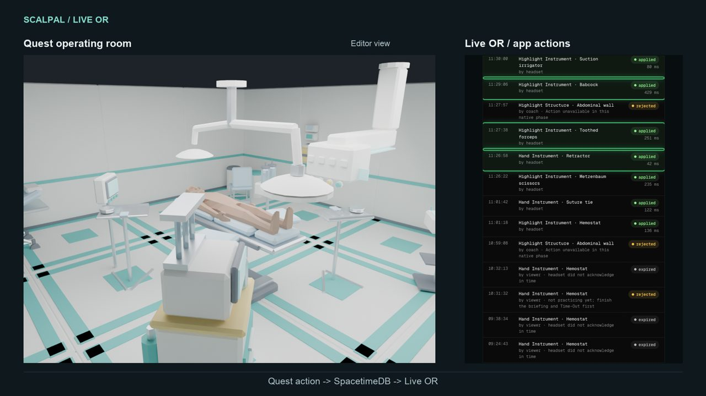
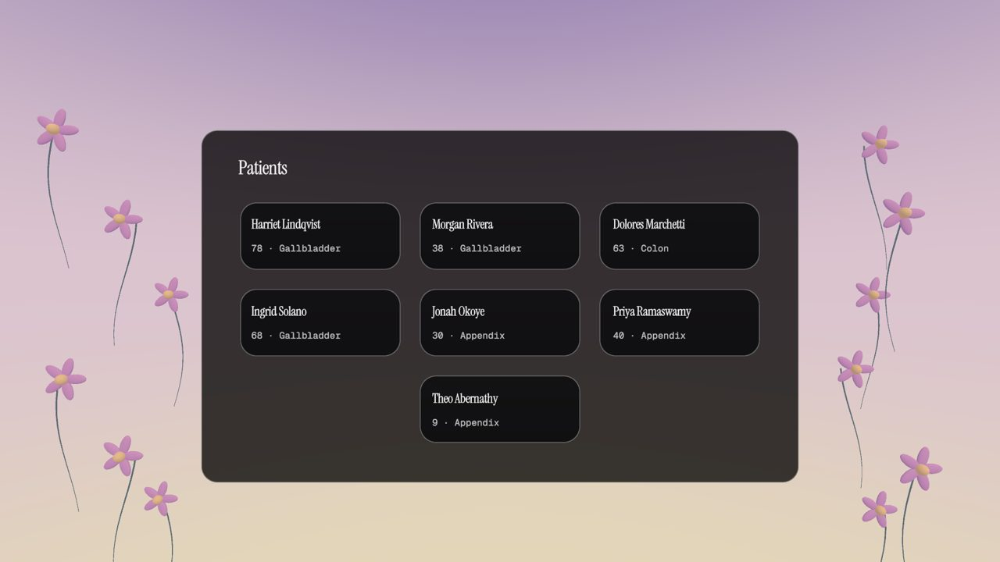
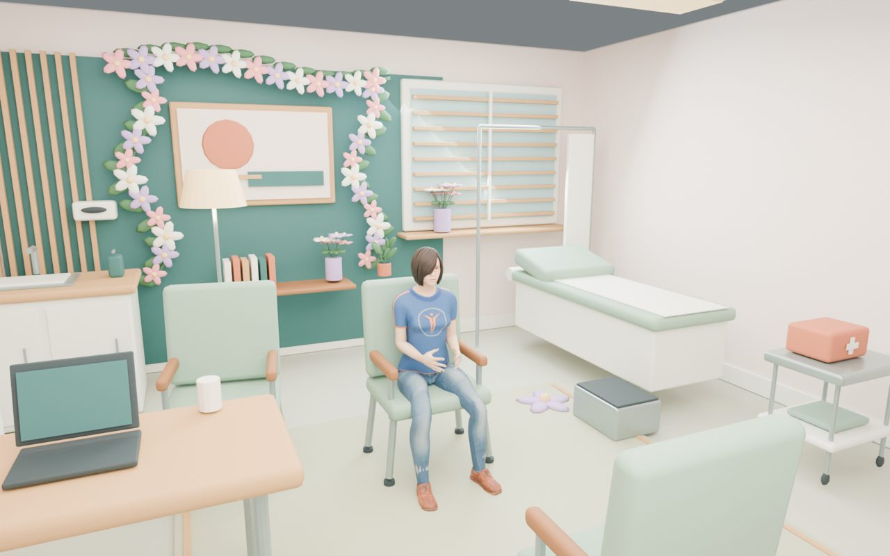
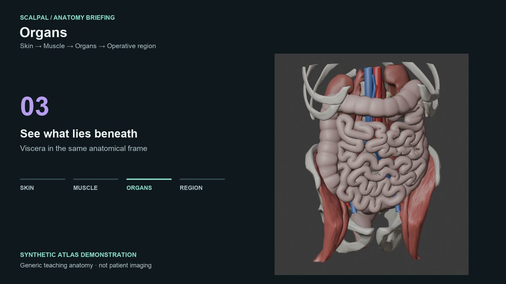
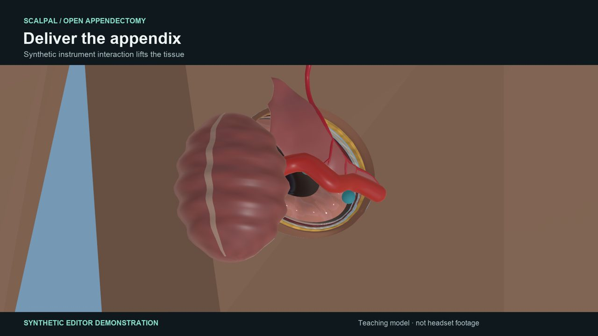
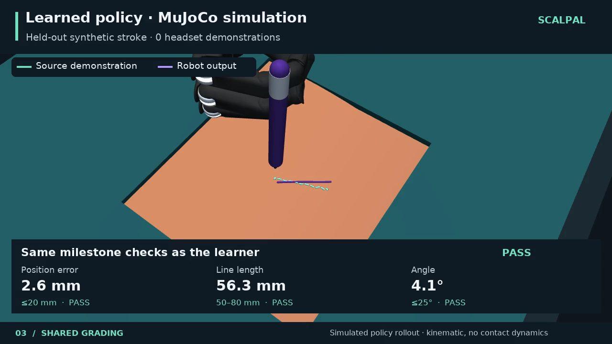
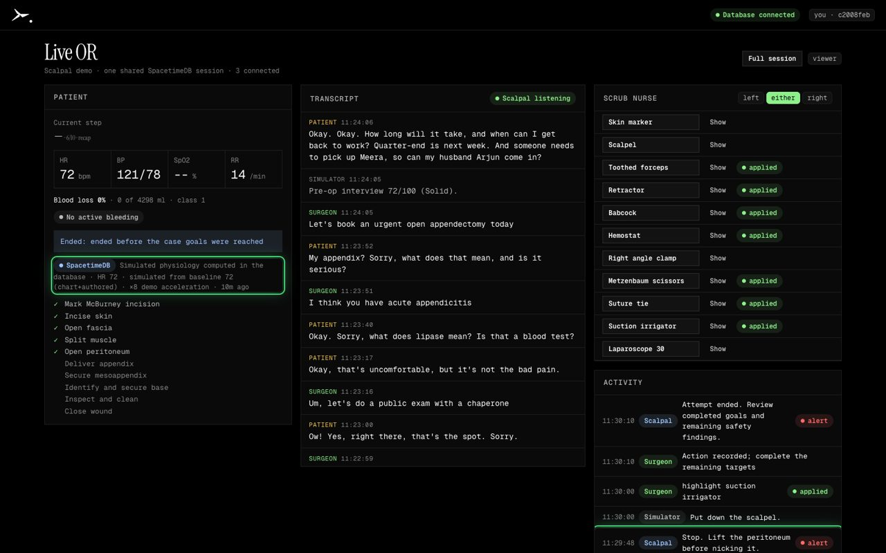
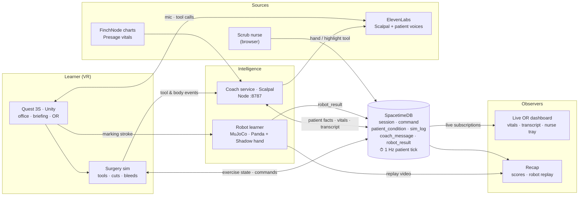

# Scalpal

**Practice surgery in VR with an AI attending, then watch a robot learn from your hands.**

Scalpal is a Meta Quest 3S app built at MHacks 2026. You pick a patient with a real synthetic health record, interview them in a doctor's office, study the anatomy, then operate. An AI coach called Scalpal talks you through it out loud. A teammate on a laptop can join as your scrub nurse. When you finish, you get a scored debrief and a simulated robot arm that tries the same move.

[**Download the APK**](https://github.com/stephenhungg/scalpal/releases/latest/download/scalpal.apk) · [**Live OR dashboard**](https://dashboard.scalpal.tech) · [**Site**](https://scalpal.tech) · [**Docs**](https://docs.scalpal.tech)



## The run

| | |
|---|---|
|  | **1. Pick a patient.** Every chart is a real FinchNode synthetic health record, with risks flagged from the chart. |
|  | **2. Interview them.** A voiced patient answers your questions in a full-VR office. The risks you catch count toward your score. |
|  | **3. Brief on the anatomy.** Peel the body from skin to muscle to organs to the operative region. |
|  | **4. Operate.** Open appendectomy in VR, or AR on a reclining volunteer. Real instruments, cuts, bleeding and live vitals. Scalpal coaches you by voice and can swap or highlight your tools. |
|  | **5. Recap.** Your score, the mistakes you made, a spoken debrief, and a simulated robot replaying the marking step, graded by the same checks as you. |

## Built with our sponsors

### SpacetimeDB: the operating room lives in the database

SpacetimeDB is not storage for us. It is the shared room that every participant plays in.

- **The patient runs inside the database.** A scheduled reducer ticks the patient's physiology once a second. Bleeding and mistakes change the vitals for every client at once, whether or not anyone is watching.
- **Humans and AI are peers.** The headset, the browser scrub nurse, the viewer and the Scalpal coach are roles checked inside reducers. The AI can hand you an instrument only through the same reducer a human uses, and the module rejects it if the move isn't legal yet ("not practicing yet").
- **One log feeds everything.** `sim_log`, `command`, `patient_condition` and `robot_result` drive the Live OR dashboard, the timeline, the debrief and the robot pipeline. Nothing is stitched together afterwards.
- **Private tables, public views.** 25 tables, 23 views and 52 reducers in `services/realtime`. Clients subscribe to views, so a viewer can't read or write what it shouldn't.
- **Hosted on Maincloud**, with a local instance as the demo fallback. The coach falls back to local physiology and tags `condition.source` if the database is unreachable.

In a recorded session, headset actions landed in the database in 42–429 ms, and one run logged 1,930 events. On Maincloud, our end-to-end suites pass 41/41: scrub nurse 17, sim log 5, realtime 7 and patient condition 12.



### ElevenLabs: every voice in the app

- **Scalpal, the coach**, is an ElevenLabs Conversational AI agent. You talk to it with push-to-talk on Y. It has client tools (`swap_instrument`, `highlight_instrument`) that act on the operating room through SpacetimeDB, and an urgent-alert queue so it never talks over itself.
- **The patient** in the diagnosis office is a second voiced agent.
- **Speech to text** (Scribe) transcribes the learner's spoken answers in the office; Claude matches them to a choice.
- **Text to speech** (Flash v2.5) speaks instant coach reflexes and the end-of-run debrief.

### Anthropic Claude: eyes, answers and patients

- **Vision.** Claude (Haiku 4.5) looks at the learner's point of view on request ("what am I looking at?") and summarizes it in the background, so Scalpal knows what is in view. Labeled boxes from the scene (and an OWLv2 detector on camera frames) are trusted over the model's own guesses.
- **Spoken answers.** In the office interview, Claude matches what the learner says to one of the four choices, or asks again when it is unclear.
- **Patients.** Claude (Opus) wrote each patient's `patient.md` (the voice agent's character), `patient_status.md` (Scalpal's clinical context) and the fixed interview from the FinchNode chart and an authored case, checked by the repo's validators and reviewed before commit.
- **The coach's brain.** Both ElevenLabs agents run on Claude Sonnet.

### FinchNode: real synthetic charts, cited risks

- Every patient comes from FinchNode's demo API (`/scenarios`, `/users/:subject/records`): demographics, meds, conditions, labs, vitals and allergies.
- **Deterministic, cited risk rules.** No model decides what counts as a risk. Anticoagulants, antiplatelets, glucose-lowering drugs, SGLT2 inhibitors and eGFR by LOINC code each raise a flag that points back to the chart entry behind it.
- The learner is scored on whether they catch those risks in the interview before surgery.
- **FinchNode Connect admission.** The patient consents on FinchNode's hosted page, and the headset polls until consent is recorded.
- The acute surgical story on top of each chart is authored and labeled as such, because FinchNode's records have no acute problem.

### Presage: vitals from a camera

- In AR mode, `services/vitals` measures a real volunteer's pulse and breathing with Presage SmartSpectra from a phone camera.
- It freezes a measured baseline before surgery. The OR monitor then shows that baseline plus the simulated blood loss, labeled `simulated from baseline 72 (measured)`.
- A quota guard caps live minutes and ends sessions with no face in view.

## Architecture

SpacetimeDB is the shared operating room. The left side writes into it through role-checked reducers. The right side reads it live through subscriptions.



The Quest app is Unity 6000.0.66f2 (`apps/quest`). The coach and case service is Hono/TypeScript (`services/preop`). The robot learner is a behavior-cloned policy for a Franka Panda with a Shadow hand in MuJoCo (`services/motion`), and it uses the same milestone grader as the learner. The Live OR dashboard is Vite + React (`apps/companion`).

## Run it

```sh
# realtime
spacetime start                       # :3000
cd services/realtime && npm ci && npm run publish:local
# coach + cases
cd services/preop && npm ci && npm start   # :8787
# Live OR dashboard
cd apps/companion && npm ci && npm run dev
# headset: install the APK, then route the Quest to the laptop over USB
adb install scalpal.apk && adb reverse tcp:8787 tcp:8787 && adb reverse tcp:3000 tcp:3000
```

API keys (ElevenLabs, Presage, optional FinchNode sandbox) go in each service's `.env`, which is never committed. See [project setup](apps/quest/README.md) and the [scripts](scripts/README.md) for the full session gate.

## Honest limits

- The robot is a **simulated policy rollout** in MuJoCo. It doesn't drive real hardware. Its learning curve was trained on synthetic demonstrations.
- Patients are synthetic. Charts are real FinchNode data; acute stories are authored.
- AR placement on a volunteer is an approximate overlay, not measured anatomy.
- This is a teaching simulator, not clinical guidance or evidence of surgical competence.

## Team

| | |
|---|---|
| Stephen | The Quest app, Unity, body registration and integration |
| Matthew | Scalpal coach, the pre-op service with FinchNode, anatomy and the diagnosis office |
| Nathan | The dashboard, SpacetimeDB and the gateway |
| Silas | The motion pipeline, Presage vitals, the landing site and the dashboard's look |

## For contributors

Follow [AGENTS.md](AGENTS.md). Start with the [system integration map](docs/system-integration.md), [operation flow](docs/operation-flow.md), [native session](docs/native-session.md), [data and realtime](docs/data-and-realtime.md) and [AR surgery audit](docs/ar-surgery-audit.md). Keep credentials, participant footage, device identifiers and raw datasets out of Git.
