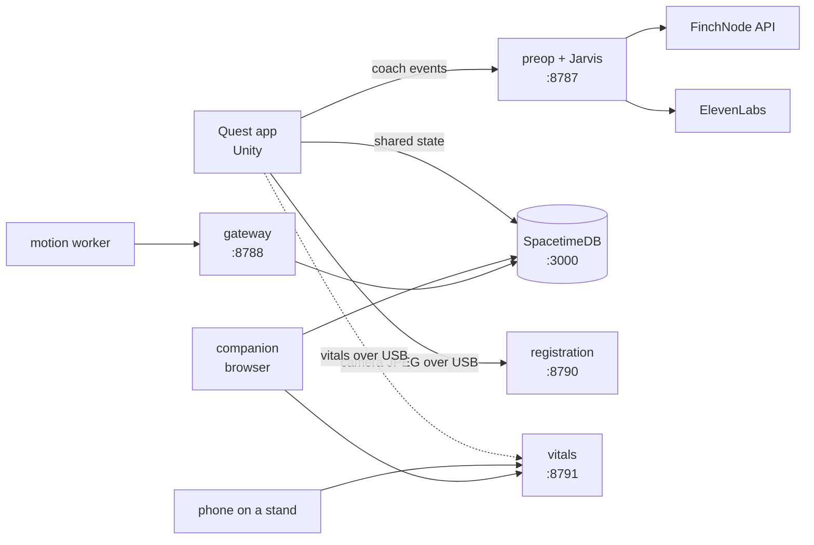

## Components

| Component | Owner | Runs on | Port |
| --- | --- | --- | --- |
| [Quest app](/components/quest) | Stephen | Quest 3S | |
| [Pre-op service and Jarvis](/components/jarvis) | Matthew | Mac or hosted | 8787 |
| [Gateway](/api/gateway) | Nathan | Mac or hosted | 8788 |
| [Body registration](/components/registration) | Stephen | Mac, USB to the headset | 8790 |
| [Vitals (Presage)](/components/vitals) | Silas | Mac | 8791 |
| [Vision](/components/vision) | Matthew | Mac | 8792 |
| [Realtime (SpacetimeDB)](/components/realtime) | Nathan | local or Maincloud | 3000 |
| [Companion](/components/companion) | Nathan, styled by Silas | browser | 5173 |
| [Motion pipeline](/components/motion) | Silas | Mac | |

## How data moves

- **Shared session state** lives in SpacetimeDB. The headset publishes its exercise state and events. The companion and Jarvis read them. All tables are private, and clients only see sessions they belong to.
- **Big files**, like video clips, never go through the database. The gateway hands out short-lived signed URLs for uploads and downloads.
- **Provider keys** stay on the services. The gateway issues ElevenLabs and TURN credentials as grants, so keys never reach a client.
- **Local services** on the Mac reach the headset over USB with `adb reverse`. On the headset, `localhost` is the headset, so this is how it reaches the Mac.

## Coordinates and honesty rules

A few rules hold across every component:

- Camera image coordinates, Unity world coordinates and robot coordinates are always kept separate and named.
- When registration is invalid, scoring pauses and misleading anatomy is hidden.
- Missing hand landmarks in a clip are reported as gaps, never filled in.
- Synthetic and demo data is always labeled.
