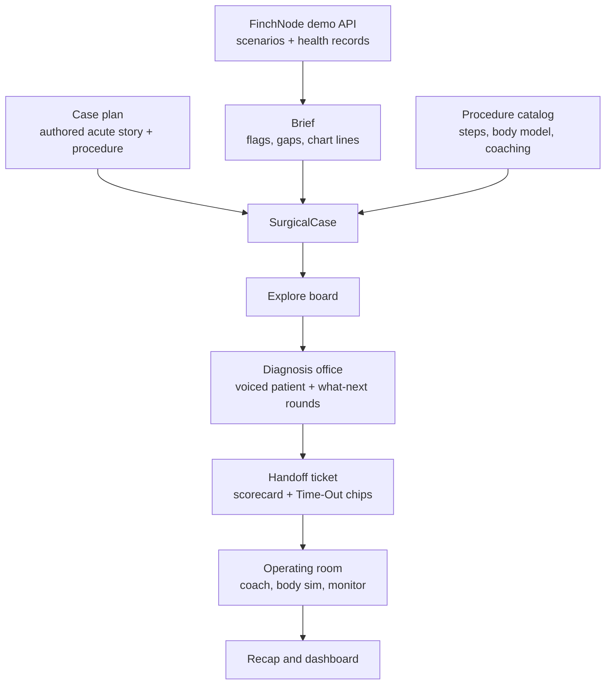

A Scalpal case is one synthetic patient carried through the whole run. The chart is real FinchNode data. The acute story on top of it, the interview, and the surgery are authored teaching content. This section explains how those pieces fit, and how to author your own with the `authoring-scalpal-cases` agent skill.

<Note>
Every case is illustrative teaching content built on synthetic data. It is not clinical guidance, and a clinician should review any case before it's presented as more than a demo.
</Note>

## The pipeline

### 1. Chart to brief

The preop service reads the patient's record from FinchNode (or a recorded fixture offline) and builds a brief. Age is computed at the chart's `dataAsOf` date. Live medications, conditions, allergies and the latest key labs become chart lines. Fourteen rule-based **risk flags** fall out of them: bleeding (anticoagulants or antiplatelets), latex, contrast, other allergies, renal, metformin with low kidney function, diabetes, anemia, cardiac, airway, polypharmacy, pediatric, elderly, and an incomplete chart. Anything missing becomes a **data gap**, because missing data is unknown, never "none".

### 2. Brief to case

An authored **case plan** picks the procedure, urgency, indication and the acute presentation. The chart never picks the procedure. Each risk flag is pinned to the procedure step it changes (a bleeding risk to the vascular step, a latex allergy to the first step), and the pre-op checklist is the flags plus distractors.

### 3. Diagnosis office

The learner talks to the patient (an ElevenLabs voice that plays `patient.md`), and after each patient turn picks one of four clinician moves by tap or voice. The rounds run history, exam, tests, diagnosis, then plan. The scorecard gives full marks for the best move, half for a partial one. Every chart risk the learner elicited becomes a Time-Out chip; the ones they missed are flagged.

### 4. Operating room

The headset loads the same case live. The Scalpal coach gets a prompt built only from this case: the patient, their risks, `patient_status.md`, what happened in the office, and the procedure's steps with coaching. The learner runs the Time-Out, then operates. The open appendectomy runs a body simulation where measured tool actions become tissue facts, milestones are checks over those facts, and bleeding drives a simulated monitor that can lose the patient.

### 5. Recap

The run ends with a recap built from the office scorecard and the surgery grade, exported to the dashboard.

## What you can author today

<CardGroup cols={2}>
  <Card title="Tier 1: a new patient" icon="user-plus">
    A new or re-authored patient on an existing procedure. Pure data: case plan, encounter, interview and patient files. Plays end to end in the headset when the procedure is an appendectomy.
  </Card>
  <Card title="Tier 2: a new procedure" icon="wrench">
    A procedure the headset can't run yet. The interview and coach work, but the operating room needs code and Unity work. The skill writes the data and lists exactly what's missing.
  </Card>
</CardGroup>

| Procedure | Office and coach | Headset operating room |
| --- | --- | --- |
| Open appendectomy | yes | yes, the main path |
| Laparoscopic appendectomy | yes | yes, as the advanced variant |
| Laparoscopic cholecystectomy | yes | not yet |
| Laparoscopic sigmoid colectomy | yes | not yet |

Patients must be FinchNode subjects. You re-author one of FinchNode's synthetic demo patients, or use one FinchNode adds. A hand-made patient only works offline. See [choosing a patient](/cases/patients).
