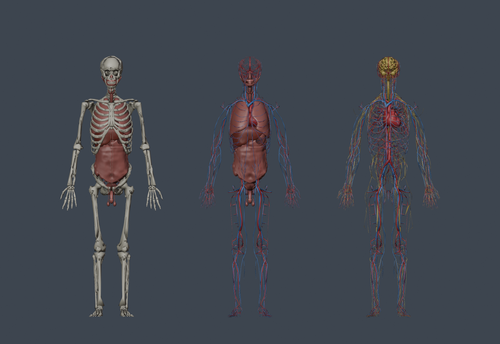
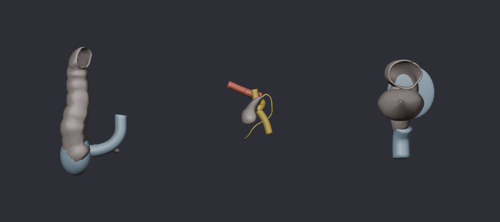

# Anatomy atlas assets

Full-body Z-Anatomy layers and separate high-detail Human Reference Atlas organs for Scalpal's Unity experience. These are generic anatomical models, not participant-specific anatomy or tissue simulation.

## Get this on another computer

Install Git LFS and Blender 4.5 LTS, then:

```sh
git lfs install
git clone --branch codex/anatomy-atlas https://github.com/stephenhungg/scalpal.git
cd scalpal
git lfs pull
git lfs fsck
```

For an existing clone, run `git fetch origin`, `git switch codex/anatomy-atlas`, `git pull --ff-only`, and `git lfs pull`. Preserve any unrelated local work before switching branches. Repository access is required; this does not change collaborator permissions.

Open **[blender/atlas.blend](blender/atlas.blend)** directly in Blender. It contains all 4,031 prepared meshes, organized into system collections, plus separate heart, liver, and vasculature scenes. Covering layers start hidden; enable their collections in the Outliner. Source labels and stable IDs are embedded as mesh-object custom properties. There are no linked external Blender libraries.

| Deliverable | Location | Storage |
| --- | --- | --- |
| Editable Blender workspace | `blender/atlas.blend` | Git LFS |
| All 11 full-resolution source FBX/GLB files | `originals/` | Git LFS |
| All 12 prepared Unity FBXs and stable metadata | `../../apps/quest/Assets/Scalpal/Anatomy/` | Git |
| Preview image | `preview.png` | Git |
| Source checksums, attribution, generation scripts | This directory and `../../scripts/anatomy/` | Git |

`atlas.blend` contains the prepared display geometry. Import the files in `originals/` when editing full-resolution sources. The roughly 255 MB of originals are checked into LFS, not left on one developer's machine. Do not overwrite these pinned originals with edits; save authored work as a new `.blend` under `blender/` and commit it. Blender backup files and temporary build caches remain ignored.

To regenerate the workspace, run Blender in background mode with `--python-exit-code 1 --python scripts/anatomy/create_workspace.py` from the repository root. This overwrites the generated `atlas.blend`, so commit authored edits first. Its generator verifies the saved file by reopening it and checking all structure IDs.

## Reproduce sources

Run `python3 scripts/anatomy/fetch.py` from the repository. It validates the tracked originals against `sources.json` and can recover missing files from pinned upstream URLs. Run `git lfs pull` first to hydrate any LFS pointers. Original full-resolution geometry stays intact.

Sources:

- Z-Anatomy Unity FBX exports: https://github.com/LluisV/Z-Anatomy, revision `6c7f9016bd5899ac8edafd31b9900c151df42ed6`. Credit Lluis Vinent, Z-Anatomy, and BodyParts3D / DBCLS. Source project declares CC BY-SA 4.0; upstream model credits include component-specific terms. Preserved notices are in `attribution/`.
- Human Reference Atlas male heart, liver, and blood vasculature, release 2.5 high-resolution GLBs: https://github.com/cns-iu/hra-organ-gallery-in-vr, revision `92dc604271f1a3e92cc2ce598405ada2daeb9460`. Credit Human Reference Atlas / HuBMAP, the contributing model authors, and the NLM Visible Human Project. Source catalog: https://humanatlas.io/3d-reference-library. Original GLBs are in `originals/`; these files contain exporter metadata but no embedded author attribution.

Different atlas sources are not spatially interchangeable. Full-body layers share the Z-Anatomy source frame. HRA detail models are separate inspection assets and must not be automatically attached to the participant torso.

## Status

Asset preparation and local geometry inspection are not physical Quest validation. Unity scene composition, registration fitting, actual stereo rendering, and headset frame time must be verified by the Quest integrator. Rendering anatomy does not implement cutting, deformation, bleeding, or physiological flow.

Verified export inventory: 3,874 full-body source parts across eight systems (669,730 triangles), 11 supplemental exercise targets (9,833 triangles), plus 146 parts in three independent detail models (360,261 triangles). All passed the Blender round-trip checks. The manifest records 1,400 excluded source guides. Local code checks passed for desktop, Android player defines, and Editor with an Android target; these use Unity test doubles, not the Unity editor.

## Build and verify runtime geometry

Requires Python 3 and a complete Blender installation (tested with Blender 4.5.13 LTS). From the repository root:

```sh
python3 scripts/anatomy/prepare.py --blender /path/to/Blender
dotnet run --project scripts/anatomy/runtime-check
```

For macOS, pass the executable inside the app, for example `/Applications/Blender.app/Contents/MacOS/Blender`. A stripped binary without Blender's bundled Python scripts will not work. The script uses `--python-exit-code 1`, so a geometry failure fails the build instead of producing a false success.

The builder exports eight full-body FBXs, one supplemental exercise-target FBX, and three independent detail FBXs to `apps/quest/Assets/Scalpal/Anatomy/Models/`. Each source structure remains independently named. Full-body display exports target 60,000 triangles per system; small structures have a minimum retained geometry allowance, so this is not a strict cap. **Catalog-mapped surgery targets retain their original geometry**, and are excluded from reduction. Detail exports target 150,000 per model. Source originals are never simplified in place. Mirrored transforms have their face winding corrected when baked into vertices. This display simplification needs visual inspection at the intended viewing distance; it is not evidence of anatomical accuracy.

`Resources/anatomy-atlas.json` records every structure, its source label, stable ID, source/display triangle counts, checksums, and unmapped exercise structures. Only explicit name equivalences map to the existing exercise catalog. No placeholder anatomy is invented for missing meshes. An unrecognized structure remains accessible through its source ID, but is not silently treated as a surgical target.

Z-Anatomy's `.i`/`.j` helper meshes include visible cuboid label pointers and region guides. They are excluded from the tissue display and listed under `excludedGuides`; the complete source originals retain them. Edge-only markers are also excluded. Simplification output is validated before export to remove duplicate faces that FBX import would otherwise drop.

The atlas maps 18 original targets plus 11 supplemental targets. Every interactive and mistake target for appendectomy, gallbladder, and sigmoid colectomy is covered. Four catalog IDs remain unmapped: `abdominal_wall`, `umbilicus`, `heart`, and `lungs`; some have source substructures but no canonical combined node. Port placement and confirmation do not need fake anatomy colliders. `exerciseCoverage` and `unmappedCatalogIds` record the distinction. The supplemental targets are schematic teaching geometry, not anatomically validated source segmentation. See [case wiring and first demo](../../docs/anatomy-integration.md).

Verification reimports all exported FBXs in Blender and checks exact mesh-name coverage, triangle counts, SHA256, and world bounds within 1 mm of the prepared geometry. It validates an FBX round trip, not Unity's importer or headset rendering. Generated GUIDs are stable, and existing `.meta` files are preserved.

## Unity integration

1. Use Stephen's Unity 6 URP Quest project. Do not replace its bootstrap scene, packages, or XR rig with the upstream desktop application.
2. Run **Scalpal > Anatomy > Build Atlas Prefab**. It creates `Anatomy/Prefabs/AnatomyAtlas.prefab` and separate `detail-*.prefab` assets. Build fails on missing or ambiguous mesh mappings. Materials are shared, and only catalog-mapped targets receive static mesh colliders.
3. The atlas prefab starts in preview mode, with the outer surface hidden and a rotating root. Use it on the selection pedestal. All body systems retain a shared source frame; the origin is **not** the umbilicus. Imported anatomy still needs measured fitting into the torso frame in `docs/unity-handoff.md`.
4. For participant practice, call `SetPreviewMode(false)` before displaying it and drive `SetRegistrationValid(valid)` from Stephen's tracker. Invalid registration hides managed renderers and colliders. Use `AnatomyExerciseBinding` for all input so case scoring is gated as well.
5. Assign the existing `CoachRelay` and active `AnatomyController` to `AnatomyCoachBinding`. Call `Rebind()` if either reference changes. Highlight requests use stable catalog IDs; missing/hidden targets receive rejected acknowledgements.

For desktop inspection, **Scalpal > Anatomy > Build Atlas Preview Scene** generates a separate optional scene with a camera, light, and mouse-operated layer/search panel. Open that generated scene and press Play. Toggle systems, switch ghost materials, search source names or IDs, isolate/highlight a part, and pause rotation. The panel is excluded on Android/iOS; it is not an XR rig and does not replace Stephen's bootstrap. The renderer starts with shared opaque materials; artery/vein and organ palette variants improve visual distinction.

Scene code can call:

```csharp
atlas.SetSystemVisible("muscular", false);
atlas.SetSystemVisible("cardiovascular", true);
atlas.SetSystemGhosted("skeletal", true); // Optional shared see-through material.
atlas.Isolate("liver");
atlas.Highlight("liver");
atlas.ClearHighlight();
atlas.RestoreVisibility();
atlas.SetPreviewRotation(false);
```

Systems: `exercise-targets`, `cardiovascular`, `joints`, `lymphatic`, `muscular`, `nervous`, `surface`, `skeletal`, `visceral`. Detailed model roots have independent IDs and positions. They are for separate inspection, not automatic substitution into the full-body rig.

The older 150k whole-exercise validator is not a full-body atlas acceptance test. This atlas can contain thousands of independently named renderers. Do not assume that simplifying triangles fixes draw-call overhead. Ghost mode creates overlapping transparent surfaces and is especially expensive; it is off by default. Show relevant layers/regions, measure on the Quest with the actual camera/voice workload, and optimize batching or visibility before claiming a frame-rate target.

## Preview

`scripts/anatomy/render_preview.py` renders the prepared meshes in Blender. The output is a geometry inspection image, not a Unity screenshot. Run it with the same Blender background invocation used by the builder.



## Appendectomy-first demo

Run **Scalpal > Anatomy > Build Appendectomy Demo Scene** to generate the wired desktop case/service/coach harness. See [the integration guide](../../docs/anatomy-integration.md) for scene setup, tool activation, registration, and live Jarvis boundaries. The actual headset rig and physics/input mapping remain the Unity integrator's work.

The authored targets below include the requested cecum/terminal ileum, five enlarged duct/artery targets, and the colectomy additions. The image is a Blender inspection of schematic teaching geometry.


