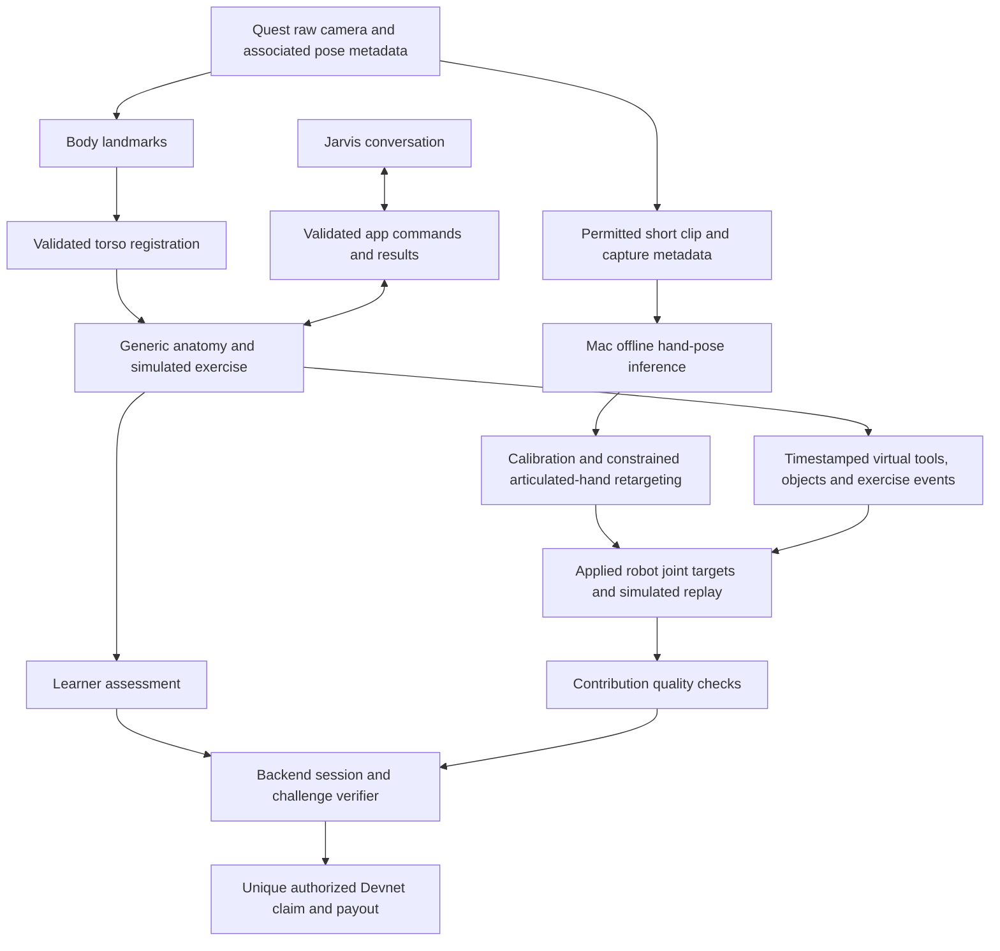

# Scalpal Architecture

> Scope update: Solana, wallets, payouts, and monetary completion rewards are removed. Nathan owns the companion website + SpacetimeDB/routing lane; Matthew continues Jarvis. This earlier proposal contains superseded reward/challenge references. Read [current direction](current-direction.md) and [Nathan's implementation plan](nathan-plan.md) first.

Updated October 3, 2026. This document describes the current proposed application, not an implemented system or an approved clinical specification. The earlier office-hours design was reviewed before the robotics extension; that review does not establish feasibility of the current combined scope.

## Product and First Slice

Scalpal connects AI-guided human practice with robot demonstrations. A learner discusses a supported anatomy exercise with Jarvis, explores its rotating 3D model, practices with simulated tools and generic anatomy aligned over a real reclining participant, and reviews their attempt. A recorded passthrough clip is processed into estimated hand movements and retargeted to a simulated articulated robot hand. An accepted contribution receives a sponsor-funded Solana Devnet reward.

The immediate robotics deliverable is **video-to-motion retargeting and replay**. A replay is not an autonomous policy, proof of robot learning, or evidence of clinical competence. Learning a policy from quality-checked demonstrations is a later experiment.

The first slice should contain one complete exercise, one short recording, one articulated robot-hand replay, and one idempotent Devnet reward. Choose a task that makes both the educational objective and the hand movement observable. Instrument pick-and-place around a virtual restricted region is a candidate, not a selected case. Gallbladder anatomy was an earlier teaching example, not a committed full surgical procedure.

Physical actions remain simulated. The application does not supply tissue mechanics, force feedback, real dissection, or patient-specific internal-organ measurements. A Blender organ mesh supplies geometry, not validated surgical physics or a scoring rubric.

## What Exists

Native Quest camera acquisition, sample deployment, a desktop mirror, and stereo bottle detection/placement have been tested on a physical Quest 3S. [Hardware Baseline](hardware-baseline.md) separates measured results from remaining uncertainties.

The Scalpal application, torso tracking, anatomy assets, voice tools, clip recorder, hand reconstruction, robot retargeter, companion wallet application, reward service, and onchain challenge integration are not implemented. No end-to-end Scalpal session has been demonstrated.

## Proposed Stack and Boundaries

| Component | Responsibility | Proposed location | Status |
|---|---|---|---|
| Native XR runtime | Permissions, raw camera acquisition, calibrated image geometry, tracked camera/head poses, controllers, stereo rendering, pause/resume | Unity Android application on Quest 3S | Camera/sample foundation tested; Scalpal integration absent |
| Body perception | Estimate visible shoulder/hip landmarks from current camera frames | Native headset inference candidate; integration and budget must be measured | Pretrained model preferred; MediaPipe is a candidate |
| Torso registration | Validate surface association, fit position/orientation/scale, report uncertainty, attach generic anatomy | Unity headset application | Unverified on reclining people |
| Anatomy and exercise | Separate organ identities, selection preview, simulated tools, authored step rules, feedback events | Unity headset application | Proposed |
| Jarvis orchestration | Conversation, reviewed explanations, supported application action requests | Voice provider plus validated Unity bridge | ElevenLabs is a candidate; provider/transport not selected |
| Recording | Save permitted raw passthrough video and necessary synchronized capture/scene metadata | Quest capture with transfer to the Mac | Capture route, synchronization, encoding, and rights unresolved |
| Motion reconstruction | Decode the short clip; estimate hand landmarks, handedness, quality, and motion | Offline processor on the companion Mac | MediaPipe Hand Landmarker candidate; actual footage untested |
| Robot retargeting/replay | Convert inferred motion to a selected articulated robot hand's feasible joint targets; replay recorded commands | Mac-hosted robot simulation initially | Robot model, simulator, and retargeter not selected |
| Session/record store | Attempt records, permitted motion artifacts, versions, replay manifests, and reward claims | Backend and restricted artifact storage | Tiger Data is a recording/retrieval candidate, not a mapper or trainer |
| Challenge/reward service | Wallet pairing, result validation, contribution acceptance, payment reservation/reconciliation | Backend plus Mac companion wallet page | Proposed; secrets remain server-side |
| Solana | Funded challenge, authorized acceptance receipt, unique claim, Devnet payout | Devnet program/transaction integration | Exact custom-program scope not finalized |

Do not add multiple databases or inference services solely to accumulate sponsor integrations. Native Unity is the working XR direction because the earlier browser experiment did not produce reliable immersive placement. The companion web page handles pairing and review; it is not the primary headset renderer.

## Data Flow

The latest user correction is explicit: **the robotics input is recorded passthrough video, not Meta's SDK hand-joint stream**. Body registration and offline hand reconstruction are different perception tasks. Success in either one does not establish the other.

Raw Passthrough Camera API images exclude virtual organs, tools, and UI. A composited headset recording is a different artifact. Preserve relevant virtual scene state separately, and identify which recording each viewer is displaying. An attractive composited video alone is insufficient to reconstruct the inputs to a virtual task.

## Conceptual Contracts

These describe information boundaries for implementation teams. They are not existing API names, schemas, or network endpoints.

| Boundary | Required information and behavior |
|---|---|
| Camera observation → perception | Frame identity, dimensions, orientation, crop, intrinsics, camera source, acquisition-time estimate, associated camera pose and its timing/quality. Keep uncertainty explicit. |
| Body landmarks → registration | Landmark pixels, confidence, source observation identity, validated depth/surface association. A table hit is not a human torso point. |
| Registration → renderer/rules | Torso transform, scale, validity, observation age, failure reason. Rules consume validity before assessing interactions. |
| Exercise manifest → app/coach | Stable exercise/structure IDs, asset version, content/rubric version, supported steps, transitions, hints, and completion criteria. |
| Agent → app | Session/mode/step version, allowlisted action, stable target ID, bounded parameters. Return applied, loading, rejected, unavailable, or failed; confirm speech only after an actual result. |
| App → recording manifest | Clip identity, timestamp mapping, calibration, dropped/missing frames, available tracked poses, consent/rights status, exercise version, and synchronized tool/object/interaction events. |
| Hand inference → retargeter | Handedness, estimated landmark sequence, confidence, frame/time identity, coordinate convention, scale/translation assumptions, and missing/occluded intervals. |
| Retargeter → simulator/replay | Robot model/version, joint names and ordering, units, control mode, feasible applied targets, limits, initial state, replay timebase, and quality/failure events. |
| App/replay → backend verifier | Attempt/challenge identity, fixed versions, observable learning result, separately checked contribution quality, artifact reference/digest, and paired recipient wallet. |
| Verifier → Solana | Authorized challenge/claim identity, bounded recipient/amount, acceptance reference, and durable transaction state. No raw video, body imagery, secrets, or detailed motion stream onchain. |

Record commands actually applied after conversion and limit handling. Raw inferred human poses do not necessarily represent movements the selected robot can execute. If robot learning is pursued later, also preserve permitted simulator observations, object state, outcomes, reset conditions, and controller/environment versions.

## Coordinate, Image, and Timing Rules

1. **Image pixels are not world positions.** Use the actual crop and intrinsics to form camera rays. Adjust the principal point when cropping or resizing. Do not reuse a guessed browser field of view.
2. **Pose belongs to an observation time.** Avoid applying an old image with the latest head pose. The tested preview-copy timestamps were not proven exposure timestamps. Sensor time, app monotonic time, decoded video presentation time, and backend wall time need an explicit mapping; do not subtract unrelated clocks to invent latency.
3. **Model “world” coordinates are not Quest world coordinates.** MediaPipe estimates do not automatically supply calibrated headset-world positions or reliable metric wrist translation. Label their origin, units, orientation, and scale assumptions before conversion.
4. **The headset moves while recording.** Apparent hand movement combines camera movement and hand movement. Retain usable camera poses/calibration where available and test their association; otherwise restrict the reconstruction claim rather than presenting exact world motion.
5. **Monocular depth is uncertain.** Wrist translation, finger occlusion, scale, contact, and tool interaction require separate validation. Finger flexion replay may succeed before accurate wrist translation. A full arm requires an additional arm inverse-kinematics/controller stage.
6. **Robot anatomy differs from human anatomy.** Use the selected robot's kinematics and limits, with explicit joint-name mapping. Human joint angles are not transferable one-to-one. A pinch-controlled gripper is a simpler alternative but changes the articulated robot-hand scope and requires an explicit decision.
7. **Validity controls presentation.** Missing landmarks or implausible motion should mark an interval invalid or pause replay. Do not silently interpolate long tracking gaps into supposedly observed demonstrations. Define any interpolation limit from measured clips.

[dex-retargeting](https://github.com/dexsuite/dex-retargeting) is a candidate for constrained hand mapping without training a custom neural network first. Compatibility with the chosen robot model, simulator, and inferred input must still be tested. Replaying joint targets under a different initial object state does not guarantee the same contact or task outcome.

## Proposed Modes and Failure States

Primary modes: `Startup → Selecting → ChallengeAccepted → Fitting → Practicing → Reviewing → ProcessingMotion → RobotReplay → RewardStatus → Recap`.

- **Startup:** Check required permissions, camera readiness, asset availability, and connection state. A failed camera check blocks body-aligned practice.
- **Selecting:** Jarvis offers only implemented exercises. The rotating Blender model belongs here; inspect, rotate/stop, zoom, isolate a structure, restore context, then explicitly confirm.
- **ChallengeAccepted:** Bind the selected challenge and versions, explain acceptance rules, establish participant recording consent, and pair a wallet. Consent does not independently establish platform export rights.
- **Fitting:** Registration moves between `Unaligned`, `Valid`, and `Uncertain`; the learner confirms a usable generic fit before practice.
- **Practicing:** Authored rules, known Unity object identities, and validated actions determine progress. Recording is a separate substate (`Off`, `Recording`, `Failed`, `Complete`). A recording failure can invalidate the contribution without erasing learning feedback.
- **Tracking uncertainty:** Pause assessment and hide misleading body overlays. Resume only after recovery checks and fit confirmation. Preserve the attempt.
- **Voice/network failure:** Preserve the attempt and provide local pause/controller/text controls. Do not require a cloud response to stop an interaction.
- **Reviewing:** Explain learner performance from exercise events, independently of recording quality and payment status.
- **ProcessingMotion:** Transfer and process the short clip offline on the Mac. Processing is allowed to take time; immediate live robotic mirroring is not the first commitment.
- **RobotReplay:** Show the reconstructed motion and selected articulated hand. Clearly label invalid intervals, failure, and replay; do not call it autonomous learning.
- **RewardStatus:** `Ineligible`, `PendingVerification`, `Accepted`, `Submitting`, `Confirmed`, `Failed`, or `NeedsReconciliation`. A rejected motion contribution does not imply the anatomy lesson failed.
- **Recap:** Preserve feedback, replay availability, and transaction status; retry creates a new attempt under the fixed challenge eligibility policy.

## Voice and Authority

The voice agent may request a supported preview, highlight a known structure, explain an authored step, provide an allowed hint, or pause. Unity validates identifiers, mode, parameters, and session/step versions and serializes conflicting requests. No voice tool executes arbitrary scene code or authorizes payment.

Exercise rules own progression and learner assessment. A separate contribution checker owns technical acceptance of recordings/retargeted motion. The backend owns reward eligibility; the chain enforces authorized claims and transfers. Neither an LLM response nor an onchain digest proves medical correctness or data quality.

Provider API keys and the treasury private key stay outside the repository and outside the distributed headset build. Use server-mediated or suitably scoped short-lived client credentials where the chosen provider supports them. Document endpoint configuration without committing secrets.

## Rewards and Storage

The proposed onchain story is a sponsor-funded challenge, not an arbitrary completion faucet. Bind its task/version, acceptance rule, verifier authority, budget, and reward before a contribution. Demo sponsors are illustrative unless an actual funding commitment exists. Devnet test SOL has no real monetary value.

Use a companion Mac web wallet to verify wallet control and pair it with the session; Quest wallet compatibility is not established. Wallet ownership does not establish a unique human identity.

Atomically reserve a unique claim, persist the signed transaction/signature before submission, and reconcile unknown submission outcomes before retrying. Return an existing claim result for duplicate requests. If a custom Solana challenge program is implemented, it should enforce unique claims and the allowed verifier/budget; the exact program scope still needs a decision. Offchain validation remains a trust boundary.

Store camera artifacts privately and separately from public pseudonymous receipts. Record artifact access, retention, and deletion behavior before sharing. Tiger Data can store permitted timestamped motion/scene records and retrieve them for replay; it does not perform pose reconstruction or train the robot.

## Capture Rights

The proposed input is camera footage. Meta's SDK hand-pose-specific notice is not the direct rule for this input. Meta identifies camera images as Device User Data under its Developer Data Use Policy. In-app CV, recording, third-party export, and sponsored dataset licensing are not interchangeable uses; assess the exact planned camera-data use before lab sharing, licensing, or training. Do not assume processing footage into landmarks or robot commands automatically exempts derived data.

Separate participant consent from platform terms and downstream asset/data licenses. No lab export, licensed dataset sale, or permitted robot-training route has been established by this design. This does not assert that every local recording use is prohibited; the permitted capture/storage/use boundary must be resolved for the actual workflow.

## Evidence Gates and Open Decisions

First test the two unresolved links independently: real-person torso registration, and one short permitted video clip → estimated finger motion → one articulated robot-hand replay. Keep known synthetic-motion tests available to distinguish simulator/retargeter errors from video reconstruction errors.

Older design examples included 90% valid-tracking time, one continuous 10-second valid interval, a 5 cm external-point offset bound, a 300 ms stale cutoff, 500 ms consecutive valid observations before recovery, recovery readiness within 2 seconds, and median voice response under 2 seconds. These are **provisional example targets**, not measurements, accepted clinical thresholds, or validated performance of the combined architecture. Revise them after physical tests; record timing/measurement uncertainty.

Open integration decisions:

- One educational exercise, its observable hand task, rubric, and qualified content review.
- Markerless torso feasibility; participant-relative fiducials only as an explicitly chosen contingency.
- Camera recording route, frame/pose synchronization, codec/transfer path, capture rights, retention, and participant consent flow.
- Hand model performance on actual occluded first-person footage; scope of wrist translation versus finger-pose replay.
- Articulated robot-hand model, simulator, retargeter compatibility, limits, and scene/reset definition.
- Voice provider/transport, inference placement/budget, backend/store, and network access from Quest.
- Contribution acceptance checks, sponsor representation, reward amount, verifier key ownership, and custom-program scope.

## Primary References

- [Meta Passthrough Camera API](https://developers.meta.com/vr/documentation/unity/unity-pca-overview/) and [Data Use Policy](https://developers.meta.com/vr/policy/data-use/).
- [MediaPipe Hand Landmarker](https://developers.google.com/edge/mediapipe/solutions/vision/hand_landmarker) and [Pose Landmarker](https://developers.google.com/edge/mediapipe/solutions/vision/pose_landmarker).
- [Unity model import](https://docs.unity3d.com/Manual/HOWTO-ImportObjectsFrom3DApps.html) and [Z-Anatomy component licensing](https://github.com/Z-Anatomy/Models-of-human-anatomy/blob/master/Readme.md).
- [ElevenLabs client tools](https://elevenlabs.io/docs/eleven-agents/customization/tools/client-tools).
- [dex-retargeting](https://github.com/dexsuite/dex-retargeting), [Robosuite controllers](https://robosuite.ai/docs/modules/controllers.html), and [robomimic dataset structure](https://robomimic.github.io/docs/datasets/overview.html).
- [Solana Devnet](https://solana.com/docs/references/clusters), [PDA](https://solana.com/docs/core/pda), and [CPI](https://solana.com/docs/core/cpi).
- [FLS FAQ](https://www.flsprogram.org/about-fls/faq/) for the distinction between cognitive learning, physical practice, and assessed proficiency.
