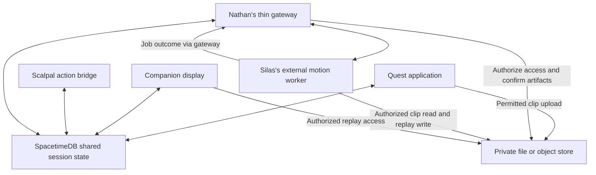

# Data Storage, Realtime State, and Nathan's Backend Lane

> Implementation update: team feature branches now contain component code. Read the [system integration map](system-integration.md) for audited commits, actual routes, missing adapters and verification. The plan below describes intended responsibilities, not proof of a connected deployment.

Research and updated assignment: October 3, 2026. The user assigned Nathan the companion website + SpacetimeDB/routing implementation lane. See [Nathan's work order](nathan-plan.md), which supersedes the earlier suggestion to wait for an unspecified backend plan. This document explains the design; no backend, bucket, SDK integration, stream, or recording pipeline is deployed by the documentation change. Solana and monetary completion rewards remain removed.

## Recommendation

Use **SpacetimeDB for shared session state and coordination**, **a private file/object store for recordings and derived artifacts**, and **Silas's external worker for video inference and robot replay**. Nathan owns the connections between those components. Keep camera rendering, body registration, and immediate simulation local to the Quest.

SpacetimeDB would be meaningful core infrastructure because the headset, companion display, and coach all consume the same exercise/session state and motion-job progress. It should not be an extra database attached only to qualify for a prize. Do not add Tiger Data or another state database unless a concrete requirement remains unmet.

For the first local test, files can remain in a restricted Mac artifact directory served through the authenticated gateway. For cloud sharing, a private Cloudflare R2 bucket is a concrete candidate; choose the deployment/storage account with Nathan. Access and platform data-use requirements must permit the intended transfer. No cloud recording storage is configured today.

## Where Each Kind of Data Goes

| Data | Proposed home | What other components see |
| --- | --- | --- |
| Session membership, exercise/version, current step/mode | SpacetimeDB | Authorized session subscribers receive relevant state |
| Selected anatomy structure, pause state, coarse readiness | SpacetimeDB | The headset, observer, and coach share the same context |
| Requested voice actions and applied/rejected acknowledgements | SpacetimeDB command/result rows when routing across processes is needed | A command's actual result, not just the coach's assumption |
| Authored exercise events and feedback summaries | SpacetimeDB | Persisted learning result and relevant history |
| Recording/upload metadata | SpacetimeDB | Artifact ID, object key/reference, type/size, timing summary, verified availability |
| Processing jobs and status/error | SpacetimeDB | Queued/running/ready/failed, linked input/output artifacts |
| Raw camera clips | Private file/object storage | An authorized temporary read/upload URL, not video bytes replicated to subscribers |
| Calibration/pose/virtual scene timeline | Private artifact file alongside the clip | Metadata and a protected reference in the database |
| Full inferred landmark/joint sequences | Private artifact files | Quality summaries and a replay manifest/reference |
| Robot replay output | Private artifact files, plus small shared replay state | Ready/error status, playback command/position when shared viewing is needed |
| Live camera textures, full-rate torso transforms, current interaction physics | Quest memory/local runtime | At most sampled status for observers; no network dependency in the rendering loop |
| Provider authorization and storage credentials | Gateway/service configuration | Scoped client authorization only; secrets never become replicated rows |

The distinction is architectural: databases hold the small records that coordinate a session, while files hold the large artifacts. It is not a claim that SpacetimeDB cannot represent binary data. Avoid putting MP4s, full frame sequences, or every robot joint sample into broadly subscribed tables.

## Source-Verified Capabilities and Limits

SpacetimeDB [subscriptions](https://spacetimedb.com/docs/clients/subscriptions/) push matching rows and their subsequent changes to clients. Its [C# SDK](https://spacetimedb.com/docs/clients/c-sharp/) documents a Unity package and generated module bindings. The Unity connection must be advanced through the SDK's network manager or the app's update loop. Quest Android/IL2CPP compatibility and actual connectivity still require a physical-headset test.

[Reducers](https://spacetimedb.com/docs/functions/reducers/) perform transactional state changes but cannot access the filesystem or network. [Procedures](https://spacetimedb.com/docs/functions/procedures/) can call external services with different execution semantics. The first proposal uses a thin external gateway/worker bridge for signed storage access, provider authorization, and Silas's processor; SpacetimeDB remains authoritative for shared state. Do not run video decoding or a Python ML runtime inside a database reducer.

[Private tables and identity-aware views](https://spacetimedb.com/docs/tables/access-permissions/) support selective exposure. A client's filtered subscription to a public table is not a security boundary. Keep sensitive session data private and expose only authorized rows through views; authorize mutations against session membership and roles.

R2 [presigned URLs](https://developers.cloudflare.com/r2/api/s3/presigned-urls/) support temporary GET and PUT access. Generate them in trusted service code; give the client only access to the required object. Retain stable object keys in protected metadata and mint fresh read URLs when needed, instead of persisting expired URLs as the only artifact reference.

## Simple Routing Picture



The gateway route for local files may proxy a transfer; cloud object storage can accept a direct signed upload. No full-rate video passes through the database. Nathan's live companion video uses a separate media transport, with the existing composited Mac mirror as the first source to validate; it remains distinct from raw clip storage and motion inference.

## One Session, End to End

1. Nathan's backend establishes a session and participant roles. The Quest and companion subscribe only to the authorized state they need.
2. Scalpal uses the current exercise/step context. A supported action request carries a command ID, target session, expected version, and bounded parameters. Unity validates it, applies or rejects it, and reports the outcome. Local pause works immediately without waiting for the cloud.
3. The learner starts a defined recording segment. The Quest writes a local clip and associated scene/timing metadata. The session exposes recording progress/status, not live video frames.
4. The gateway authorizes an upload to the chosen storage route. It confirms the expected artifact actually arrived before marking it available. Uploading does not automatically mean reconstruction succeeded.
5. A unique processing job references the available clip/manifest. The gateway dispatches it to Silas's worker, which estimates hand motion and produces the selected robot replay.
6. The worker writes output files, then reports their availability and quality through the gateway. Only an authorized worker/gateway identity can report completion.
7. SpacetimeDB records the result. Subscriptions update the headset/companion automatically. The viewer obtains authorized access to the replay and shows ready, failed, or partially valid output honestly.
8. The session recap preserves learning feedback and replay status separately. No wallet, payment, reward claim, or onchain operation exists in this flow.

Each component agrees stable session/attempt/artifact/job IDs and versions. The realtime database shares coordination state; it does not turn the offline reconstruction stage into live robot teleoperation.

For job coordination, an atomic reducer creates or returns the job under an agreed deduplication key, such as attempt ID, input artifact ID, and processor configuration version. Another atomic transition claims a pending job or expired lease and records the worker identity, lease, and current run/version. Completion includes that run/version and is accepted only if it still matches the active claim and attempt. Reconnect/retry may repeat dispatch or computation; this design does not promise exactly-once worker execution. Use run-specific output artifacts and reject stale completions so a superseded run cannot overwrite the current result. The gateway reconciles persisted pending/expired work after restart rather than relying only on an in-memory dispatch.

## What "Realtime" Means Here

The proposed realtime features are shared exercise state, selected structure, pause/resume, command acknowledgement, recording/job status, and optional synchronized replay controls. A laptop observer can see a step change immediately; Scalpal can reason about the same confirmed step rather than an outdated prompt.

Headset camera rendering, body attachment, and virtual-tool interaction remain local. Publish coarse observer state only when useful and measure update load. Do not send every camera frame or wait for a remote database round trip before rendering the next overlay.

Recording, object upload, and clip processing are asynchronous. SpacetimeDB notifications do not supply a low-latency live video transport. The live companion website is now required in Nathan's work order: validate a separate composited-view stream, initially from the Mac mirror, so viewers see virtual organs/tools. Raw camera streaming is not an equivalent spectator view. State and media connection failures must be distinguishable.

## Nathan's Assigned Responsibilities

Nathan is named by the user; no GitHub account mapping is assumed. Matthew's existing Scalpal agent remains Matthew's responsibility.

- Define the smallest shared schema: sessions/membership, exercise state/events, required command acknowledgements, artifact metadata, and motion jobs/results.
- Build the companion website, including live composited headset video over a separate media connection and relevant session/coach/processing panels.
- Build session-scoped subscriptions and authorized state transitions. Specify which client may change each field.
- Establish the file storage route, authorized upload/download, verified availability, and artifact retention/deletion behavior.
- Provide the gateway boundary for voice authorization and the motion worker. Coordinate it with Matthew, Stephen, and Silas.
- Generate compatible Unity/web bindings or adapters and document endpoint/connectivity configuration. Stephen integrates the Unity connection into the runtime; Matthew consumes confirmed experience state; Silas supplies the processor.
- Handle disconnect/reconnect, stale commands, duplicate upload confirmations, job retries, and late worker responses without corrupting the active attempt.

These tasks replace the removed payout lane. The update is a repository work order, not a message sent to Nathan or an executed deployment. Follow [Nathan's implementation plan](nathan-plan.md) for sequencing and done checks.

## Suggested Repository Homes

```text
services/realtime/       # Nathan: SpacetimeDB module, tables/views/reducers
services/api/            # Nathan: thin auth/upload/provider/worker gateway
services/motion/         # Silas: reconstruction and robot replay
packages/contracts/     # Agreed IDs, versions, artifact/job/command contracts
apps/quest/              # Local capture, registration, simulation, state adapter
apps/companion/          # Nathan: live observer video, state panels, results/replay
```

Keep generated client bindings with the consuming project or establish a shared generation step; do not invent a language-independent import of one generated SDK. The module language and exact gateway transport remain Nathan's implementation decisions.

## First Acceptance Check

Use synthetic state and a nonpersonal test artifact before participant footage. Show one session on the Quest and laptop: a supported state change reaches both; an artifact becomes available; concurrent duplicate requests produce one current job claim; an authorized worker result changes replay status; reconnect reloads the correct state. Test a stale command, duplicate job request, failed upload, unauthorized session access, expired-lease retry, and late completion from an obsolete run/attempt. An obsolete worker must not overwrite a newer run's result; repeated computation remains possible.

This would demonstrate SpacetimeDB as the core realtime backend. Actual endpoint availability, SDK behavior on Quest, transfer latency, permissions, and restart durability must be measured; no account, deployment, cost commitment, or working pipeline is established by this document.
