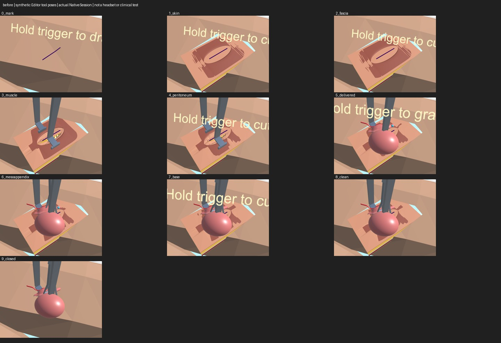
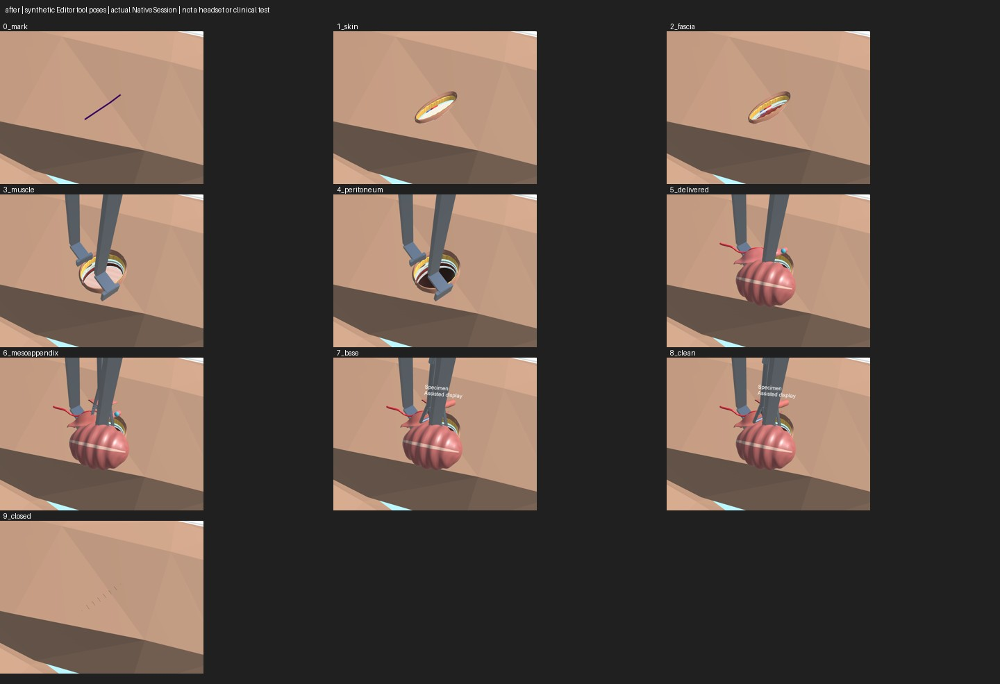

# Open Surgery Visual Audit — October 4, 2026

## Scope and Evidence

The actual `NativeSession` was driven through all ten open-appendectomy milestones using synthetic tracked tool poses, the registered wall volume, actual atlas assets and the production body-event path. Each stage was rendered from a learner-height view and a close view; additional captures show membrane tenting, clamps before division, divided mesentery before ties and the retained base tie before division. These are graphics-backed Editor images, not a physical Quest playthrough or clinical validation. No participant imagery was acquired.

The reference criteria and simulator research are in [Open Appendectomy Visual Acceptance](research/open-appendectomy-visuals.md). The original source comparison uses `0ff88d1` plus the focused `fbb6067` closure correction. The ten-stage fixture originated as completed unpublished work in the Shell worktree; it was adopted into main with additional action refreshes and sub-action captures. The fixture invokes the production trigger-hint update after parking tools: the old captured captions did not establish a physical headset obstruction.

## Audit and Changes

| Stage | Observed defect | Implemented change or remaining boundary |
| --- | --- | --- |
| 0. Mark | Intact skin and RLQ guide worked; ink later floated across the opened field. | Marker ink remains on intact skin and is concealed after incision. The measured marker center/direction drives the wound view. |
| 1. Incise skin/fat | Rectangular coupon, oversized shader aperture, yellow/skin floor without coherent local exposure. | A finite measured incision ellipse, two skin edges projected to the curved VR skin, and a lobular yellow fat appearance. Short strokes have shorter geometry. |
| 2. Open fascia | Almost identical to skin/fat. | Ordered pale fascia and red muscle exposure; authored fiber appearance uses the existing wound-local +X mechanical axis. A readable resting aperture is an art approximation. |
| 3. Split muscle | Coarse fractured slab and rigid-looking layer bands. | Semantic muscle lips respond to the accepted measured split width. Actual volume, contact and fracture evidence remain active but the raw coupon draw is suppressed. This is not exact fracture-mesh rendering. |
| 4. Tent/nick membrane | Whole-layer movement and room visible through the empty body. | Local tent centered on an accepted membrane grip, thin wet membrane surface and a bounded dark cavity lining after entry. The lining has no collider or anatomical identity; its120 mm depth is illustrative. Glistening illustrative bowel loops ring the opening under the membrane (centre left open so the caecum stays visible to grasp). |
| 5. Deliver appendix | Smooth schematic cecum obscured the base. | Render-only haustral/taenia cues within the original source envelope. The appendix is tinted inflamed (render-only property block; divided pieces keep it). The learner can now rotate the real grasped assembly with the Babcock wrist pose (bounded80° and45°/s). The base, colliders and deformation frames move with all four source parts; fixed-view exposure/contact evidence is recorded below. |
| 6. Mesoappendix | Clamp/cut/tie actions produced almost identical body pictures. | Accepted ties produce source-section ligatures; accepted measured divisions produce capped retained/distal source-mesh views. The divided mesoappendix shows a blood bead at its cut until `tiedBothSides`. |
| 7. Base/specimen | Original whole organ remained visible after removal. | Accepted division produces a retained stump and a20 mm-separated specimen, explicitly labeled assisted display. It is not an independently grabbable specimen; original contact geometry remains. |
| 8. Inspect/clean | Blood could disappear when interaction paused, and old marks were overwritten. | Cuts and stains persist for the attempt; pause preserves registered blood, loss of fit hides without clearing, recovery restores. Control stops flow and dries the cut; suction lowers cavity pool without erasing cumulative loss. Each first division adds blood pooled on the wound floor's dependent side; suction dwell clears it (from the body log). Completing a 1 s inspection dwell rings the stump or the vessel ties for 3 s (attempt clock), drawn over the caecum. |
| 9. Close | Open slab, organs and placed instruments protruded through closed skin. | Explicit assistant closure conceals the operative contents and adds a skin-projected seam and six interrupted sutures. Underlying fractured physics is not healed or reset. |

`OpenStepVisualsValidation` (in `OpenSurgeryBuild.Verify`) walks all ten milestones through the real interaction path and requires, per step, the visual absent before and present after, a changed learner render with tools hidden when a graphics device exists, the layered closing order, and a retry render identical to the untouched patient.

## Persistent Injury Contract

Elapsed time, tool reset (A), inspection, temporary tracking loss, hide/show and rebinding the same Body identity cannot heal wounds or clear stains. Accepted hemostatic control changes wetness and emission, not the stored cut. A genuinely new attempt clears injury presentation. Explicit assisted closure adds a seam rather than silently pretending no operation happened. Off-field injuries remain visible after closure.

The fixed64-segment/64-stain budgets preserve earlier marks when saturated. Nearby stains can still grow, but additional disconnected marks beyond the budget are not represented. This avoids apparent regeneration without claiming an unlimited decal backend. Off-field incision/drop/stain presentation applies to the virtual patient; AR retains the registered in-field wound and cavity pool and does not paint virtual wounds onto the real person's passthrough skin.

## Verification and Limits

The retained Resources material directly references the tissue shader. Appearance checks cover finite bounds/indices/tangents, ordered exposure, actual curved-collider skin projection, local tenting, dark closed cavity sightlines and caching. Actual imported organ checks retain mesh/collider identities, source envelopes, contact availability, body logs and transformed registration. Division tests require both clipped sides and caps at the measured station; rejected/unmeasured actions create no invented view. Closure checks require the actual nonempty mobile group, concealment, seam/suture geometry and unchanged source/contact poses. Persistence checks use real skin strokes and accepted control, a60-second simulation, hidden/restored display, overflow and real new-attempt reset. The existing wall coupling test additionally requires unchanged cut faces/topology across a pause.

Graphics-backed final renders passed wound appearance24,449, organ appearance4,810, accepted action appearance75, closure23, marking286 and the ten-stage production-consumer sequence90 checks. Persistence passed447 in that graphics run; the subsequent unified build passed448 after adding an actual `NativeWorkbench.ResetTools()` assertion. Real Editor Play Mode passed87 checks with actual Start/Update/buttons/PhysX and an isolated coach/local database; compositor, body frames and controller poses remain synthetic. A first Play Mode startup failed before the gate ran and the unchanged retry passed.

A final review found that the cavity pool honored its display callback only while paused. The added active-simulation regression failed against the old code, then passed397 blood checks with the callback applied to the valid simulation branch. The stored pool and cumulative loss stay unchanged across hidden/restored display. The first green run terminated in the Meta analytics native startup thread before executing the gate; an unchanged retry passed. These startup failures are retained as diagnostics, not reported as passed test runs.

The complete rendering sequence must also be inspected visually: terminal markers alone do not establish realism. Headset stereo appearance, aliasing, controller-driven operative completion, voice, physical AR fit and frame time remain physical acceptance work. The mannequin is still low polygon; the cecum is still a schematic source ellipsoid; mesenteric attachments, hollow lumen, free specimen dynamics and layered physical suturing remain approximations. The clinical content and material parameters have not received a qualified surgeon's review.

## Committed Render Evidence

[Capture provenance and regeneration](../experiments/open-surgery-visual-audit/README.md). Both grids are synthetic Editor views. The new cavity closes the background; later ties/divisions and seam are visible states, but the base remains obscured from the fixed patient-right camera. The smaller view does not demonstrate readable stereo detail.

## Source-Anatomy Follow-Up

A read-only atlas review found no separately labeled native cecum. The rounded inferior ascending-colon source region is a candidate for an authored replacement; a coherent update must keep the stable tissue ID and change source geometry, deformation and contact together. Attachment/longitudinal references need explicit authoring rather than a nearest-surface fallback in overlapping meshes. Comparing unchanged geometry from several learner angles and allowing authentic shared group orientation should precede declaring an anatomical placement error. The appendix lies on the dorsomedial cecal wall below the ileocecal valve, so some initial occlusion is plausible; the current simulation's limited exposure is the unresolved issue. [Surgeon-authored Webop anatomy](https://www.webop.de/en/general-and-visceral-surgery/colorectal-surgery/appendectomy-open/anatomy).

## Wrist Exposure, Surgical Lighting and Aim Follow-Up

The original positional-only grip left part of the base hidden. The production Babcock grasp now captures wrist orientation and rotates the four-part assembly, keeping the original source attachment and collider/deformation frames. Only this scene-authored group opts into80°; other groups retain positional behavior. Angular motion is bounded to45°/s, travel remains200mm and linear motion remains0.25m/s. Turning tissue earns no base clamp/tie progress. Tracking jumps release without immediately reacquiring a grasp in the same sample.

`OrganExposureValidation` uses the actual imported NativeSession anatomy and production Babcock/clamp/tie consumer, after explicitly synthetic prior wall-exposure events. From two fixed patient-right views, the chosen80° diagonal wrist pose exposes26/46 and27/46 actual3mm section samples, and27/46 and28/46 actual4mm samples, in both VR and a translated/rotated AR registration frame. The held material-point error is0.000mm in that fixture. Real clamp/tie actions measure those source stations. All47,713 assertions passed; deliberately restoring the positional-only consumer fails wrist convergence. These are Editor geometry/contact/render checks, not a wearer-controlled operation or anatomical calibration. The prior fixed-view images without wrist rotation remain historical evidence.

A wound-relative warm pixel spotlight and a cool vertex fill now illuminate the shared surgical field in both modes. The rig adds no shadow maps, cookies or reflection probes; it dims only the known workbench directional light while active and restores that light safely. Lost registration/compositor disables it.181 actual-scene gate/material checks passed, including active-device support for retained shaders. Quest GPU cost and stereo readability remain unmeasured.

The actual1578-triangle patient export has split face normals. Render-only60° smoothing now improves coincident-corner seams without moving positions, changing indices/UVs/bounds, or modifying the authored collision mesh.20 real-source assertions passed, including a×1000 source-unit oracle and finite tangents. Read/Write is enabled on that one importer; the runtime owns one render clone. This adds no polygons and does not repair a low-resolution silhouette.

The hand/controller laser remains visible on empty space and surfaces independently of the identity label. Known patient collision on Ignore Raycast is queried explicitly; it blocks intact skin and is skipped only inside the exact active shader aperture. The actual tissue wall remains an occluder.48 real imported-skin/underlying-organ tests passed, with closure/lost-fit/off-ellipse/depth/foreign-collider negatives; disabling the aperture predicate fails the laser endpoint assertion, and restoring it passes. Collision/render world-coordinate coverage matches4721/4721 in both directions within10µm (measured worst error0). XR samples and prior wall events are synthetic.

Higher polygon counts should target silhouette and deformation deficits in visible surgical structures. Broad subdivision would add Quest cost while leaving the schematic source anatomy and assisted division mechanics intact; normal/material/lighting fixes are a separate improvement, not an anatomical fidelity claim.

[Fixed-view before](../experiments/open-surgery-visual-audit/exposure-vr-before.png), [after wrist exposure](../experiments/open-surgery-visual-audit/exposure-vr-after.png), and [synthetic registered AR view](../experiments/open-surgery-visual-audit/exposure-ar-after.png). Capture provenance is in the experiment README.
