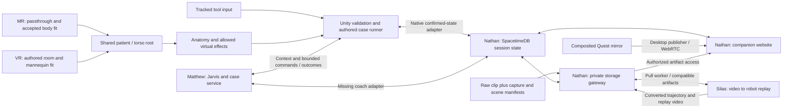

# System Integration Map

## Handoff Mode Contract Audit

Audited main `8454199` against the latest clarification and the active handoff producer. The shared field is `HandoffTicket.presentationMode` in `scalpal.handoff.v1`: `mixed_reality` or `virtual`. Theatre preflight controls recommendation/availability; `BindOfficeSource` preserves the mode and original scored attempt, `HandoffFlow.ChooseMode` records the learner choice, `NativePresentation.Awake` overrides the inspector default with the ticket, and `NativeCaseSession.Start` passes the resulting mode into the exercise/coach. Neither scored-source binding nor `CanChoose` forces VR. Explore/office remain full VR. [Exact mode and preflight contract](office-to-or-handoff.md#implementation-checkpoint).

Added ten startup/source/serialization regressions to the committed-scene mode validator, with the presentation initially set to the opposite mode. `verify_session.py --suite player` passed: mode230, registration111, Handoff215 plus the complete unified Editor gate. These are synthetic/reflected component checks, not new Play Mode or hardware evidence. Existing runtime already follows the clarified contract, so no runtime or scene default was changed; the installed Q2 APK below remains the runtime checkpoint. Physical fit and the controller-blocked launch still need operator testing.

## Latest Quest Integration Checkpoint — October 4, 2026, 12:42 AM EDT

Quest integration owner checkpoint Q2, review follow-up to Q1. Source **`e0891da`**, including contact `95d691d` and pairing `66c032e`; development ARM64 IL2CPP APK **`0.6.1-review` / Android code 12**, Unity 6000.0.66f2. The single player retains **Launch → DiagnosisOffice → NativeSession (AR or VR) → RunEnding**. APK **80,409,192 bytes**, SHA256 `8f190aa509c1867716ea94380e834386c0dd28b8fa601fc0d6666ae628db9ffa`; local artifact `../work/builds/scalpal-unified-0.6.1-review-e0891da.apk` (outside Git).

| Check | Result / actual evidence |
| --- | --- |
| Unified Editor gate | `verify_session.py --suite player` passed, and the build reran it successfully. Four-scene ordering and Shell/Office/native/Surgery/Handoff/Recap gates passed. No complete physical run inferred. |
| Imported buried-tip contact | 335 geometry/input assertions passed against all nine committed practice meshes, including the four strict-helper failures identified in the review. Independent ray-parity fixtures test inward/outward points, asset origin/count, transformed frames, BVH bounds, repeated-query cache and real artery deformation revision. Nearest-normal fallback remains approximate near holes/concavities; actual Quest initialization/query timing is unmeasured. |
| Pairing and timeout | Production bridge with deterministic cache/transport doubles passed 77/77. Stale-membership and timeout-order mutation controls fail. The native scene boundary gate passed 96 synthetic assertions, including generated-row and temporary-file pairing tests. No live rotated-invite headset test claimed. |
| Real Play Mode boundary | `verify_session.py --suite playmode` passed 86 checks with real Start/Update, reset/retry button callbacks, actual reset-frame tray pose, head/focus freeze/recovery, subscribed highlight polling and PhysX triggers in both OR modes. Throwaway local SpacetimeDB and isolated coach; tracking/body/compositor input is synthetic. |
| Android build/install | Unified build succeeded; `aapt` confirmed package `com.scalpal.nativeworkbench`, version/code and ARM64. `adb install -r` succeeded; before/after private configuration equality passed and existing loopback routes were restored. App data was preserved. |
| Physical startup | **Blocked at Quest's controllers-required launch dialog**, exit 2 in the 20-second app-scoped smoke. No Launch rendering/XR or later stage was established physically. Owner: operator/headset input; wear Quest, wake both controllers and accept the prompt. No participant acquisition or recording started. |

The review follow-up also fixes fake-null component creation, stale A/retry copy, and fast reach/scale recovery within tracking grace with trigger rearm. [Native session](native-session.md#quest-core-review-follow-up) records the source route and approximation limits. The pre-practice handoff mode API already preserves the same shared attempt, invalidates old AR registration and refuses switching during active/paused practice; its merged consumer and mode/handoff gates were inspected rather than replaced. The paused-practice “new attempt → VR” caller recovery remains the handoff owner's existing boundary described in that component document. Shared preop service restoration and its GUID remain preserved.

Physical body fit, held-tool feel/performance, spoken provider behavior, consented surgery video and actual robot replay remain separate acceptance checks. Generated Editor changes were backed up outside Git and restored; unrelated local files were preserved. This Q2 checkpoint supersedes Q1's APK/startup summary below without upgrading its physical evidence.

## Shared Preop Service Dependency Correction

Restoration `9fbfbbc` is present at audited main `075bb38`. `ScalpalPreopService.cs` retains GUID `7e5d1bd4423a946858e02b36d170c73e`; Shell's `HubController` and `ShellBuild` consume it on main and in all four active sibling worktrees (`scalpal-shell`, `scalpal-handoff`, `scalpal-surgery`, `scalpal-recap`). The earlier cleanup `5668231` missed the then-unpublished Shell dependency. Preserve this service. Before future shared-code removal, search both symbols and Unity GUID references across those working trees, not just committed main or scene bindings; defer removal when the reference check is incomplete. This correction was verified by source/reference inspection; no new Unity or hardware test was run for this documentation change. The Q1 build evidence below remains unchanged.

## Latest Quest Integration Checkpoint — October 4, 2026, 12:23 AM EDT

Quest integration owner checkpoint Q1. Source `b1d57c1`; Unity6000.0.66f2; development ARM64 IL2CPP APK **`0.6.0-flow` / Android code11**. The single player contains **Launch → DiagnosisOffice → NativeSession (AR or VR) → RunEnding**. APK80,398,944 bytes; SHA256 `8e4d5f2aa01711d51d7404c8fc95cb4cb3523ac2e3b7e153b161f43be2af7e69`. Local artifact: `../work/builds/scalpal-unified-0.6.0-flow-b1d57c1.apk` (outside Git). No raw footage, private session configuration or device logs are committed.

| Check | Result / actual evidence |
| --- | --- |
| Full player compile/Editor gate | Passed `verify_session.py --suite player`, and again inside the unified Android build. Office425 + route52; Shell225 + input25; native registration111/mode220/wall10,696; Surgery367 interaction/fluid/delivery; recap47/integration56 plus grade/video/review checks; handoff215 plus lifecycle60/source-binding36. Synthetic poses/fixtures and isolated HTTP are explicitly component evidence. |
| Real Play Mode boundaries | Native73 (both AR/VR, lifecycle/buttons/PhysX, throwaway local DB/isolated coach); Office73 (actual scene transition, shared same attempt, canonical handoff, wrong-plan and Time-Out risk review); Shell22 (actual Start/Explore/office/back controls and isolated HTTP, realtime disabled). Tracking/card inputs are synthetic; no provider voice or complete open-body run claimed. |
| Coach and smoke tooling | Production C#/isolated-Hono coach173 checks passed. Stage-aware USB smoke10 Python regressions passed, including stale telemetry, wrong scenes, faults and tracking loss. OR keeps its stricter floor/alignment gate. |
| Android package/install | Build succeeded; `aapt` confirms package `com.scalpal.nativeworkbench`, version/code and arm64-v8a. `adb install -r` succeeded. Private configuration equality checked before/after; existing data preserved and local USB service forwards restored. |
| Physical headset smoke | **Blocked at Quest's controllers-required launch dialog.** No running app process was observed in the20-second smoke window; scene rendering/XR readiness and Explore → Office → OR → Recap were not established physically. Owner: headset/operator input; wear headset, wake both controllers and accept the OS prompt. No participant acquisition or recording was started. |

Build-owner fixes in this checkpoint: `ScalpalPlayerBuild.Verify` now runs the omitted full Surgery and Recap/Handoff gates and returns to the committed startup scene before packaging. `verify_session.py --suite player` exposes that repeatable gate. Android-only read-only `QuestFlowTelemetry` reports current allowlisted scene and XR/head/focus; the USB helper no longer misclassifies a healthy Shell/Office/Recap as missing OR status. These additions never advance scenes, manufacture case results or enable capture.

Remaining owner boundaries: **Surgery/content** still needs accepted-wall-geometry consumer hookup and broader procedure coverage (handoff currently admits open/laparoscopic appendectomy; other procedures show “Surgery coming soon”). **Office/Jarvis** owns live patient/attending provider and audio acceptance. **Capture/robot/Recap** own a consented actual hand clip during full VR, successful worker/replay and headset decoding; labeled synthetic fallback is not learner replay. **Quest integration** owns minimal blocking merge/compile fixes, packaging/install and actual smoke evidence; AR body fit and tissue performance also need hardware checks.

Recurring checkpoint is active hourly through noon Eastern October4 (16:00 UTC), with additional checkpoints after observed major teammate pushes. Work directly on main, never force-push, and preserve private app/demo data. Run the unified Editor gate, affected boundary checks, then `Scalpal.Handoff.Editor.ScalpalPlayerBuild.Build` with an absolute `SCALPAL_QUEST_APK` and isolated `GRADLE_USER_HOME`. Component fixture logs and Editor-generated backups are outside Git; unrelated preexisting local files were preserved. This heading supersedes older build/flow summaries below; history remains for source-specific evidence.

Audited October 3, 2026. This is the starting point for understanding the actual repository, routing, and work remaining to assemble one surgery environment. Read [current direction](current-direction.md) for product scope and [integration contracts](integration-contracts.md) for boundary requirements. A component working on its own is not a working session.

## Diagnosis Office Component

The native office is a core stage of the latest full-VR flow. Its component milestone (`1666376`, documentation through `f1b43e9`) started at stable tissue `0145544`, with main `fc69836`. Matthew's initial encounter dependency was pinned at `dda34d9` (interview `1ed5f76`, patient tools `94b399e`, cleaned summary `00926a9`, browser flow `988d825`, realtime producer `f61b1ce`, three-identity helper `ff93cac`, exact coach membership binding `dda34d9`). Audit inspected Matthew `e409c22` (additive browser webcam/body-map work; encounter/realtime contracts unchanged), Nathan `0d28d43` (documentation-only versus merged `aa182cd`), and Silas `a901a50` (unchanged). The office subsequently merged consolidated main `3203b29` and current main `f9c7513`, including Unity encounter bindings at `83b81b5`. Work now ships directly to main. New art/runtime live in `assets/environments/doctor-office/` and `Assets/Scalpal/EncounterOffice/`; the NativeSession, tissue solver, registration and scored tool route are preserved.

`NativeEncounterSession` → `POST /encounters` → one service `EncounterSession`; patient `answer`/`examine`/`order_test` return authored or chart facts and actual gathered findings. Priya (40, female) and Jonah (30, male) use their exact fictional synthetic subjects. Source/demographic guards refuse real or mismatched records. `POST /encounters/:id/attending` changes role; summary uses only gathered facts; `record_assessment` records the learner's diagnosis/differential/plan/timing and returns the authored score. Unasked answer-key facts are excluded from the attending prompt. Unknown examinations remain unavailable. Phase gates freeze scored evidence. No Unity scoring engine is added.

`QuestJarvisVoice` verifies encounter/patient/phase identity, selects the existing patient agent through `/jarvis/connection?agent=patient` and Jarvis through the default endpoint, and routes encounter tools to the office handler. The existing six surgical tools retain their coach endpoint. Native world-space panels expose question/exam/test selection, gathered results, editable assessment and attending feedback when provider credentials are unavailable. The service's additive `display` text keeps provider instructions out of learner UI while retaining provider `result`. The optional existing `RealtimeBridge` mirrors actions/results into its explicitly joined shared session; the office native client itself does not start a separate Spacetime scorer or spectator media producer.

See [diagnosis office](diagnosis-office.md) for scene/build instructions, art provenance, verification and remaining physical/provider dependencies. Backend evidence on consolidated main `3203b29` includes 169 preop tests (two provider tests skipped), type/catalog checks and 30 actual loopback HTTP → production coach bridge → pinned SpacetimeDB 2.10.2 subscription checks on an isolated disposable database. The final native office gate passed 227 assertions, with actual coroutine/HTTP exchanges, imported donor skinning/textures, text bounds and character/UI clearance, and repeated successfully after syncing main `f9c7513`. Synthetic tests do not establish headset or spoken provider behavior.

## Current Abdominal Tissue Route

Focused implementation snapshot `1a01fab` is stacked on AR snapshot `9215799`, with main `fc69836`. Final fetch found main `fc69836`, Nathan `aa182cd` and Silas `a901a50` unchanged; Matthew advanced to `94b399e` through `1ed5f76`. The new patient-interview/attending routes are additive, the default `/jarvis/connection` still returns Jarvis, and existing anatomy/procedure catalogs and surgical coach event contracts did not change. Patient/attending tools are not routed by the native headset client; that separate encounter flow is not merged or claimed by this tissue milestone. Producer/consumer audit traces `NativeCaseSession` → `NativeProcedureInput.InteractionReady` → `NativeTissueSimulation` → private mesh + existing `MeshCollider` on `appendix`, `mesoappendix` and `appendicular_artery`. The original scored contact path, case IDs/content version, coach and realtime payloads/ports are unchanged. Three targets total 2,916 display triangles; local fixed-step cages provide grasp feedback without a new case outcome.

The bounded render-only overview expands to 81 parts / 120,125 triangles with source-frame abdominal exterior/wall/pelvis/spine/vessel references. `AnatomyLayerView` is local preview presentation; X cycles layers during selection, and still identifies during practice. Added references never get scored colliders or silently expand the authored exercise. Runtime material copies/collider updates, invalid-gate reset, retry, hiding and tool-release paths are checked. Surface commits and MeshCollider recooking are capped at 30 Hz; actual Quest cost/feel remain unverified.

The repeatable Unity gate passed: bridge33, body76, instruments160, native input24, tissue5,739 assertions including actual imported geometry and layer inspection, authored appendectomy75, attempt72, coach68. The tissue assertion count includes per-vertex source preservation checks and is not a count of distinct behavioral scenarios. These are Editor/transport-fixture evidence, not physical playthrough or live voice/video validation. See [tissue simulation](tissue-simulation.md) for presets, geometry gaps, primary sources and hardware evidence. Android ARM64 IL2CPP development build `0.4.0-tissue` / code8 succeeded and the 63.47 MiB APK installed over USB. Launch smoke stopped at Quest's controllers-required dialog; no new XR readiness, layer visuals, grasp feel or frame-time result is claimed. Local coach/gateway/pose health returned200 and the existing private USB configuration/routes were restored without starting capture.

## Current AR / Body Registration Route

This focused milestone builds on main `fc69836`; fetch audit found main/Nathan/Silas unchanged and Matthew `409e6a3` adds only the previously reviewed HTTP documentation correction. The existing producer/consumer modes already accept `mixed_reality` and `virtual`; no teammate contract is redefined. Default native mode is now AR, with exact coach pairing to its chosen mode and a fresh attempt on mode change. The shared backend still receives only coarse state and authored events, not participant images or landmarks. The first-use permission lifecycle now keeps camera/depth off until both grants and XR readiness return; a permission-dialog pause preserves the pending opt-in, while active suspension, denial, mode change and disable cancel it.

`NativeBodyRegistration` acquires opt-in Meta MRUK 85 images and cached intrinsics/extrinsics/pose, uses USB-reversed local 8790 → `services/registration` → `scalpal.body_pose.v1` image points, then fits the generic atlas against a cached native environment-raycast surface grid. Four markers and the 42-part render-only overview appear after automatic stable acquisition; no controller-plane points are needed. One current automatically acquired-fit gate controls practice anatomy/ports, native contacts, coach tracking, shared registration state and resume commands. Full VR restores the authored mannequin fit; the same nine-part case engine remains the scorer. Participant/video capture, the gateway upload/worker and companion WebRTC receive no frames from this local inference path. [Exact body-fit contract and limitations](body-registration.md).

Evidence: the earlier installed `0.2.1-main` now passes actual USB tracked-head/floor/focus launch smoke and is visibly paired in the Quest mirror. Full wearer case/recap/retry and provider voice remain unverified. The permission-lifecycle revision passed 76 synthetic surface/projection/automatic-gate/permission checks and 33 registration-service tests including actual blank-JPEG CPU/loopback HTTP; the preceding atlas revision separately passed 37 imported anatomy-axis checks. `0.3.2-auto-body` (code 7) built/installed with camera/spatial permissions; actual app-scoped XR/head/floor/focus launch smoke passed, with controllers untracked and acquisition off. Physical automatic fit remains unverified. Existing Unity instrument 160/input 24/playthrough 75/attempt 72/coach 68 checks passed. These results are component evidence, not a physical body overlay or native camera test.

## Audited Sources

These are source snapshots, not deployment claims. Refresh this table and the affected routes after fetching changes before a shipping milestone. Branch names can move; the commit links preserve the audit evidence.

| Component / owner | Snapshot | Actual contents and limits |
| --- | --- | --- |
| Native AR/body fit / Stephen | [`0d0f4f7`](https://github.com/stephenhungg/scalpal/tree/0d0f4f7) | Passthrough scene, 42-part render-only overview, local MediaPipe image inference and cached native live-depth grid. Three stable observations automatically fit anatomy without controller-plane points. Permission-dialog opt-in survives pause with sources off until grants/XR ready. Source/editor/build checks passed; `0.3.2-auto-body` installed and actual XR/head/floor/focus launch smoke passed. Controllers were untracked; participant automatic fit remains unverified. |
| Native workbench / Stephen | [`a895dab`](https://github.com/stephenhungg/scalpal/tree/a895dab7e35d3be00b2f9fefad35f9f82be75c0f) | Openable Unity 6000.0.66f2 project, 15 tool prefabs/runtime, instrument sandbox, static operating-room/patient preview, reconstructable camera experiment. Android OpenXR native workbench with head/controllers, room art and patch validity/reset gates. Held-tool interpolation disabled and poses refreshed before rendering after user-reported lag; user confirmed held motion keeps up after correction. No complete surgery bootstrap, organs, body registration or network adapter. |
| Jarvis / Matthew | Merged [`64edc9e`](https://github.com/stephenhungg/scalpal/tree/64edc9e) | Preop/case/coach, shared six-tool implementation, polled alerts and stable context key. Native transport now calls shared tool routes and sends context on meaningful changes. Preserve integrated rejection/idempotency guards; alert/reflex pacing remains a native adapter gap. |
| Anatomy / Matthew lane | [`6057689`](https://github.com/stephenhungg/scalpal/tree/6057689cfa7bb6968b1a572d4598d47bd3e68e9e) | Anatomy source/export/build/preview assets, supplemental targets, case/input binding and guarded coach synchronization; appendectomy-first desktop harness. Asset source frames and licenses differ; no measured Quest performance or patient fit. |
| Companion / Nathan | Merged [`aa182cd`](https://github.com/stephenhungg/scalpal/tree/aa182cd) | Spacetime module, observer, private gateway/worker protocol, generated bindings, R2 helper and deployment config. Preserve integrated retry/attempt ownership fixes. Imported owner deployment reports do not prove this consolidated code is deployed remotely. |
| Motion / Silas | Merged [`a901a50`](https://github.com/stephenhungg/scalpal/tree/a901a50) | Video decode, right/left-hand inference/retargeting, licensed Shadow meshes, kinematic MuJoCo replay, local processor and pull-based gateway worker. Compatible four-artifact/trajectory conversion is implemented. Actual Quest-clip accuracy remains unverified. |

The enabled build scene is now `Assets/Scalpal/Quest/Scenes/NativeSession.unity`. It reuses the Android OpenXR rig, adds a limited nine-part appendectomy atlas, and connects one native case/coach/realtime/voice coordinator. The original workbench and art previews remain available. Built-in rendering is preserved; teammate URP assumptions were adapted instead of changing the working headset renderer.

## Current Assembled Slice

Main consolidates the native integration, anatomy `6057689`, Jarvis `64edc9e`, Nathan `aa182cd` and Silas `a901a50` histories. Overlaps retain newer native bindings, built-in rendering and backend retry/ownership fixes. Full anatomy FBXs/originals/Blender sources are included and LFS checked; the headset scene still references its nine-part subset. Legacy alternate case/contact directors are source components, not additional active scorers. See [native session](native-session.md) for exact bindings and physical limits.

`NativeCaseSession` requests a reviewed synthetic appendectomy and a fresh explicit matching coach session. `AnatomyExerciseBinding`/`CaseRunner` is the local progression authority. `NativeProcedureInput` reuses the existing tip contact and validates held/tracked/activated tools, selected anatomy ownership, actual tip overlap and authored port instrument rules. There is one scored event route and one coach command handler; branch `CaseDirector`/extra contact scorers are not installed.

`QuestSessionBridge` uses actual invitations/views/reducer acknowledgements and freezes attempt ownership. External replacement abandons the old runner. `QuestJarvisVoice` implements signed connection and PCM transport; explicit Y enables microphone. Its six known tools use `POST /coach/sessions/:sid/tools/:name` with complete JSON parameters. Only unknown tools reach the root fallback. Prior documentation incorrectly inferred that all tools were unavailable from that fallback. The existing agent's provider credentials and spoken voice remain unverified. Conversational selection remains absent from this controller-selected case.

Shared tool/context-key adapters are now implemented. Fifty Unity checks ran actual native tool/HTTP coroutines against isolated recorded-fixture Hono: all six tools, raw parameters, acknowledged/pending highlights, HTTP errors and stale connection generations. No WSS, microphone or provider executed. Polled alerts/reflex pacing and configurable patient selection remain separate work. Keep the synthetic patient until real-record consent/review is deliberately integrated.

Motion frozen dependencies and 30 tests passed; one real-hand sample-video test skipped because its external clip is absent. The new gateway worker supplies four compatible artifacts, heartbeats and stale-run handling. Unsupported `configVersion` now fails before download/inference; `motion-v1` is the supported configuration. Effective hand/mirroring flags are worker-wide and recorded in quality reports, but are not encoded in per-job configuration identity. A prior 60-frame synthetic replay retained 50 valid/10 explicit gap frames and encoded H.264/yuv420p 640×480 at 30 FPS. Output-path traversal/symlink escapes and malformed jobs are rejected. Download size limits and capture-manifest processing remain absent; no real Quest reconstruction has run.

Failure-path checks now reject stale/unknown coach-step events before scoring and retain that rejection across lost responses. The first terminal coach command outcome is immutable. A fresh shared attempt clears selected/highlighted anatomy, step totals, preview and old registration; authored events must belong to the active session and current attempt. These fixes do not add general durable event IDs to Nathan's event reducer or change the existing worker/capture limitations.

The local preop, Spacetime, gateway and companion processes run on ports 8787, 3000, 8788 and 5173 respectively. The gateway is registered with the local module; invitations/tokens remain outside Git. Backend integration passed 23 actual local-server tests and preop passed 140 tests, with two provider-live tests skipped. Synthetic Unity tests exercised the actual appendectomy geometry through ten steps/thirteen deliberate actions and checked attempt replacement/retry boundaries. The consolidated `0.2.1-main` APK built and installed over USB; launch is blocked by the Quest controllers-required prompt. The actual shared observer still reports no connected headset. Compilation and editor poses do not establish a physical complete-session pass.

Native passthrough and automatic generic surface body registration are implemented in the focused AR revision but physically unverified. Native video/WebRTC production remains absent. The motion gateway worker is now implemented; its current-source actual gateway evidence is recorded below. The companion's state view is connected through the native adapter; its live-video surface has no native producer. Those routes below remain required. Earlier branch-only observations describe their inspected sources, not an additional runtime installed into this scene.

## Intended Connected Routes

This diagram is the target assembly. Missing adapters are listed below; it is not evidence these edges currently run.



Immediate rendering, registration, tool physics and input stay local. SpacetimeDB coordinates small confirmed state and commands. Video bytes travel through WebRTC or private storage, never a subscription table. The existing laptop mirror supplies spectator media; raw passthrough supplies the proposed motion input. Those sources have different contents.

## Explore → Office → OR Route

Target for the [latest experience flow](current-direction.md#latest-experience-flow). Status as of October 3, 2026; nothing below is an end-to-end result.

| Stage | Producer / consumer | Exists | Missing |
| --- | --- | --- | --- |
| Launch screen | `Shell/Scenes/Launch.unity` → `HubController` | Floral full-VR hub, one Start, live trigger/pinch hint and Editor Enter; first enabled build scene | Physical startup-time, tracking and comfort measurement |
| Explore page | Live `/patients` → `ScalpalPreopService` → matching `/brief`; local bundle fallback/metadata → `HubController` | Nine available fixture cards, server `encounterAvailable`, fixed-size text, bounded paging above twelve, retry cooldown, filters/detail and explicit Begin | Physical glass/readability/input/performance checks; live encounter service and office pairing requirements |
| Diagnosis office | Encounter engine (`/encounters`, tools, `/attending`, `/score`) → `Assets/Scalpal/EncounterOffice/` | Native floral office, CC0 patients, glass panels, keyboard and role-bound voice transport; 371 native checks pass. Priya/Jonah have breathing/head motion and actual audio-driven jaws, bundled exact-match authored greetings/history speech, hold-to-talk and optional open mic. `ShellTransition` now consumes the Explore-selected patient ID once and calls existing `StartPatient`. | Server availability now drives Shell Begin; current office accepts canonical subject IDs and owns shared-attempt creation. All authored patient presentations/speech need the office owner’s verification; retry/revoked subjects have no authored interview. Live provider and physical voice/controller/stereo checks remain pending. |
| Assessment → surgery | Scorecard → `HandoffRun` → re-fetched encounter/score/case → `NativeCaseSession` | One player carries patient, correct procedure, encounter, original score and structured risks; wrong-plan challenge/consequence, Theatre, six-row Time-Out and explicit coach voice gate. Pre-practice mode changes preserve attempt; practice changes request a new attempt while preserving diagnosis | Complete physical learner run, companion encounter/handoff mirroring, app-restart ticket recovery; server-side assessment revision remains absent |
| Operating room (AR or VR) | Theatre choice → `NativePresentation` + existing body registration + one CaseRunner | Handoff-driven patient/procedure/encounter; AR enabled/default only after green operator preflight, otherwise VR. Registration progress/confirmation/recovery and silent transitions. Coach `/sessions` now receives `encounterId`; caption-only local scorer can reconnect through the ordered event journal | Physical registration/stereo/voice/mode-switch verification; other surgery content explicitly shown as coming soon; native raw hand capture and replay still absent |
| Robot replay and recap | Raw passthrough capture → gateway → Silas worker → companion/headset playback | Gateway/worker replay and RunEnding panel; native completion/retry route and durable result contract in the review follow-up below | Native capture/upload/job producer is Editor-verified only (device camera, live reducer exchange unverified); unmeasured hints/path economy; automatic observer publication; physical clip/full-session run |

The operating room offers AR on a real reclining participant or full VR, so MediaPipe body registration is main-path for AR; see the body registration section below. Registration robustness gaps are listed in the audit (grace period on single bad frames, freshness window, stuck in-flight observation).

Shell implementation and exact handoff/pause limits: [Launch and Explore](shell.md). `ScalpalPreopService` and `Exercises/Data` now have an active hub consumer and must not be removed as dead code. The shell introduces no case/coach authority or shared attempt. Office files and the surgery scene remain owned by their existing lanes.

### Shell review follow-up audit

Reviewed main `440069f28dd10b77e1c9d3e3cd6b928dee154f70`, including the `23acfd1` list/DTO capability producer, actual preop route implementations, the current `NativeEncounterSession.StartPatient`, `EncounterOfficeRoute`, `EncounterOfficeRig.Ready`, shared build settings and the surgery prepare assignments. The old Shell two-ID and authored-ID sets are removed. Live list → matching live synthetic demo/sandbox brief → explicit Begin → immutable ID/endpoint → aligned office → existing StartPatient remains the route. Current StartPatient loads the authored case and, when its realtime bridge is bound, requires a paired shared session before creating the authoritative encounter. The Shell does not bypass that production gate.

The Shell component gate passed 168 assertions after the review fixes, including actual HTTP 429 handling, live recovery, capability flips, fixed text sizes and 25-patient paging. The current production `/case` returns a renderable HTTP200 retry state; the fixture also tests a controlled legacy429 response. A regenerated recorded-fixture bundle fixes the stale playable rate-limited patient and supplies the capability flags offline. No service/office/voice owner code is edited.

Integration owner: preserve one player's Launch → DiagnosisOffice → NativeSession order and all additional scenes; surgery prepare methods must merge that list or invoke `ShellBuild.EnsureSceneOrder()` after preparation. Both component APKs use the same package ID and replace one another. The exact build contract and physical limitations are in [Shell](shell.md). Shared attempt/office-to-OR behavior remains under its existing owner; the Shell adds no scoring or progression engine.

The review milestone was subsequently rebased onto `249f9ffcac74c9dd10527ada2e4603db31fcf523`, preserving the integration owner’s canonical theatre ticket and `Load(..., revealSeconds:)` API. The rebased Shell component gate passed 221 assertions, including all eight live encounter flags and scene-order preservation. The overlap also included the office owner’s availability/canonical-ID work; the duplicate ID sets are removed while the existing canonical ID validator remains shared. The unified `ScalpalPlayerBuild` now owns the combined player; standalone surgery preparation still needs to preserve that scene order. No handoff, native surgery, office or voice implementation was overwritten by this merge.

Final Shell sync includes `5cc8b85` and `c857fec7ed8b002fe63f98b460fe64ed7edc967d`: the integration owner preserved the scored office AR/VR choice and prevents redundant VR selection from reopening a scored attempt. The changed HandoffFlow/HandoffRun consumers and Shell boundary fixture were inspected; Shell entry/input/service behavior is unchanged. After the first merge, Unity passed 221 component assertions, 22 actual async-scene/HTTP Play Mode assertions, and 36 synthetic handoff/pause boundary assertions. The 36 boundary assertions also passed after `c857fec`. The HTTP fixture explicitly isolates realtime pairing; no shared-attempt, provider or physical complete-session result is implied. A reviewed ARM64 Shell APK built and its signature verified; its exact pre-later-OR source snapshot, size and hash are in [Shell](shell.md).

The final `91467b173939e5e3b2922974c66986220cf82fa6` service/catalog sync moved primary appendix patients to `open_appendectomy` and appended an advanced laparoscopic offline case. Shell now groups both procedures under Appendix and chooses bundle display metadata by the catalog primary procedure. The exporter was rerun to retain the owner’s new surgery fields and advanced case; no service or tissue implementation was modified. Unity passed 225 component assertions, refreshed previews and rebuilt the signed ARM64 component APK on this snapshot.

The recap/voice sync through `b6dbe965fe7a60679378a1b65903b985b623c7cd` was audited in HandoffFlow, HandoffRun, ScalpalPlayerBuild and build settings. `ShellBuild.EnsureSceneOrder` retains the owner’s newly required RunEnding after NativeSession and preserves all remaining enabled/disabled scene entries; its regression fixture uses disabled NativeWorkbench and enabled InstrumentSandbox as extras. Unity then passed all 225 Shell component assertions, 22 real HTTP/scene Play Mode assertions and 36 synthetic handoff boundary assertions on this merged source. This final source sync is newer than the recorded component APK. The final `4efe26fac58cf94967e18d97bb3fad2eb6350c60` sync only adds surgery evidence documentation.

### Shell source audit

Initial shell source was `1773fe7eb5718b190e4fe24935dad6b2d9df8be5`; the shipping integration rebased onto main `c05671ec71fea332f61aed4a6b61ebe896fa9572` (after the earlier `c33cacbe29036488d66c8eac63d45886336e118d` gate). Affected producer/consumer audit includes the eight service encounters at `3be2ac0a59a7e1bb78d390d5b015764533d5fd9a`, the native office/audio update `d291d0f`, Matthew vision `1f34298fa76610967972abfef0a9e397e554762c`, Nathan `0aff4f7d7caa347e1c4c0ca23dbeaa045a6b00d1` and Silas `a901a50f560b55d978a84155a429985d55552886`. Vision/realtime/robot lanes add no required consumer to this handoff. At that checkpoint the office rejected IDs other than Priya/Jonah; the review follow-up above supersedes that temporary Shell gate.

The final fetch also audited preop `6b6b7a01adf859f7f6454144cf1168ab63204617`, vision `68baaf6d25f9f18d5672b4d2f05ea1aafb6edee5`, and Silas `f5d71a2`. Merged service changes add character/clinical wording and structured score carryover; the list/brief/create-encounter route and native patient capability are unchanged. The updated office speech manifest is included without changing its owner code. The shell does not consume score carryover yet.

A subsequent shipping sync included main `2f64d5e` (open-body state/DTO additions `1965cb3`, instrument assets, and Jarvis detector changes). The regenerated packaged bundle was revalidated and previews rebuilt; the added procedure/body fields are additive to the shell DTO consumer, and no native office entry or patient ID changed. The shell still routes diagnosis rather than selecting an OR procedure.

Final source synchronization includes main `9fbfbbc6e683b2b073549b4ba50411810875b9a8`: legacy anatomy adapters were removed, the active preop service was retained, and native surgery/voice/realtime paths changed. Shell-owned runtime and the office `StartPatient` entry are unchanged; these later surgery changes are outside the recorded APK snapshot. The shell component gate passed all 134 assertions on this synchronized source (`/tmp/scalpal-shell-main-final.log`).

The exact route is HTTP list/bundle → matching brief → explicit Begin → one-shot `(patientId, serviceUrl)` → `DiagnosisOffice` initialized → existing `NativeEncounterSession.StartPatient` → authoritative `POST /encounters`. No new DTO, attempt, scorer, robot promise or scene-code voice action is introduced. Scene geometry is in Unity meters; the shell uses the existing floor XR origin and makes no camera-to-world/body/robot registration claim. Blocked, unknown, non-synthetic or stale chart state cannot begin; confirmed Back unloads the encounter and clears selection. Offline browsing cannot create an encounter.

Office-owner follow-up: verify presentation/speech across all server-advertised encounters, including admitted sandbox aliases. The existing StartPatient entry point needs no hook change. Add an explicit server-operation pause boundary if queued/in-flight encounter requests must stop rather than completing while UI/audio are paused. OR loading, same-attempt assessment carryover, capture and replay remain separate owner work. The shell preserves the newer OR AR/VR documentation without implementing either surgery handoff.

### Native theatre handoff

`Assets/Scalpal/Handoff/` owns the run ticket, state/card controller, reused office glass/Inter resource prefab, editor validation and unified builder. `NativeCaseSession` uses ticket IDs only when a ticket exists; legacy standalone component behavior remains available. Scene-loaded presentation is applied before the OR starts. The identity gate re-fetches scored encounter, score and case before enabling Time-Out or shared attempt work; no adapter infers a correct procedure from learner prose. See [built behavior and remaining interfaces](office-to-or-handoff.md#implementation-checkpoint).

The final source also includes `d35d10d` / `e5ccb10` (expanded authored patient eligibility and office Play Mode fixture), audited before adapting that fixture to the canonical route. The earlier integration includes `824068b` (office routing `6fff0ef`/`ca566d2`, native optional-body fix `016d64a`, instrument gate correction `91da21c`, recap component `effd9fb`/`4b3885a`, service tracker `fce97a8`): the live Shell selection/pause route, `RetryRequested` input split, native voice hardening, timestamp-correlated realtime attempt acknowledgement and additive open-body coach payload were inspected. The handoff keeps ownership of surgery retries and copies mutable body evidence in its recovery journal. The native producer/consumer audit includes main `212c420`, office checkpoint `35bd49d`, and Jarvis content revisions `072feca` / `2251e02` fetched through `a7ada33`. Matthew's `1e309cb` subsequently made the coach prose consume these same `carryoverItems`; the fetched native DTO now retains the server's object-valued critical findings and score sections as well. The office `QuestJarvisVoice` public API was consumed without editing its implementation. Source paths, score fields, session POST body, scene bindings, native registration gate and retry route were compared directly; branch names are not treated as fixed snapshots. Unity passed 215 handoff + 33 recovery + 36 Shell boundary + 36 source-binding checks, 425 office + 52 office-route checks, 181 Shell checks and full native session verification. Preop passed 257 tests with two provider skips and typecheck. The combined Android APK and three mono card previews built/rendered; no physical complete-session or provider claim is made.

The office producer’s `TryPrepareHandoff` validates its captured shared IDs and scored encounter row before transferring a cloned snapshot. The first OR entry adopts that same attempt; `sourceOffice` remains immutable across later surgery retries while the current ticket attempt changes. The final synchronization also retains MR registration/brief-occlusion work `a2cc392` and audit `b67a655`: ticket-selected mode still overrides scene defaults before OR initialization, and the registration producer remains owned by that lane. The canonical AR/VR ticket supersedes the older direct office-to-VR shortcut, including the conflicting source-based VR restriction in `c3fa51b`. This handoff task explicitly requires AR when preflight is green; both office and OR still share the same scored source. Legacy route helpers remain for standalone compatibility, but the office Continue button goes through the canonical cards. The canonical office Play Mode gate now passed 70 checks against actual local HTTP and committed SpacetimeDB rows, including wrong-plan cards, Time-Out POST and one unchanged office attempt through coach/scoring. Inputs were synthetic and voice transport was fixture-disabled; this does not establish physical AR, live provider or complete surgery/replay evidence. The in-memory ticket holds the confirmed shared session/attempt IDs; `QuestSessionBridge.PublishSnapshot` continues publishing existing coarse lifecycle state. Presentation and lifecycle remain separate internally. No generated reducer bindings were edited, and a new `handoff` realtime phase or companion override UI is **not** claimed. Shell `Launch` is now the first scene in the combined Android build. Its global pause is observed by the handoff controller: coach/scoring stop and a deliberate fit/resume gate follows.

### Structured office carryover

The handoff service change was audited against main `35bd49d` (including the merged `814e551` producers), after fetching the office/Jarvis and companion branch refs. `GET /encounters/:id/score` now adds patient identity, procedure site, urgency and `carryoverItems`. Each item links a real chart flag to authored case considerations and explicit office history/test evidence. `found` means that evidence was covered, not that the risk was resolved; `missed` means it was not covered; age-only flags are `chart_only`. Existing deterministic scores and prose `carryover()` are unchanged.

The real fixture HTTP regression follows a wrong procedure through scoring, fetches the correct procedure and structured risks, and creates a matching virtual coach with `encounterId`; its prompt includes the office carryover. The current coach route accepts an unrelated encounter ID but excludes its context, so the native handoff must perform its explicit scored/patient/procedure verification before creating the coach. After the latest merge, preop passed **257 tests (2 provider skips)** and `npm run typecheck`. This is local HTTP/component evidence, not provider or headset evidence.

## Where the Current Code Routes

### Case selection, practice and Jarvis

Matthew's [`services/preop`](https://github.com/stephenhungg/scalpal/tree/68576cc0f92190d461c2fee995c5022da9f9b3f7/services/preop) defaults to port **8787**. `GET /patients`, `GET /patients/:id/case` and `POST /patients/:id/preop-check` supply authored cases and synthetic FinchNode chart context. `/unity/bundle` supplies the Unity-safe offline bundle. Returned `actions` route through `ScalpalPreopService.Dispatch`; the bundle fallback is not a fallback for cloud voice or shared-state connectivity.

The laptop `/jarvis` page creates `POST /coach/sessions` with `patientId` and presentation `mode` (`mixed_reality` or `virtual`). Coach snapshots and tracking-loss speech now distinguish those modes; this does not switch the Unity scene. `CoachRelay` currently adopts the newest matching session through `GET /coach/current?patientId=...`, posts batches to `/coach/sessions/:sid/events`, polls `/commands`, and posts `/commands/:cid/ack`. The browser receives `/coach/sessions/:sid/stream` SSE and obtains ElevenLabs connection details through `/jarvis/connection`. The coach sessions live in a service-local `Map`, not SpacetimeDB. Latest voice work uses deterministic pre-rendered next-step callouts alongside reflex warnings and reports appendectomy text rehearsals; that is not a headset scene rehearsal.

[`CaseDirector`](https://github.com/stephenhungg/scalpal/blob/68576cc0f92190d461c2fee995c5022da9f9b3f7/apps/quest/Assets/Scalpal/Experience/CaseDirector.cs) creates a local `CaseRunner`, consumes scene/UI events, and forwards those events to the coach's separate server engine. The coach snapshot has a `version`; the Unity relay’s input batch still has no event ID, attempt ID or expected version. The server now accepts optional `eventId` and `stepId`, deduplicates remembered IDs and attempts forward reconciliation to the reported headset step. The existing relay does not populate those fields. These remain two engines that can diverge after loss/retry or laptop simulation, not one confirmed authoritative shared attempt.

`AnatomyCoachBinding` applies only `highlight` and `clear_highlight`, then acknowledges the result. The broader preview/rotate/isolate/confirm/pause commands in Nathan's allowlist are not automatically implemented by this binding. The Jarvis demo page's **auto-apply highlight** checkbox is checked by default; disable it for real Unity integration so a browser cannot report a scene effect it did not perform.

On the Jarvis branch, relay gaps include `pending.Clear()` before HTTP success, command IDs marked seen before a reliable acknowledgement, and initial tracking defaulting true. The newer anatomy branch changes that relay; see the alternative slice below. Reconnect/retry needs a deduplicated event outbox, retryable acknowledgements and an explicit initial validity snapshot. Match an explicitly paired session/attempt; newest-patient adoption is only a single-room prototype shortcut.

### Newer anatomy/case integration slice

The anatomy branch's latest [integration guide](https://github.com/stephenhungg/scalpal/blob/6057689cfa7bb6968b1a572d4598d47bd3e68e9e/docs/anatomy-integration.md) adds `AnatomyCaseSource` → `AnatomyExerciseBinding` → local `CaseRunner` → updated `CoachRelay`. It prepares appendectomy first (`lap_appendectomy`, adult `patient-demo-multi-source`), validates required target/collider and step-graph bindings, excludes preview from scoring and stops the old attempt on loading/failure. This is a more guarded alternative to the Jarvis branch's `CaseDirector`, not another runner to enable alongside it.

The anatomy relay explicitly publishes initial tracking, validates an untouched matching patient/procedure/initial step, isolates outstanding requests/commands by session generation and pauses synchronization after delivery failure. It still forwards events to a separate coach engine and needs fresh-session recovery; durable retry/idempotency, concurrent-writer ownership and SpacetimeDB routing remain unimplemented. Import the selected relay version deliberately rather than overwriting its fixes with the older Jarvis copy.

Jarvis receipt work (`8616c0c`, retained in `68576cc`) separates receipt `accepted` (well formed/received) from `applied` (reached scoring), adds snapshot `eventCount` and allows well-formed noncatalog IDs as off-target events. The anatomy relay still requires `snapshot.version == 0`, although hints/highlights/timers can advance that version before any exercise input. Align adoption with zero exercise inputs plus initial step/completed count, and check case/content/presentation identity. Its DTO currently ignores `applied`; receipt success alone must not be treated as equal local/server progression. The local binding also rejects noncase contacts while the server now accepts them as off-target attempts; agree one feedback policy before wiring raw contacts. Server-side `receive` now exposes `headsetStepId`, `desynced` and `resyncCount`; forward reconciliation synthesizes expected events in its own engine. This does not replace an explicit confirmed-step exchange or an outbox/attempt contract. Event IDs remain optional and the remembered set is service-local and bounded.

`AnatomyInstrumentTip` defaults to contact-entry activation and checks the selected tool ID; it does not read `InstrumentBehaviour.Held`, tracking or trigger input. Native integration must disable `activateOnEntry` and bridge deliberate held/tracked activation into `ActivateContact`, with per-cycle debounce and raw focus kept separate. Do not stack it with the other two contact adapters. The new desktop generator uses simulated inputs/registration and still assumes a team's URP project; real Unity editor import, physics, native XR and patient alignment remain unvalidated by its test doubles.

### Tools and local scene effects

Main's [instrument runtime](instrument-runtime.md) owns pickup, tracked pose, activation and allowed effects. The native workbench now connects those inputs to floor-space head/controllers, while gating effects on XR/head/focus validity. It listens to `ActionApplied` only for local hardware telemetry and does not feed a case scorer. A resets tool and target root poses; before-render pose refresh changes presentation without replaying trigger events. The user reported lag in the first build; the user confirmed the corrected held tool keeps up with hand movement. All **15 tool IDs match Matthew's audited instrument catalog**. Prefabs use `inst_<id>`; addressable anatomy uses `AnatomyPart.stableId` / `anat_<id>`. The latest anatomy manifest adds 11 supplemental targets and reports complete interactive/mistake target coverage for the three catalog procedures. These include schematic approximations; identifier coverage does not prove spatial fit or clinical correctness.

`InstrumentBehaviour.ActionApplied` reports an actual authored effect, with Unity-world position and a Unity monotonic timestamp. `InstrumentTipContact.TouchApplied` reports deliberate activated contact. Matthew's alternative `InstrumentTip` adds raw-contact focus and activated scored touches. Pick one scored-contact path; never count both it and `TouchApplied` for the same action. A contact, a visual effect and an accepted step transition are distinct signals; map only the event the exercise rubric expects.

Matthew's current port placement occurs on trigger entry, before the held/activated check. `CaseDirector` gates operation phase and anatomy visibility, but does not check the entering tool against the port's permitted instrument IDs. Its anatomy reference is optional, so a missing reference bypasses the registration check. Before composing a real practice scene, require the practice controller reference, held/tracked permitted-tool placement, `forceActivated=false`, and a non-preview anatomy controller. Desktop autoplay and browser simulation must be excluded from a live scored attempt.

### Realtime, live observer and storage

Nathan's [`services/realtime`](https://github.com/stephenhungg/scalpal/tree/f57692486e48ebea3d76a3c8bf141bf5f0c00204/services/realtime) has private backing tables, identity/role checks and session-member views. Headset clients publish confirmed exercise state/results; coach/operator requests become command rows with `commandId` and `expectedStepVersion`, then a headset resolves them. Generated C# bindings exist, but no Unity connection/publisher or Matthew bridge consumes them yet.

The companion routes are `/`, `/join/:code`, `/s/:id` and `/s/:id/simulate`. The last is a browser headset substitute. The home form defaults to `lap_appendectomy` @ `0.1.0`, the exercise Unity starts, so a companion-started retry (empty exercise, falling back to the session's) keeps headset practice enabled. Under the new flow the exercise should come from the chosen patient. The realtime field `mode` means lifecycle phase; it lacks a separate MR/full-VR presentation field. Matthew's coach `mode` means presentation instead; map these explicitly rather than copying the same field name.

The desktop publisher uses `getDisplayMedia` to share an explicitly selected mirror window, with audio off, one WebRTC peer per viewer and private signaling rows. Same-network browser test evidence does not establish actual Quest-mirror capture, cross-network TURN or measured headset-to-observer delay.

Nathan's [`services/api`](https://github.com/stephenhungg/scalpal/tree/f57692486e48ebea3d76a3c8bf141bf5f0c00204/services/api) also defaults to port **8787**, conflicting with Matthew's service. Proposed local layout: keep Matthew on 8787, set Nathan's `PORT=8788` and `PUBLIC_BASE_URL=http://<reachable-host>:8788`, with companion 5173, SpacetimeDB 3000 and Silas local processor 8765. This is a configuration recommendation, not a running deployment. On Quest, `localhost` is the headset; use the reachable Mac address or configured USB forwarding. Recheck browser origins, HTTP policy and signed URLs when changing ports.

Storage is local private files or configured S3/R2. Nathan’s `setup-r2.ts` adds bucket reachability/CORS setup and a Node presigned PUT/read/head/hash/delete round trip. CORS setup errors are caught before that round trip continues, so a successful script run alone does not prove browser CORS or the authorized session-upload path. This audit did not run it. Upload goes `requestUpload` → signed PUT grant → upload → `markUploaded` → gateway existence/size and optional hash verification → available/failed. A browser file labeled `raw_clip` does not prove camera provenance. `capture_manifest` and `scene_timeline` kinds exist, but their contents are not validated; no native clip recorder is connected. Large artifacts may be marked available without SHA256 verification. Deletion exists; automatic retention is not established.

### Motion jobs and replay

Nathan's [worker proposal](https://github.com/stephenhungg/scalpal/blob/f57692486e48ebea3d76a3c8bf141bf5f0c00204/packages/contracts/worker-api.md) uses authenticated **pull**: `POST /v1/worker/claim`, then `/v1/worker/jobs/:job/runs/:run/{heartbeat,outputs,complete,fail}`. Input arrives through signed reads; outputs need registration and signed uploads. Jobs deduplicate on attempt/input/config; retries increment the run generation. Its example worker produces synthetic targets.

Silas's [`services/motion`](https://github.com/stephenhungg/scalpal/tree/a901a50/services/motion) retains CLI `run`/`process` and local synchronous HTTP `POST /jobs` on 8765. The new `gateway-worker` uses Nathan's pull claim/heartbeat/output-upload/complete/fail endpoints. It decodes video, estimates one selected hand, retargets to 24 named Shadow-hand joint values (including two fixed wrist joints), and renders kinematic MuJoCo replay. Wrist world translation/orientation, robot contact/dynamics and autonomous learning are not supplied.

| Boundary | Current implementation | Remaining limit |
| --- | --- | --- |
| Job identity | Gateway job ID/run generation and signed input download | Only `motion-v1` accepted; hand/mirroring are worker-wide flags rather than persisted job options |
| Lease | Background heartbeat every lease/3; stale 409 abandons outcomes | Actual success/retry/long-running interruption evidence must remain separately identified |
| Trajectory | `scalpal.robot_trajectory.v1`, named joints, radians, `frames.t/q/valid` and invalid intervals | Schema compatibility does not prove reconstructed motion accuracy or validate every output on the gateway |
| Artifacts | `hand_estimates`, `robot_trajectory`, `replay_video`, `quality_report` | Worker ignores extra manifests; recap gateway now requires a matching capture-provenance manifest before known-source playback. The native producer is Editor-verified only; see [native hand capture](#native-hand-capture-producer). |
| Replay | Robot-only video for the companion plus compatible trajectory | Companion presents video/joint plots, not an interactive articulated 3D robot viewer |

The source `motion.json` keeps null `qpos` for invalid frames. The compatible trajectory holds a display pose with `valid:false`; this is not an observation. Silas uses decoded-video `t_ms`, image-normalized and hand-centered model coordinates, and radians for joints, not Quest world motion. Rendering labels tracking gaps; constant-average-FPS MP4 makes variable-frame-rate timing approximate. An actual local gateway/SpacetimeDB/worker exchange passed using a generated ten-frame blank clip on a fresh throwaway database: signed upload and hash verification → claim/inference → final no-hand failure on run 1 with zero outputs. A separately completed learning result stayed completed. This verifies the failure boundary; it does not substitute for a real-hand success clip. The worker default gateway is corrected to port 8788, avoiding the coach on 8787.

The schema fixture must stay synchronized with `packages/contracts/robot-trajectory.v1.schema.json`.

## One Cohesive Surgery Environment

Both presentations must instantiate the same validated scene assembly; these are required bindings, not existing bootstrap components:

| Shared binding | Requirement |
| --- | --- |
| Session / attempt | Explicit paired IDs, selected authored exercise/content version, step version, separate presentation mode |
| XR rig / tools | Actual native tracking origin and controller adapters; grip/tip anchors; tracking loss drops tools |
| Patient / torso | Stable patient root, calibrated anatomy offset, torso origin at skin umbilicus, meters, +Z toward head, +Y out of abdomen, +X participant left |
| Anatomy | Separate selection preview and practice controller; known stable IDs, validated highlight materials and interaction colliders |
| Registration | One validity signal reaches practice rendering, tool targets, contact dispatcher, case/UI scoring and coach/shared state |
| Case / coach | Exactly one accepted transition per action; Unity outcome acknowledgement; shared context reflects confirmed state |
| Capture / timeline | Explicit raw-versus-composited source, frame/clock mapping and applied virtual scene events tied to the same attempt |
| Reset / mode change | Release tools, stop actions, invalidate old fit, clear stale commands, restore target state and rebind before practice |

Full VR supplies an authored patient transform; MR supplies an accepted current real-person fit. Neither makes an arbitrary imported organ atlas automatically align. The static preview retains `AnatomyRoot_Unbound`; the new full-VR session replaces it with an explicitly authored limited atlas fit. Scale/frame conversion belongs in a validated anatomy-to-torso adapter, not duplicated per tool. VR tracking and scene validity still gate actions even without body CV. Keep the selection pedestal's preview bypass out of practice.

For the first integration, Unity remains the immediate simulation and authored-step authority, publishes its accepted state to SpacetimeDB, and Matthew's coach consumes that confirmed state for guidance. This is the proposed resolution of today's duplicate engines, requiring owner agreement and adapter work; do not add a third scorer in the gateway. A server scorer may instead be chosen deliberately, but then Unity needs an explicit prediction/reconciliation path and all clients use that choice consistently.

## Integration Work Before an End-to-End Claim

1. **Stephen + Matthew:** The native full-VR appendectomy scene is assembled. Complete the physical case/recap/retry and voice checks on Quest; validate MR body fit separately.
2. **Stephen + Nathan + Matthew:** The native publisher and single coach/voice transport are implemented. Verify a real headset action reaches the joined companion and a bounded command returns an actual applied/rejected outcome. Presentation mode is explicit in coach state; Nathan's lifecycle row still has no separate presentation field.
3. **Stephen + Nathan + Silas:** Capture one permitted raw clip with manifest/timeline; run the implemented gateway worker on that actual clip and show its verified outputs in the companion.
4. **Nathan / boundary owners:** Authored exercise events now enforce current-attempt/session ownership. Retry event IDs, same-attempt capture extras, authenticated worker ownership/strict lease expiry and output schema/finite values/units/limits before ready remain required. Local motion run IDs and job object shape now reject malformed input; keep download and effective configuration limits explicit.

The service checks are specific source findings, not evidence an exposed system is currently compromised. Keep prototype routes local until their actual intended deployment and access boundaries are tested.

## Shipping Checks

Every integration milestone names the audited commits, changed boundary, tested environment and remaining gap. Component tests do not substitute for these exchanges:

- Fresh-clone Unity import has stable GUIDs, no missing meshes/materials/scripts, required scene bindings and compatible packages. Check catalog/tool/anatomy IDs against the selected case, not filenames alone.
- One tracked activation creates one accepted event and one transition; repeated collider entry, event retry and reconnect cannot double count. Wrong-tool/port/contact is rejected. Missing references fail closed.
- Initial invalid fit, loss/recovery and a mode change hide misleading practice anatomy and block tool effects plus UI scoring. Preview visibility never authorizes practice.
- A real voice request applies or rejects in Unity; only that outcome is acknowledged. Observer and coach see the same attempt and confirmed version. Failed HTTP/ack retries recover; old session commands cannot affect a new attempt.
- Actual composited headset video is visible remotely with organs/tools; stream failure is distinct from state failure. Measure delay on the tested network rather than equating requested 30 FPS with end-to-end latency.
- One nonpersonal artifact proves upload/access verification first; then a permitted actual Quest clip runs through the real processor, compatible private outputs and browser replay. Failed/gapped video remains labeled; stale/expired/other-worker completion and cross-attempt metadata are rejected.
- Reset and repeat the complete selected exercise in each presentation without stale held targets, duplicated sessions or leftover scoring. Record physical-headset frame time separately from editor checks.

## Evidence From This Audit

Source routing and formats were inspected at the commits above. Catalog comparison confirmed all 15 main tool prefab IDs match Matthew's catalog. The latest anatomy binding update was inspected before publication; target manifest/mesh content remains unchanged from the checked export. Source-manifest checks confirmed unique interactive/mistake targets for cholecystectomy (7), appendectomy (6) and sigmoid colectomy (10), plus the 11 supplemental target mesh checksum. Documentation checks passed 75 local links/anchors and 12 pinned repository references. These checks do not establish imported scene bindings, spatial fit or runtime behavior. This documentation audit did not execute the feature-branch services or an end-to-end headset session. Prior main validation passed 157 instrument editor checks and room/patient import checks. The new native build passed scene validation, the moved-target reset regression and 160 instrument checks including immediate held-pose/interpolation restoration. Version 0.1.0-native built and installed on Quest 3S; app telemetry observed valid XR/head/floor/focus, tracked controllers, tool pickup/release states and a reset event. The user reported slow tool motion. Version 0.1.1-native removes held-body interpolation and refreshes controller poses before rendering; its ARM64 APK built and installed, then emitted live valid tracking, pickup/release and applied grasper/dissector patch effects. The user confirmed the updated tool keeps up with hand movement; no quantitative latency bound was measured. These establish a native component and a reported defect with a user-confirmed motion correction, not a working surgical session. Render frame time, per-eye appearance and cutting were not measured in this milestone. Nathan's branch reports 23 local integration tests and synthetic browser media; Silas reports synthetic/photo-loop/worker checks. Those are teammate-reported component evidence, not independently reproduced integrated results.

Refresh this map whenever a route, contract, owner, entry scene or verified milestone changes. Link component-specific details rather than creating a competing architecture in every handoff.

AR/body-fit publication checkpoint: corrected `0.3.0-ar` APK built/installed; required camera permission confirmed from the APK manifest. Current services gate passed 140 preop (two provider skips), 23 backend, 19 HTTP, 156 relay, 10 SDK and companion type/build. USB routes include local8790; camera acquisition remains opt-in. Current reinstall launch is blocked at controllers-required; no physical AR/camera/body alignment result is claimed. The earlier 0.2.1 full-VR launch/pairing evidence remains separate.

Wearer report after launch: real room and floating organ preview visible in `0.3.0-ar`. This supersedes the reinstall launch-dialog blocker for that launch. Body inference/calibration, stereo registration and a full practice run remain unverified.

Actual USB AR smoke after wearer launch reports current XR/head/floor/focus readiness. Reported Update frequency is about 72 Hz (one 68.3 Hz window); it is an application-loop counter, not GPU timing or body-inference performance. Controllers were untracked in this sample. No participant camera request was started by the test.

Latest corrected APK reinstall also passes actual app-scoped XR/head/floor/focus smoke at `0.3.0-ar`, with initial effect count0. Controller pickup and body-camera processing did not run in this smoke.


## Connected Abdominal Physics Publication Checkpoint

Source snapshots fetched before publication: main `fc69836c9114f4725e4591dbf7e548e564328e56`, Matthew `98d38b620ee18fac75f29c50208d9c465ef9eba3`, Nathan `0aff4f7d7caa347e1c4c0ca23dbeaa045a6b00d1`, Silas `a901a50f560b55d978a84155a429985d55552886`. These are inspected branch snapshots, not a claim that all were merged or deployed. Published material inputs are pinned at `8314e4e967e30d3ae0f592074a2f94dac30b2776`; the connected runtime source is `b07ef2bc21c7383f74c68d6f54400a9e0981946a` on `codex/volumetric-tissue`.

`NativeCaseSession.Start` initializes the existing procedure input, cage coordinator, generated wall and artery bleeding coordinator. The wall uses `AuthoredAnatomyToPatient` source meters, not patient-frame axes. Actual tracked/held/activated `CutStart`/`CutEnd` anchors produce finite blade triangles → wall topology changes and `BladeSwept` → current artery triangle intersection → one local fluid ledger. Owned activated Seal/Clip tips require real collider penetration; Suction uses the pool geometry. Cage updates → sampled contact → surface/collider commits. All effects use session/registration readiness, freeze on gate loss and reset with retry. The new wall and blood pool are unscored; the existing `NativeProcedureInput` → `AnatomyExerciseBinding`/`CaseRunner` → `CoachRelay` remains the single accepted-event path. New incision/contact/fluid state is not yet published to Jarvis or SpacetimeDB; no new shared contract is implied.

Source audit corrected the imported factor100 mesh-to-meter conversion and tiny-area normal normalization. The artery has10 open terminal loops; the contact-only proxy adds120 disclosed cap triangles while rendering/scoring keep the imported mesh. Per-probe authored rest allowances preserve existing attachments through rigid/uniform fit transforms. Actual source audit:3 supported bodies,3.544 mm initial sampled authored overlap,0 rest corrections,0 excess residual and55.328 mm conservative sampling bound. This sparse solver has no continuous collision guarantee and does not cover all organs or wall-to-organ contact.

The repeatable `verify_session.py --suite unity` passed production bridge33, body76, instrument160, input24, tissue5,745, volume18,172, viscoelastic866, volume runtime2,220, bleeding221, vessel runtime261, contact2,102, appendectomy75, attempt72 and coach68 assertions plus final scene validation. Viscoelastic fixtures include real solver commit/freeze/cut/retry/inverted-step history boundaries. These are synthetic Editor checks using actual scene/assets, not physical or live-provider evidence. The new revision has not been built/installed or physically tested; the earlier0.4.0 installation remains separate. Default materials and bleeding parameters remain unmeasured, and the full physics goal is open.

Matthew's additive encounter/realtime work and browser `/jarvis/camera` test harness were inspected through the snapshot above. That harness projects MediaPipe landmarks in2D and sends coach events/command outcomes; it is not native metric body registration and must not be used as concurrent scoring evidence for the same native acceptance session. Nathan's latest snapshot adds encounter tables/reducers/views and generated bindings atop main. Existing surgery exercise/command fields remain unchanged. Encounter mutation checks active session/coach role but does not compare the encounter's saved attempt against the current attempt; stale encounter mutation is an owner-lane follow-up, not a change to this local mechanics contract. Neither branch supplies a consumer for the new tissue topology/bleeding state. No live service, voice-provider, video or participant capture test ran for this milestone.


Material-force follow-up source `048ad579203655c01e2e6f77bbb54857bbdca4aa`: `TissueVolume` accepts prescribed constructor-pinned material-root targets, enforces them within the existing timestep, and caches accepted SI internal nodal forces from the same per-cell constitutive histories. No force read advances material time. Cuts retain root targets; rollback preserves accepted force/history; retry clears them. `NativeCouponValidation` adds5,468 passing synthetic traction/covariance/scaling/history/rollback checks to the Unity gate. The source-linked skin benchmark reproduces two summary points through the actual solver but finds three distinct end-compatible spectra; runtime calibration remains false. New source files/report and assumptions are in [the experiment](research/solver-calibration-experiment.md). Teammate snapshots remain the prior publication's main/Matthew/Nathan/Silas hashes, re-fetched unchanged for this checkpoint. No new case, coach, realtime or scoring contract is introduced.


Android physics deployment checkpoint: `0.5.0-volume` / code9 ARM64 IL2CPP built with the full Unity verification gate and installed over USB; package version/code/ABI confirmed. Private existing configuration andUSB routes restored; no participant capture. APK63.64 MiB, SHA256 `5e6e461b4217a28c5ecdd92372e24aab4fbb7739895c5e327df4c2736d8e4b25`. Launch smoke exit2 is specifically Quest’s controllers-required interception, not a validated app process/XR session. Physical mechanics/performance and live voice/video remain pending. Build-induced whitespace changes were removed and authored XR/OpenXR preload references preserved; only version/code settings are changed.


Consolidation follow-up: main `3203b292a2013832efaa0c5637c4eba64e389ea7` includes the physics/material-force commits through `048ad579203655c01e2e6f77bbb54857bbdca4aa`, followed by Matthew’s encounter-aware `QuestJarvisVoice` and Nathan’s additive encounter tables. Earlier draft PR10 was closed and its base/head branches removed during that external consolidation. Packaging follow-up is now based directly on this main snapshot in `codex/physics-player-0-5`.

The rebased checkout passed the full Unity gate. After refreshing `services/preop` dependencies with its committed lockfile, the services gate passed169 preop tests (two live-provider skips),23 backend tests, companion type/build,19 isolated coach HTTP,156 relay and10 actual SDK subscription/reconnect/attempt checks on a fresh throwaway database. Voice gate passed PCM/protocol/encounter-ID checks and50 native tool coroutine/HTTP checks; no WSS/microphone/live-provider test. Initial service/voice runs failed solely because the previously installed preop dependencies lacked the newly merged `spacetimedb` package; `npm ci` resolved it. A present `node_modules` directory does not prove it matches a newly pulled lockfile. The measured calibration and physical-session gaps remain open.


Current installed physics package: consolidated main3203b29 plus version-only packaging changes built as `0.5.1-volume` / code10,63.64 MiB, SHA256 `864e7d56a1e3f69483ae0068a2b08a0578064b64f5cdddde7518f60131011a90`. Install and package version/ABI checks passed. Private USB routes were restored, no camera opt-in/capture started. Launch smoke exited2 at controllers-required interception; full session, mechanics/performance and live provider/video remain unverified. The legacy native component scene still starts with the AR preview; the newly documented Enter/explore/office/full-VR/replay product flow is separate unfinished integration work, not established by this packaging test.


## Tissue Audit Repair — Contact Query

Audit snapshot `4ca4e31` confirmed an all-triangle scan in sampled cage contact; its 45–90 ms estimate was not a measured Quest result. The first repair uses a rest-topology BVH refitted to current deformed proxy vertices and synchronous Burst jobs, with persistent bounded buffers and explicit lifetime disposal. An independent brute-force oracle passed on all three actual imported/capped sources across deformation and rigid/uniform transforms; 3,269 contact assertions passed. The 128-probe artery fixture tested 5,182 triangles instead of 272,128 (52.5× fewer); appendix3,642/56,576 and mesoappendix3,287/59,904. Warm Editor query means were0.0674/0.0638/0.0997 ms; these are component desktop measurements, not Quest frame times or the cost of the complete contact/mesh-cooking step. The existing authored attachment allowances remain unchanged (3.544 mm sampled rest overlap, zero excess corrections). Nearest-normal sign and128-probe sampling remain approximations, not an exact winding SDF or continuous collision guarantee. Burst1.8.27/Collections2.6.5/Mathematics1.3.2 are pinned in the Unity manifest/lockfile.


Tissue audit grasp checkpoint: the actual `NativeVolumeSimulation` tool route passed 5/10 mm inward/outward/lateral commands with persistent handle identity, at least2.5/6 mm tissue movement and positive per-cell Jacobians;220,292 runtime assertions passed. A35 mm connected material patch has thickness-column attachment weights, authored compliant constraints and0.1 m/s target limit. Failed trials reduce target travel/inertia, use a grasp-only numerical J-floor0.2 projection and bounded free-node backtracking, preserve prescribed pins and commit material history/forces only after accepted geometry. Impossible prescribed boundaries still reject and the same grasp resumes after correction. This changes interactive numerical stabilization, not the StVK/Maxwell constitutive law or measured tissue viscosity. Warm64 nonacquiring tool ticks and32 cut/surface writes allocated0 managed bytes in the Editor fixture. Quest CPU cost of the extra grasp safeguards remains unmeasured.


Contact coupling follow-up: contact now runs after every fixed90 Hz cage step, independently of the30 Hz renderer/collider commit. Two bounded passes project all penetrating probes rather than one deepest point per pair. Closing normal velocity is removed only at corrected nodes; tangential and untouched-node velocities survive. The synthetic fixture residual decreased2.000→1.442 mm despite intervening elastic return and stayed1.637 mm under a3 cm/s moving grasp; this is not complete separation. Reused8-node candidate/influence arrays and cached instrument tips remove the listed hot-path managed allocations. Imported FBX axes do differ from the anatomy root; cage posterior attachment direction now explicitly transforms from that root into each part, and rotated-part/common-frame regressions passed. The contact gate passed4,327 assertions; source nearest-distance oracle and fixed authored overlaps still passed. Actual Quest timing, unsampled intersections and CCD remain unverified.

### Tissue audit repair — bounded rendering and observation cleanup

The Unity gate at contact checkpoint `5230b10` plus these repairs passed vessel arithmetic 231, vessel runtime 299 and body registration 88 assertions. Long valid practice no longer faults bleeding; the injury clock is clamped. The blood display radius is capped at 4 cm and world-gravity aligned, with rotated suction and warmed cached mesh-query regressions. Wall and blood materials clone a committed opaque Resources material instead of relying on runtime shader lookup. The observation iterator catches faults and always clears in-flight state/disposes its request, including cancellation; readback uses actual texture dimensions. This is synthetic Editor evidence, not an Android shader, physical camera, Quest performance or participant capture check. MR reacquisition/hysteresis remains off the main-path scope.

### Tissue audit repair — appendix-field practice wall

Audited source checkpoints on main: contact query `9a120d8`, grasp `7c77123`, topology assertions `f2520eb`, substep contact `5230b10`, bounded visuals/coroutine cleanup `8e298e0`. Origin `48ab131`/`2c907c6` changes OR presentation documentation; no tissue IDs, caller coordinates, event authority or material bindings changed there. These mechanics remain shared; this repair does not settle the presentation-policy conflict with the prior full-VR instruction.

The unique practice atlas appendix now supplies the wall coupon's source-frame XY projection. The actual mesh projects to (-0.053643, 0.949402) m, rather than the umbilical (0, 1.017768) m; anterior depths and authored layer thickness remain unchanged. Missing/ambiguous appendix data retains the standalone coupon reference position. This is an unscored practice patch over the appendix field, not an authored laparoscopic incision/port rubric. Rotated/scaled synthetic and actual native atlas fixtures passed; `verify_session.py --suite unity` passed with volume runtime 220,287, independent topology 111,494, contact 4,327, bleeding 231 and vessel 299 assertions. The deliberate binding/mass/rest-coordinate/cell/geometry corruptions are detected. Physical visual placement and headset timing remain unverified.

### Tissue audit Android checkpoint

Source `c1b3100` built successfully as an ARM64 IL2CPP development APK (81,205,184 bytes; SHA256 `e6bb17b0e0b19a23e37a9d08c06ab551bae6b50e7fd596709a2816c99365a9df`). The packaged ARM64 Burst library contains `TissueSurfaceBvh`, `RefitJob` and `QueryJob`; the serialized opaque template is present in player data. The build reran the native mechanics/session gate successfully. This component APK retains `0.5.1-volume`/code10 and has not been installed or physically tested; it is not evidence of the explore/office/replay flow or on-device timing.

Build shutdown exposed seven persistent native allocations from the manually initialized Editor tissue fixture. That fixture now explicitly disposes its contact resources through the same idempotent lifecycle cleanup used by `OnDestroy`; the Unity verification runner rejects persistent allocation leak diagnostics. This supplements the source/callback cleanup checks rather than treating an Editor teardown warning as physical-player evidence.

The post-cleanup Unity gate passed at origin snapshot `17100eb` plus the cleanup changes: tissue 5,751, volume runtime 220,287 and contact 4,327 assertions, with no persistent allocation leak diagnostic at shutdown. This final fixture cleanup is newer than the `c1b3100` APK; its device `OnDestroy` path remains the same contact disposal with an explicit callable wrapper for manual initialization.

### Open-body scoring foundation

Audited main `fc0c16260debc99694e25c79e4230bc08843e16b`, Matthew `fc0c16260debc99694e25c79e4230bc08843e16b`, Nathan `0aff4f7d7caa347e1c4c0ca23dbeaa045a6b00d1`, Silas motion `a901a50f560b55d978a84155a429985d55552886`. Incoming main through `a7ada33` adds structured office carryover and camera-detector context; it does not provide an open-body surgery consumer. New `BodyAction` (registered torso metres, measurement mm/degrees, active-practice ms) → existing `AnatomyExerciseBinding.Submit` → `CaseRunner` → `CoachRelay` surgery evidence → reference `StepEngine` is the single scored route. `Procedure.openBody` carries version1 tissue properties, milestone predicates, guardrails and decision prompts. No physical action checks current-step identity. The coach does not synthesize missing open-body actions to catch up; the same event log carries every consequence and facts/guardrails reach the existing Jarvis context. The generic realtime event envelope still carries compact labels; it is not the full body log.

Service244 tests passed (two provider skips), typecheck passed, Unity body gate65 assertions and instrument gate311 assertions passed. These are synthetic/component evidence. Native measured tool adapter, existing vessel fluid exchange, scene composition/handoff and full headset/voice/AR tests remain separate pending boundaries. `open_appendectomy` is catalog data; the retained browser 2D camera harness cannot manufacture its metric cuts/ligations and is excluded from open-body reachability checks. Atlas coverage's empty legacy touch-target list is not proof of generated wound bindings.

Open-instrument checkpoint on foundation `1965cb3` / audited upstream `ab9fbf0`: the existing `InstrumentAssetBuilder` now generates eight original Unity mesh instruments and a ten-instance Resources tray (paired retractors/hemostats), reusing pickup, activation and finite blade anchors. Unity6000.0.66f2 `BuildOpenAndValidate` passed311 assertions, including nondegenerate bounded meshes, source IDs, one tip adapter, articulation and tracking-loss behavior. These committed prefab/mesh assets are component evidence; adding the tray to a real OR and validating contact/haptics on Quest remain pending. No scene or tissue-owner file changed in this milestone.
## Run ending contract — recap lane (October 3)

Initial review audit: main `440069f28dd10b77e1c9d3e3cd6b928dee154f70`; synchronized integration audit: `249f9ffcac74c9dd10527ada2e4603db31fcf523`, which adds the canonical `HandoffRun`/`HandoffTicket`, `HandoffFlow` and unified player builder. Actual producers inspected: `EncounterOfficeRoute`/`EncounterSurgeryHandoff`, `NativeCaseSession`, `AnatomyExerciseBinding`/`CaseRunner`, `QuestSessionBridge`, preop `Scorecard` and coach routes, and gateway motion-job/artifact rows. The actual shared run producer is `HandoffRun.Current` (`HandoffTicket`), not a type named `RunContext`. The follow-up also audits surgery producer `91467b173939e5e3b2922974c66986220cf82fa6`: `BodyGradeAdapter` now consumes its actual finalized `BodyGrade`. The earlier standalone recap implementation and its component tests did not establish these boundaries; this revision adds the native completion route and fixes the reviewed contract defects.

### Durable RunResult

`Scalpal.Recap.RunResult` in `Assets/Scalpal/Recap/Runtime/RunResult.cs` is the wire shape, `schemaVersion: "scalpal.run_result.v1"`:

- Identity: `runId` is the **canonical `HandoffTicket.runId`**, preserved through surgical retries; standalone legacy practice uses its real coach session ID, followed by `sessionId`, `attemptId`, `encounterId`, `patientId`, `procedureId`. `isSample` distinguishes an explicitly selected fixture.
- `diagnosisAvailable` is authoritative. False means unavailable even if Unity `JsonUtility` writes an empty/zeroed nested object. `diagnosis` copies the real preop `Scorecard`: patient metadata, `carryoverItems`, total/max/grade, sections, criticalFound/Missed, differentials, feedback, diagnosis result and procedure choice. There are no invented `risksFound`/`risksMissed` requirements. The companion imports the producer's TypeScript type. A legacy v1 payload without the flag is accepted only when its score range identifies an available score; a zeroed placeholder is unavailable.
- `surgery` retains `{available,demoAssisted,total,max,grade,milestones,guardrailViolations,orderDeviations,bloodLossMl,decisions,economy,hints}` and adds `rubric`, `complete`, `completionReason`, `missingMilestones`, `missingMetrics`, `hintsAvailable`, `decisionSummaryAvailable`, `correctDecisions`, `decisionCount` and `eventClock`. `BodyGradeAdapter` copies **the producer’s exact `earnedPoints` and `availablePoints` (currently 80)** and labels the `illustrative_v1_uncalibrated` rubric explicitly. It does not rescore actions. An explicit early finish can finalize the case while `complete:false`; missing goals stay visible. Legacy runs without a producer grade stay unavailable. Hints and path economy remain unavailable, not zero. Decision correctness is copied as the producer’s aggregate; raw recorded choices use `correctnessAvailable:false` rather than inventing per-choice assessment.
- Timed facts are `{id,label,atSeconds,timeKnown}`; decisions additionally carry `correct` and `correctnessAvailable`. Live milestone/guardrail callbacks retain the accepted `BodyAction.timeMs`; late snapshot-only facts have `timeKnown:false`. Open-body `eventClock` is `active_interaction`, measured in seconds after converting producer milliseconds, and pauses whenever the interaction is not ready. It is **not wall-clock OR elapsed time**. Economy remains `{available,leftPathMeters,rightPathMeters,durationSeconds}`; duration can be known while path economy remains unavailable.
- `replay`: durable `{jobId,jobRun,sourceArtifactId,replayArtifactId,status,failureReason,source,durationSeconds,captureStartRunSeconds,clockAligned,eventClock}`. Status is queued/processing/ready/failed. Source is learner/rehearsal/sample/unknown; unknown cannot be ready or labeled learner footage. A ready result needs a job and replay artifact ID. `sourceVideoUrl`, `replayVideoUrl`, and `expiresAtUnixMs` are **runtime-only access capabilities**, excluded from Unity export and ignored on companion import. Each viewer resolves current grants using its own authorized identity.
- `demo`: `{enabled,patientId,showSuggestedQuestions,skipMarking,preExpose,timeLapseNonKeySteps,replayHighlightSeconds}`. `DemoFlags.JudgePath(true)` selects `patient-demo-multi-source` and a 20-second replay. `Begin` clones flags and the result; the recap cannot change them after the fact. `EndSurgery` derives `demoAssisted` from that frozen snapshot. **The canonical flag is frozen by `HandoffRun.Begin` from operator `Preflight.demoMode` at the scored-office-to-theatre handoff; OR `Begin` copies it into the detailed recap flags.** Legacy standalone practice freezes at OR start. The native premark assist reads the frozen flag at practice start; an explicitly invoked manual assist is also logged as `assisted_premark` and marks the result assisted. Full-flow patient preselection and office chips precede this handoff and still need an earlier run-start owner. `preExpose` and `timeLapseNonKeySteps` still require their scene owners to consume the flags.

Both parsers accept unavailable diagnosis and surgery independently. `ExportResultJson()` preserves durable identity without five-minute signed URLs. Clinical and procedural scorecards remain separate; strengths/improvements select at most two each from supplied facts. No recap grading engine was added.

### Native OR → ending and retry

This follow-up intentionally makes the minimal `NativeCaseSession`, `QuestSessionBridge`, `ShellBuild`, `ScalpalPlayerBuild`, `HandoffRun`/`HandoffFlow` and build-settings changes requested by the integration review. The canonical `ScalpalPlayerBuild.PlayerScenes`/`ValidateSceneOrder`, `ShellBuild.Prepare` and committed `EditorBuildSettings` now order **Launch → DiagnosisOffice → NativeSession → RunEnding** in the single player. Component-only build entry points remain isolated; use the shell player for the full route.

At `BeginReviewedPractice`, `NativeCaseSession.BeginRecapRun` calls `RecapSessionIntegration.Begin` with the actual `HandoffTicket`, verified selected case and paired current session/attempt. It copies the real scorecard while retaining `sourceOffice` as the immutable original encounter provenance. Mismatches fail closed. Caption-only offline practice can still begin with a canonical run ID and no coach ID; no coach identity is fabricated. Both initial coach creation and the existing ordered-event recovery send that canonical `runId`, which the server maps to its actual coach session. `QuestSessionBridge.GetClientAccessToken()` exposes only the paired client's existing privately persisted identity token to the nonserialized recap context; it is not a worker secret. `gatewayBaseUrl` is an optional development `session-config.json` field alongside `coachBaseUrl`. The authenticated replay client requires HTTPS away from loopback.

The existing accepted-action path is unchanged: native input → `AnatomyExerciseBinding.Submit` → `CaseRunner` → `EventHandled`. On `CaseResult.completed`, native completion calls `EndSurgery` once, pauses practice/voice, waits at most five seconds for `QuestSessionBridge.ResultCommitted`, then opens `RunEnding`. An unacknowledged shared write produces a warning and retains the local result; opening recap is not proof the realtime write succeeded. `BodyGradeAdapter` consumes the actual `exercise.Grade`, body records and authored facts. Native shared summaries use exact met-milestone counts and the producer’s `complete` status, so an early explicit finish is finalized without falsely claiming all goals were reached. No aggregate grade is synthesized from legacy counters. The handoff supports the current `open_appendectomy` producer and the retained `lap_appendectomy` route.

**Retry surgery** snapshots the scored office handoff and reloads `NativeSession`, destroying old tool, tissue, body, registration and coach instances. The native session requests a server-created attempt and requires a **different attempt ID in the same session** before starting. The original scored encounter attempt remains separate from the new surgical attempt, including repeated retries. The canonical `runId` stays fixed; the confirmed surgical `attemptId` and coach session change. Diagnosis carries over, surgery/job state is cleared. `HandoffFlow` retains the ticket and hides its own card when entering RunEnding, so recap does not destroy handoff identity. Duplicate `Begin` for an already-used attempt and stale completion/job callbacks are rejected. **Choose another patient** uses the existing shell fade/load API to return to `Launch` and open explore.

### Capture, provenance and replay grants

`EndSurgery(attemptId, graderResult)` emits `SegmentEnded` once. The capture owner must already have started a consented recording during the OR segment; at end it finalizes, uploads/registers/verifies the recording and requests the existing `motion-v1` job. It then calls `AttachMotionJob(attemptId, jobId, captureStartRunSeconds, clockAligned, source, sourceArtifactId, replayArtifactId, jobRun)`. The native producer is described in [native hand capture](#native-hand-capture-producer). Without that subscriber the result is an explicit failed state with a labeled replay fallback.

A raw video artifact has no provenance field. The gateway now requires exactly one available `capture_manifest` artifact named in that job's `extraArtifactIds`, belonging to the same session and attempt, containing:

```json
{"schemaVersion":"scalpal.capture-provenance.v1","sessionId":"<session>","attemptId":"<attempt>","inputArtifactId":"<raw_clip artifact>","source":"learner"}
```

`source` may also be `rehearsal` or `sample`. Missing, ambiguous, malformed or mismatched manifests resolve to `unknown`; even a ready motion job then fails replay presentation with a provenance reason. **Existing uploads need the capture owner to adopt this additive manifest contract.** The manifest labels origin; it does not establish consent, data rights, metric depth or coordinate registration.

`GET /v1/sessions/:sessionId/replay/:jobId` authenticates the existing client bearer token through SpacetimeDB membership. Its `scalpal.replay.v1` response includes matching session/attempt/job/run, source and artifact IDs, state/reason/progress/stage, current signed video URLs and expiry. Only available videos from that exact attempt/job run qualify; non-kinematic output fails explicitly. Membership authorization reuses bounded 30-second live subscriptions keyed by token hashes (up to 64), checking current membership on each request rather than caching an allow decision. Revocation/disconnection fail closed; request limits precede connection creation.

Headset polling backs off from three seconds to ten and stops in terminal states. Playback identity is the artifact/job run, not the rotating signed URL. A grant refresh on playback error or expiry preserves the cursor and play/pause state. Exported results resolve new grants when viewed later; the companion uses the joined viewer's identity and validates session/attempt/job before showing videos. Local signed video GET supports byte ranges and video MIME for seeking.

Error markers require known learner provenance, `timeKnown:true`, matching surgery/replay `eventClock`, explicit capture-to-event clock alignment and an in-range timestamp. The default replay clock is `run`; it cannot align to `active_interaction` by assuming one offset, because pauses change that mapping. A future recorder must explicitly supply a verified mapping for that clock before those events become scrubbable. Demo playback selects a maximum 20-second **contiguous window**, starting around the earliest aligned guardrail event, otherwise an incision/ligation milestone, with three seconds of lead-in where possible. It is not an edited montage of every key event. If no aligned key event exists, the window starts at zero without implying an event-derived highlight. The bundled synthetic Shadow-hand fallback remains explicitly labeled and never turns a failed job into a successful learner replay.

### Native hand capture producer

`Assets/Scalpal/Capture` adds `HandCaptureRecorder` on the persistent `RecapRunContext` root. `NativeCaseSession.BeginRecapRun` subscribes it before `RecapRunContext.Begin`, which runs after the six Time-Out confirmations when practice starts. `Begin` raises `SegmentStarted`, case completion (`EndSurgery`) raises `SegmentEnded`, and retry, a shared-attempt change or leaving the OR call `AbandonSegment`, which deletes the local clip. A new `Begin` also discards any unfinished segment.

- **Consent.** Capture requires `TheatrePreflight.learnerCaptureConsented`, a new toggle on the operator Theatre setup card. AR additionally requires `volunteerConsented`, because the volunteer is in frame; the manifest records `subjectInFrame:true`. This adopts option (a) of the open AR question in the [handoff spec](office-to-or-handoff.md#33-capture-in-both-modes-r--sourced). Runs without a handoff never capture. Withdrawing consent or changing the mode mid-segment stops the camera and deletes the clip. The Time-Out card states whether recording will happen.
- **Raw frames.** A second MRUK `PassthroughCameraAccess` on the **right** camera at 640×480 (registration keeps the left) is enabled only for the segment. Images come from asynchronous GPU readback, and each frame's sensor timestamp and lens pose are captured before readback. The recorder accepts at most 15 fps, never rendered or composited output. It enforces strictly increasing sensor timestamps (`_timestampNsMonotonic`, the XrTime base, read through reflection; if that field is absent it falls back to the PCA Unix timestamp with that clock named). At most three raw images wait for the background JPEG encoder, and overflow is dropped and counted. Frames stream into an MJPEG AVI in `temporaryCachePath`. The defaults cap a segment at 300 s and 400 MiB; a capped clip is uploaded and labeled truncated.
- **Formats.** The clip is `raw_clip`, `video/x-msvideo`, which `cv2.VideoCapture` in `services/motion` decodes. Per-frame `sensorTimeUs`, receipt time and world camera pose go in an `other` artifact (`scalpal.capture-frames.v1`), because a long segment exceeds the gateway's 16 KiB manifest bound. The `capture_manifest` is the gateway's `scalpal.capture-provenance.v1` plus a `capture` block (`scalpal.quest-capture.v1`) with mode, consent, intrinsics, lens extrinsics, clock names, drop counts and the stop reason. `clockAligned` is always false: the capture clock is not mapped to the pausing `active_interaction` surgery clock.
- **Upload.** A separate SpacetimeDB connection uses the paired headset's existing token and survives the scene change to RunEnding. It follows the companion's grant flow: `requestUpload` → issued signed URL → streamed `PUT` with the declared `Content-Type` → `markUploaded` → gateway size/SHA-256 verification. That runs for the clip, then the timing artifact, then the manifest, and is followed by `requestMotionJob(motion-v1)` with the manifest and timing as extras. Deduplicated jobs are found by input and configuration. `AttachMotionJob(..., clockAligned:false, source, clipArtifactId)` then lets the recap poll the gateway replay route. During upload the replay is `queued` without a job, and the recap shows `captureNotice`. Every failure (consent, VR without frames, encoder, network, rejection or three failed PUT attempts) becomes `replay.failed` with a reason, while diagnosis and surgery results are unchanged. The local clip is deleted after success or failure.
- **VR.** The recorder attempts the same camera. If no frame arrives within 5 s it reports “Capture unavailable in VR: the headset delivered no passthrough camera frames while the virtual OR hides passthrough.” It does not substitute anything.

Evidence: `Scalpal.Capture.Editor.CaptureValidation` (part of `NativeSessionBuild.Verify`, 91 assertions, marker `SCALPAL_CAPTURE_VERIFY_OK`) covers segment start/stop, pre-segment and post-end frame rejection, duplicate or backwards timestamps, consent refusal and withdrawal, VR/AR no-frame labels, abandonment, the duration cap, the memory bound, network/PUT/credential failure and manifest contract rejections. It drives the upload state machine against a transport double that applies the reducer and reconciler checks. Two fixtures produced by the same headset code are byte-checked in Unity: `services/motion/tests/fixtures/quest-capture-mjpeg.avi` is decoded by the worker's own OpenCV/MediaPipe loader (`test_quest_capture.py`), and `services/api/test/unit/fixtures/quest-capture-upload.json` is replayed through the real gateway app's signed PUT and replay routes (`quest-capture.test.ts`), which resolve its manifest provenance. Synthetic Editor frames are labeled `sample`, never `learner`. Still unverified: PCA delivery on the headset (including in VR with passthrough hidden), frame orientation and content on device, encoder throughput on Quest, the SpacetimeDB reducer exchange with a live database (no `spacetime` CLI was available for `npm test`), and a real-hand clip through the worker.

### Server-owned reflection and companion

The public static `/v1/recap/voice-prompt` gateway route is removed. The headset sends the canonical `runId` to preop `POST /coach/runs/:runId/recap`; the server resolves the existing coach session registered by the actual native create/recovery request and returns the fixed reaction/self-assessment questions plus `reactionAudioRoute`. A subsequent GET of that route generates only the server's reaction question as MP3 through configured Jarvis TTS. Client prompt/text overrides are ignored. The headset plays that audio through the existing `QuestJarvisVoice.PlayLocalSpeech` API; `QuestJarvisVoice.cs` is unchanged. This is one spoken question with on-screen unscored reflection, **not a free conversation or recorded verbal self-assessment**. Provider failure preserves the written question. Self-assessment, fact-based feedback and score reveal remain on the panel. A canonical run that stayed completely offline has no server mapping and therefore keeps the written reflection fallback. Legacy standalone callers retain `/coach/sessions/:sid/recap` compatibility.

A shipping scene without a bound result says **“No result for this run.”** It does not load sample scorecards automatically. A synthetic scorecard is available only after explicit sample-demo selection. The companion `/recap` and `/s/:id/recap` likewise require import or explicit sample selection; its signed grants are resolved separately from the durable imported RunResult. Automatic result publication is still unconnected. `npm test` now includes the recap contract suite, including a fixture generated by the actual preop encounter scorer.

### Verification and remaining boundaries

The review regressions were first run against the old implementation and failed: missing diagnosis export, real scorecard compatibility, rotating-URL playback identity, implicit sample result, mutable demo flags and absent native completion hooks. `RecapIntegrationValidation.Run` exercises the actual `EncounterOfficeRoute.PrepareSurgery`/`TakeSurgery` producer with a real server scorecard, also tests the real `HandoffRun.Begin`/`BindOfficeSource` snapshot, initial/recovery `CoachRequest.runId` and two consecutive retry resets preserving original provenance, then feeds the packaged case through `AnatomyExerciseBinding.SelectCase`/`Submit` and the authored engine. It checks completion, exact producer grade transfer, stale/duplicate rejection, honest missing capture, retry snapshot consumption and reset/new-attempt behavior. `BodyGradeAdapterValidation.Run` first failed against the missing adapter, then passed using the actual packaged open-body case and real `AnatomyExerciseBinding` events: incomplete finish, exact points, accepted guardrail time, late unknown timing, unmeasured metrics, recorded choices, assisted premark and rejection of mismatched replay clocks. These tests do not mock a successful headset recording or invent a grader schema.

Run the component and review validations plus the API/preop/companion checks described in the recap README. Passing semantic/Editor tests do not establish a physical Quest session, live provider speech, actual recording/upload/worker replay, or automatic observer publication. Device validation of the capture producer, hints/path-economy measurements, pre-office demo-start ownership, pre-exposure/time-lapse consumers and physical end-to-end test remain the next owner boundaries. Prior mono screenshots and sample-video Play Mode evidence describe the earlier component milestone; regenerate/inspect them when changing the visible panels.

Recap review verification after synchronization with `5cc8b85`: Unity `RecapReviewValidation.All` passed the red-first regressions, video identity/refresh/marker checks, 47 contract assertions, 47 integration assertions and the 215-assertion handoff gate (plus its recovery/shell/source-binding checks). The actual office Play Mode harness passed 70 checks over real local HTTP and SpacetimeDB; its endpoint is synchronized practice, not a complete surgery/replay session. Recap Play Mode prepared, sought, played and paused the bundled sample, revealed separate scores, and returned to explore; mono screenshots are in `Recap/Previews`. API: 54 unit and 25 integration tests passed, including real artifact/provenance upload, signed retrieval and membership revocation. Preop: 261 passed, two provider skips, typecheck passed. Companion: `npm ci`, build and 19 tests passed, including `EncounterSession.score()` output. No physical headset, provider audio, participant recording or aggregate-grade producer was exercised.

### Native MR registration restoration — component evidence

`a2cc392` (on office/main snapshot `1cf6bb4`) restores the NativeSession MR default and its scene/coach validations, preserving the contact BVH/grasp/session audit fixes. Production registration holds a recent accepted fit through two temporary failures, invalidates at the third or2 s acquisition-age expiry, and rejects replies over1.25 s old. Eight flank probes require six consistent samples spanning four torso quadrants rather than requiring depth at the working abdomen center. Generic teaching geometry and approximate native image/depth acquisition remain explicit.

The frame-driven MR component gate passed34 assertions using actual Start/Update/buttons/PhysX, public body Process, a synthetic compositor/depth source and isolated live database/coach HTTP. Registration service33 tests and the native Unity gate (111 registration assertions plus existing tool/tissue/session checks) passed at `a2cc392`. The initial final gate crashed before test execution in native Meta Editor analytics; its retry passed. Three deliberate depth regressions (required center, five-probe consensus, missing quadrant gate) failed the new fixtures. This is not physical alignment, native sensor/performance, provider voice, participant video or robot replay evidence. Historical boundary: `1cf6bb4` forced VR for office tickets. This was resolved by `c857fec` and the dual-mode native checkpoint below; latest direction supports both AR and VR.
### Open Surgery Runtime and Case Routing

Audited snapshots: main `3c8d996`, including same-attempt office/theatre routing `e9a036a`, gated AR/VR handoff `0d0210a`, Matthew's salient-state/context feed through `d35d10d`; Matthew remote `d35d10dc26c0aabecf4a95f7bd39ecc0c34c816b`, Nathan `0aff4f7d7caa347e1c4c0ca23dbeaa045a6b00d1`, Silas motion `a901a50f560b55d978a84155a429985d55552886`. `NativeCaseSession` reads the selected encounter procedure; `Surgery/OpenSurgerySession` opts in only when that bound case has a version1 body plan. Live appendicitis plans now select `open_appendectomy`. The packaged bundle additionally preserves an explicitly labeled advanced laparoscopic variant for the existing port-scene fixtures; it does not change live patient selection.

Actual route: tracked/held/activated tool → `OpenBodyInteraction` measured finite stroke or contact/grasp/placement → `AnatomyExerciseBinding.Submit(CaseEvent.Surgery)` → the existing `CaseRunner` and `CoachRelay` → `services/preop` replay engine. There is no current-step condition in physical interaction. Coordinates remain registered-torso metres, action dimensions mm/degrees, time valid active-practice ms; frame discontinuities reset movement history. Last-forceps release is queued through the same scored path before the next cut, including registration recovery. Duplicate/backward/nonfinite/unregistered evidence is rejected. Retry replaces state, placements, fluid and presentation; resetting equipment preserves the attempt but clears transient contacts.

Perfused sources use the existing pressure/volume `VesselBleeding` class. Initial zero snapshots turn off the semantic rate for those sources before tracked tool acquisition; cumulative loss, pool and instantaneous flow snapshots use `fluid` events in the same stream. Clamps/ties/seals occlude that model; suction drains its actual pool only near the visible pool. The legacy separate `NativeVesselSimulation` is disabled only for this open-body composition. Blood loss is retained after suction; no-active-bleed predicates reevaluate live. This is a lumped source model with uncalibrated parameters, not vascular physiology or position-resolved lumen mechanics.

The runtime uses original open-tool assets, an additive five-layer volume, registered-wound teaching visuals, actual atlas contact targets including explicit iliac/ureter bindings, synthesized sound and held-controller haptic requests. Case data supplies decision choices; the panel submits decisions and an explicit finish event, and displays the frozen local grade. Judge premark is an explicit assisted marker event; only closure is automatic after all nonclosure goals are satisfied. Deterministic coach polling delivers escalation/captions/reflex WAVs through the existing Jarvis integration; the final escalation offers assistance and does not manufacture completion.

Remaining owner boundaries: appendix delivery (163.2 mm needed versus an 18.1 mm cage) is now provided by scene-authored rigid organ mobilization and validated in the actual scene geometry; two-handle muscle splitting and held peritoneal tenting need the tissue owner's supported solver interface. ASIS/umbilicus defaults and nearest-cecum base references are authored, unreviewed teaching approximations. `NativeCaseSession.EventHandled` still aggregates one advance/one warning per event and sends legacy warning narration; open-body actions can have multiple milestones/guardrails, and an explicit finish is not necessarily success. The handoff owner must consume authoritative open-body counts/grade/finish reason and retire that duplicate open-body warning narration before claiming accurate shared recap totals. The local panel and service grade already retain missing goals. No physical headset, live reflex audio, complete AR/VR operation or replay integration is established here. The later sequence/hash/resync work in `surgery-state.md` remains pending.

Open-surgery verification: `npm test`270 passing / two live-provider skips; `npm run typecheck` passed. Unity6000.0.66f2 batch `OpenSurgeryBuild.Verify` passed85 body-state and118 real-adapter/real-vessel synthetic assertions, coach serialization/gating/reset/reflex-URL checks, five-layer construction and actual native-scene bindings (25 tools, three source-derived bases, all declared organ/risk targets). The risk prefab gate passed two owned colliders /47 source triangles with preserved atlas transforms. The virtual-camera preview rendered both incision and delivered views; visual inspection passed after correcting lip normals and text sizing. These images are explicitly synthetic, not proof of actual delivery. No persistent native allocation leak or edit-mode destruction diagnostic occurred in the passing aggregate.

The full `python3 scripts/quest/verify_session.py --suite unity` gate passed on this integration:65 production-bridge boundary assertions; native scene/JSON/registration/input checks;335 instrument checks;5,751 tissue,111,494 volume topology,867 material history,5,468 force/coupon,220,287 volume runtime,231 fluid,299 vessel runtime and4,327 contact assertions;76 legacy appendectomy,72 session boundary and67 coach binding checks. The runner found no persistent allocation leak and explicitly reports `physical_playthrough_verified:false`.

A final measured-reference regression confirms surgical base/end axes follow `DeformableTissue.DeformSurfacePoint` rather than remaining at rest while the mesh moves. The open gate now passes118 adapter/fluid assertions including actual cage contact displacement, source-unit conversion, rotated/translated frame covariance and retry restoration. Authored base metadata remains unchanged; these are geometric checks, not clinical base validation.

Packaging gate boundary: `ShellBuild.Build` stops in `ShellValidation.ValidateExchange` because the offline fixture asserts exactly10 cases and the explicit retained advanced variant makes11. Live patient routing still returns the normal10 cases; the packaged resource includes one additional advanced case. `Shell/` was not edited by this thread. `OpenSurgeryBuild.BuildAndroid` packages the existing enabled scenes after the open component gate and explicitly labels `shellGate=false`; successful compilation does not supersede this shell fixture failure. The shell owner should assert the selected patient/case identities rather than an exact total excluding the retained advanced case.

`python3 scripts/quest/native-coach-check/run.py` passed168 assertions using the actual C# `CoachRelay`/`CaseRunner` compiled with Unity Mono and an isolated Hono service. The exchange covers real open-body layer actions/injury, explicit incomplete finish, lost-response retry idempotency, matching local/service frozen grade and rejected later scoring, alongside the retained13-action legacy transport fixture. The harness now explicitly includes body-state/action/grade dependencies and the new polling coroutine doubles. Anatomy standalone project dependency lists were updated; their dotnet checks were not run because dotnet is unavailable.

Publication synchronization: rebased onto main `5cc8b85`, including MR registration `a2cc392` and handoff fixes through `9da1db5`. The actual producer/consumer signatures for registration readiness, selected procedure, tool registration, volume initialization and the scored binding remain compatible. The surgery adapter honors the selected presentation. The historical office-forced-VR policy was subsequently removed by `c857fec`; see the dual-mode checkpoint below.

### Open Surgery Android Packaging Evidence

Source `91467b1` built successfully with `OpenSurgeryBuild.BuildAndroid` after rerunning the open gate on the merged MR-default scene:85 body-state and118 interaction/fluid assertions, coach checks and actual scene bindings. The development ARM64 IL2CPP APK is79,779,574 bytes; SHA256 `f7388ab5021f37be6413cb0edd590b56341d029d980b978a08ac623ccfc7afba`. It packages the three scenes enabled at that snapshot and retains the existing package version; it was not installed. Local artifact: `artifacts/open-surgery.apk` (ignored, not committed). No physical headset, AR fit, runtime audio/haptics or complete operation was tested.

The first packaging attempt completed native compilation but its shared Gradle daemon received a stop command. Retrying with a task-specific `GRADLE_USER_HOME` and a restricted environment succeeded. Concurrent builders should isolate daemon state; Unity build-failure logs can include inherited environment variables, so do not publish raw logs or launch packaging with unnecessary credentials. Editor-generated XR, package configuration and whitespace-only media metadata changes were removed after the build. The independent shell exact-case-count failure above remains; this is a component package, not proof that every product-flow gate passed.

Final read-only synchronization inspected main/Matthew `b6dbe965fe7a60679378a1b65903b985b623c7cd`, including recap integration `e5d45c8`/`acece86` and open coaching facts `b6dbe96`. Those later recap/routing changes are not included in the `91467b1` APK. `NativeCaseSession.EventHandled` still has the one-event/one-count behavior; `RecapSessionIntegration.Complete` accepts an optional aggregate `SurgeryGrade`, but its caller does not map `exercise.Grade` and therefore freezes it as unavailable. The local/service `BodyGrade` producer exists now; its uncalibrated80-point measured weighting and unscored economy must remain explicit in any recap exporter. **Superseded by the recap follow-up above:** `BodyGradeAdapter` now exports that actual grade, and native summaries use the source milestone count and complete status. The `91467b1` APK still predates this integration.

After that synchronization, preop274 tests passed (two provider skips), typecheck passed, and the final open Unity gate passed again with85 body-state and118 interaction/fluid assertions plus coach and scene bindings. No complete-session or headset claim is added.

Recap adapter follow-up after the `91467b1` grader landed: the real engine regression failed with the old unavailable recap and now passes. `RecapReviewValidation.All` passed 47 contract, 56 integration, 22 real BodyGrade adapter and 215 handoff assertions plus the media/recovery/shell/source-binding checks. Companion passed 24 tests (including actual `StepEngine` grading and current encounter score production) and the production build. Preop typecheck and 64 targeted recap/encounter/carryover/flow tests passed. The prior 70-check local HTTP run predates this grader/catalog migration; these new adapter checks are component evidence, not a completed headset or recorded replay run.


### Shared AR/VR Operating-Room Mode Checkpoint

Audited native source `f11c3dd`, handoff policy `c857fec`, normal open-surgery producer `91467b1`, recap adapter/procedure admission `aa5e6f9`, and latest main `d323f22`. Native scene initialization honors the office ticket's selected `mixed_reality`/`virtual` mode. `NativeCaseSession.TrySelectOperatingRoomMode(mode, out reason)` separates presentation from retry and lifecycle: a pre-practice change retains patient/case/phase/attempt, hides invalid anatomy/ports, stops acquisition, clears fit/Time-Out/coach/voice setup and restores authored transforms for VR. A same-mode request preserves all state. AR requires fresh preflight/registration; VR does not require a body fit. Different-mode requests during active/paused practice or run ending are refused. Shared core references and one scored event authority are retained.

Independent verification: `scripts/quest/verify_session.py --suite unity` passed, including 220 new actual-scene mode fixture assertions and the existing registration/tool/tissue/contact/scoring gates. `--suite playmode` passed73 real lifecycle/controller/PhysX/local-database/coach-HTTP checks across both modes. The database is throwaway, the coach is an isolated production route using the explicit retained advanced laparoscopic fixture, and compositor/body observations are synthetic. This is component evidence, not a complete open-body case, physical headset fit/performance, provider voice, participant recording, robot replay or complete product-flow test.

Remaining concrete boundaries at `d323f22`:

- `HandoffRun.Supported` now admits normal `open_appendectomy` as well as retained `lap_appendectomy`; the earlier normal-case admission gap is resolved by `aa5e6f9`. Shell bundle validation now checks coverage of the10 real demo patients rather than exactly10 procedures (`d323f22`); no new independent Shell gate was run in this mode checkpoint.
- `HandoffFlow.SwitchToVirtual` calls only `TryChangePresentation(false)` even from paused/stopped buttons labeled “new attempt.” The new native API refuses that active-practice change. The handoff owner needs an explicit in-place OR retry before selection; the existing office-bound `Retry()` instead returns to the office. This is an actionable consumer mismatch, not permission to silently discard the scored attempt.
- `Surgery/Runtime/OpenBodyInteraction` measures strokes and grasp separation in `wound.InverseTransformPoint` coordinates, then labels distances mm while tool speed uses world metres. AR registration applies participant scale to that frame: at0.8 scale a48 mm world stroke becomes60 local mm. Surgical assessment needs an agreed physical-SI conversion and a non-unit-scale regression; this checkpoint does not silently redefine another owner's measurements.

Final synchronization at `2b1daac` includes Jarvis `afdc290`: structure requests now directly highlight, while open-body hints report four tiers. No native mode/lifecycle signatures changed. After refreshing the locked local dependencies, preop typecheck and all5 targeted production coach-tool tests passed. The first typecheck failed because the local Anthropic SDK dependency was absent; it passed after `npm ci --ignore-scripts`. The earlier Unity/Play Mode evidence remains tied to `f11c3dd`, not a new complete-session claim.


### Open Wall Tissue API Checkpoint

Native source `5473aa9`, synchronized with main `0a687d0` at merge `e5abdee`. The actual `OpenSurgerySession` producer still initializes the five-material wall in its McBurney wound frame and disables the legacy vessel demonstration. New `OpenWallLayers` descriptors now supply factory depths and independent fascia/muscle fiber axes. `TissueVolume` supports up to four simultaneous material-face grips, compliant accepted-geometry motion, cell-owned barycentric remapping across fracture and per-material exposed surface/topology queries. `NativeVolumeSimulation` exposes world-contact/target/accepted-lift/paired-spread and finite muscle-split APIs, rejects unsupported transforms, emits mechanical cut/split facts, and preserves one shared AR/VR core. `VesselBleeding.CaptureSnapshot` copies the existing actual ledger without a second clock or scoring reducer. Exact consumer signatures and ownership are in [the tissue API handoff](open-wall-tissue-api.md).

The complete native gate passed before synchronization, including10,609 new open-wall assertions plus existing registration/contact/material/volume/tool/scoring fixtures. The standard Play Mode gate passed73 over real lifecycle/controller/PhysX/local-database/isolated-coach routes in both modes, using the retained advanced port exercise and synthetic compositor/body observations. These do not claim a complete normal open-body surgery. A subsequent scaled near-miss fixture failed the old blade branch at scale0.8/physical0.45mm, then passed after converting the open-wall blade tolerance to physical0.5mm. The focused gate now passes10,627 assertions, including exact-face0.45mm-hit/0.55mm-miss checks at scales0.8/1.2. That near-miss check invokes the internal production blade method with synthetic geometry; it is not additional controller evidence.

Measured synthetic range in the full five-layer volume: requested peritoneum world lift4.000/6.000mm produced accepted4.006/6.009mm, and requested paired muscle opening6.400/9.600mm produced accepted4.989/7.419mm, at scale0.8/1.2 respectively. Positive cell Jacobians, distinct grip retention, no movement invented before a solver step, peritoneum-held skin cut/nick survival, frozen/reset token rejection, immutable fluid snapshots and loss/pool/removal accounting are checked. These are authored engineering fixtures, not measured tissue constitutive parameters or surgical threshold acceptance.

The incoming scene-authored rigid organ mobilization `952cef8` and actual-scene delivery fixture `02a7791` are preserved; they address the earlier163.2mm delivery-versus18.1mm cage bound through a separately bounded200mm group tether. The layered-wall API does not silently raise that cage bound. Jarvis voice/context changes through `4ab7050` retain existing client signatures; no live provider voice is claimed by this checkpoint.

Remaining consumer work: `Surgery/OpenBodyInteraction` still uses a4mm fat contact plane (volume starts2mm), static wall contacts and controller-derived wall lift/spread. The surgery owner should consume current material contacts and accepted world-unit measurements, deriving its existing `BodyAction` fields and finite split surface from actual paired tool contact. The semantic wound view is still separate from the generated wall mesh. Do not re-enable `NativeVesselSimulation` beside `OpenBodyBleeding`. Cut-time patch remapping allocates buffers; actual Quest performance, physical AR fit, fully coupled open operation, permitted recording and robot replay remain unverified.


Final synchronized verification at `e5abdee`: the full `verify_session.py --suite unity` gate passed with10,627 open-wall checks and all existing native fixtures. `OpenSurgeryBuild.Verify` passed85 body-state rules,318 actual-adapter/fluid/delivery checks (including200 actual-scene delivery checks), coach checks and25-tool scene bindings. Preop typecheck and all3 incoming voice-context tests passed. These gates preserve the mobilization producer while confirming the new wall volume remains compatible; they do not establish the still-unhooked material-grip consumer or headset/provider/capture/replay behavior.

The final post-synchronization `verify_session.py --suite playmode` also passed73 checks at `e5abdee`, retaining its explicit advanced port fixture and synthetic compositor/body observations. No participant acquisition, recording, headset installation or provider call was started.


Final publication synchronization at `1871c93` includes handoff lifecycle `833f145`, unified scene order `558fb03` and office/preop changes through `2ffe20f`. The full native Unity gate passed again with10,627 open-wall assertions and all existing native fixtures. This is a new native gate result; the73-check Play Mode and318-check surgery boundary results above remain tied to `e5abdee`. No new physical or complete-flow evidence is added.

The earlier `d323f22` fallback finding is superseded for the normal ticket route: `HandoffFlow.SwitchToVirtual` now explicitly calls `Retry` before changing mode during a started attempt. `NativeCaseSession.Awake` returns early for `HasHandoff`, so that route does not populate the legacy `OfficeHandoff` field whose retry returns to the office. This source audit confirms the intended caller/core lifecycle agreement; the latest handoff-specific runtime gate was not independently run in this tissue checkpoint. The remaining static-contact/raw-tool-motion Surgery consumer work described above is unchanged.


### Generic Tissue Property and Verb Checkpoint

Owned source `283b8dd`, packaged-body boundary fixture `0126ef0`, integrated with main through `32f6e5c` at merge `4008cb4`. `TissueInteractionProperties` is an immutable case-independent property view, with normalized optional local3D fibers and nullable perfused/hollow/critical flags. Wall geometry exposes mechanical capabilities without default physiology; the caller binds complete copied properties from the existing body definitions. Atomic binding rejects identity/order/capability/fiber conflicts and preserves the prior binding on failure. Retry retains metadata; a new initialization clears it. There is no second organ registry, injury reducer, contamination counter or fluid clock.

`NativeVolumeSimulation` now supports generic material-specific cut/split verbs and accepted paired separation, retaining the old muscle wrappers. Actual damaged topology produces mechanical facts; wrong-layer muscle cutting remains possible and distinct from splitting. Readiness, current geometry, caller-derived contact/swept-surface evidence and existing world-SI conversion remain explicit. Surgery still owns forming scored actions and the event log; it has not yet switched its static wall contact/raw-controller lift-spread path to these material handles. See [the exact API handoff](open-wall-tissue-api.md#generic-interaction-properties-and-verbs).

Latest semantic data `2e2749e` adds symbolic `fiberAxis`; the packaged fixture confirms supported declarations and actual five-layer capability/flag binding, not physical reference resolution. `incision_line` must be resolved by the caller in the chosen material frame. Physical muscle still has authored +X fibers while its semantic declaration is absent; this is documented provenance, not participant-derived anatomy. Existing `BodyAction` rejects nonfinite/negative values and uses paired `retract` for the semantic split; mechanical NaN angles and signed geometry are not sent unchanged as scored evidence.

Verification: the full `verify_session.py --suite unity` gate passed on the merged source with10,696 wall assertions (69 more than the prior checkpoint), all existing native fixtures and91 synthetic capture assertions. The wall suite checks arbitrary generic properties, unknown consequence flags, immutable copied binding, rejection without partial mutation, actual packaged definitions, real material-specific fracture, distinct cut/split events, scaled world measurements and retained wrappers. Preop typecheck plus58 targeted body/golden-log/Unity-contract tests passed. Logs remain outside the repository. These are component checks; no new Play Mode, physical headset, provider voice, participant recording, robot replay or complete open operation is established.

The final merged `OpenSurgeryBuild.Verify` gate also passed at `0126ef0`:147 body-state rules,367 interaction/fluid/delivery checks (163 actual-adapter/real-vessel fixtures and204 actual-scene delivery), existing coach checks and25-tool bindings. Positional hemostasis/clamp-release, stroke/tick and alert changes through `32f6e5c` remain intact. This source exchange still does not establish the pending accepted-wall-geometry consumer hookup.
