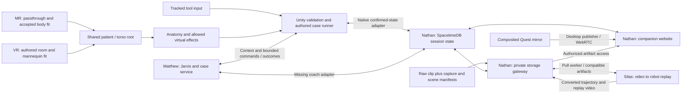

# System Integration Map

Audited October 3, 2026. This is the starting point for understanding the actual repository, routing, and work remaining to assemble one surgery environment. Read [current direction](current-direction.md) for product scope and [integration contracts](integration-contracts.md) for boundary requirements. A component working on its own is not a working session.

## Current Abdominal Tissue Route

Focused implementation snapshot `1a01fab` is stacked on AR snapshot `9215799`, with main `fc69836`. Final fetch found main `fc69836`, Nathan `aa182cd` and Silas `a901a50` unchanged; Matthew advanced to `94b399e` through `1ed5f76`. The new patient-interview/attending routes are additive, the default `/jarvis/connection` still returns Jarvis, and existing anatomy/procedure catalogs and surgical coach event contracts did not change. Patient/attending tools are not routed by the native headset client; that separate encounter flow is not merged or claimed by this tissue milestone. Producer/consumer audit traces `NativeCaseSession` → `NativeProcedureInput.InteractionReady` → `NativeTissueSimulation` → private mesh + existing `MeshCollider` on `appendix`, `mesoappendix` and `appendicular_artery`. The original scored contact path, case IDs/content version, coach and realtime payloads/ports are unchanged. Three targets total 2,916 display triangles; local fixed-step cages provide grasp feedback without a new case outcome.

The bounded render-only overview expands to 81 parts / 120,125 triangles with source-frame abdominal exterior/wall/pelvis/spine/vessel references. `AnatomyLayerView` is local preview presentation; X cycles layers during selection, and still identifies during practice. Added references never get scored colliders or silently expand the authored exercise. Runtime material copies/collider updates, invalid-gate reset, retry, hiding and tool-release paths are checked. Surface commits and MeshCollider recooking are capped at 30 Hz; actual Quest cost/feel remain unverified.

The repeatable Unity gate passed: bridge33, body76, instruments160, native input24, tissue5,739 assertions including actual imported geometry and layer inspection, authored appendectomy75, attempt72, coach68. The tissue assertion count includes per-vertex source preservation checks and is not a count of distinct behavioral scenarios. These are Editor/transport-fixture evidence, not physical playthrough or live voice/video validation. See [tissue simulation](tissue-simulation.md) for presets, geometry gaps, primary sources and hardware evidence. Android ARM64 IL2CPP development build `0.4.0-tissue` / code8 succeeded and the 63.47 MiB APK installed over USB. Launch smoke stopped at Quest's controllers-required dialog; no new XR readiness, layer visuals, grasp feel or frame-time result is claimed. Local coach/gateway/pose health returned200 and the existing private USB configuration/routes were restored without starting capture.

## Current AR / Body Registration Route

This focused milestone builds on main `fc69836`; fetch audit found main/Nathan/Silas unchanged and Matthew `409e6a3` adds only the previously reviewed HTTP documentation correction. The existing producer/consumer modes already accept `mixed_reality` and `virtual`; no teammate contract is redefined. Default native mode is now AR, with exact coach pairing to its chosen mode and a fresh attempt on mode change. The shared backend still receives only coarse state and authored events, not participant images or landmarks. The first-use permission lifecycle now keeps camera/depth off until both grants and XR readiness return; a permission-dialog pause preserves the pending opt-in, while active suspension, denial, mode change and disable cancel it.

`NativeBodyRegistration` acquires opt-in Meta MRUK 85 images and cached intrinsics/extrinsics/pose, uses USB-reversed local 8790 → `services/registration` → `scalpal.body_pose.v1` image points, then fits the generic atlas against a cached native environment-raycast surface grid. Four markers and the 42-part render-only overview appear after automatic stable acquisition; no controller-plane points are needed. One current automatically acquired-fit gate controls practice anatomy/ports, native contacts, coach tracking, shared registration state and resume commands. Full VR restores the authored mannequin fit; the same nine-part case engine remains the scorer. Participant/video capture, the gateway upload/worker and companion WebRTC receive no frames from this local inference path. [Exact body-fit contract and limitations](body-registration.md).

Evidence: the earlier installed `0.2.1-main` now passes actual USB tracked-head/floor/focus launch smoke and is visibly paired in the Quest mirror. Full wearer case/recap/retry and provider voice remain unverified. The permission-lifecycle revision passed 76 synthetic surface/projection/automatic-gate/permission checks and 33 registration-service tests including actual blank-JPEG CPU/loopback HTTP; the preceding atlas revision separately passed 37 imported anatomy-axis checks. `0.3.2-auto-body` (code 7) built/installed with camera/spatial permissions; actual app-scoped XR/head/floor/focus launch smoke passed, with controllers untracked and acquisition off. Physical automatic fit remains unverified. Existing Unity instrument 160/input 24/playthrough 75/attempt 72/coach 68 checks passed. These results are component evidence, not a physical body overlay or native camera test.

## Audited Sources

These are source snapshots, not deployment claims. Refresh this table and the affected routes after fetching changes before a shipping milestone. Branch names can move; the commit links preserve the audit evidence.

| Component / owner | Snapshot | Actual contents and limits |
| --- | --- | --- |
| Native AR/body fit / Stephen | [`0d0f4f7`](https://github.com/stephenhungg/scalpal/tree/0d0f4f7) | Passthrough scene, 42-part render-only overview, local MediaPipe image inference and cached native live-depth grid. Three stable observations automatically fit anatomy without controller-plane points. Permission-dialog opt-in survives pause with sources off until grants/XR ready. Source/editor/build checks passed; `0.3.2-auto-body` installed and actual XR/head/floor/focus launch smoke passed. Controllers were untracked; participant automatic fit remains unverified. |
| Native workbench / Stephen | [`a895dab`](https://github.com/stephenhungg/scalpal/tree/a895dab7e35d3be00b2f9fefad35f9f82be75c0f) | Openable Unity 6000.0.66f2 project, 15 tool prefabs/runtime, instrument sandbox, static operating-room/patient preview, reconstructable camera experiment. Android OpenXR native workbench with head/controllers, room art and patch validity/reset gates. Held-tool interpolation disabled and poses refreshed before rendering after user-reported lag; user confirmed held motion keeps up after correction. No complete surgery bootstrap, organs, body registration or network adapter. |
| Jarvis / Matthew | Merged [`64edc9e`](https://github.com/stephenhungg/scalpal/tree/64edc9e) | Preop/case/coach, shared six-tool implementation, polled alerts and stable context key. Native transport now calls shared tool routes and sends context on meaningful changes. Preserve integrated rejection/idempotency guards; alert/reflex pacing remains a native adapter gap. |
| Anatomy / Matthew lane | [`6057689`](https://github.com/stephenhungg/scalpal/tree/6057689cfa7bb6968b1a572d4598d47bd3e68e9e) | Anatomy source/export/build/preview assets, supplemental targets, case/input binding and guarded coach synchronization; appendectomy-first desktop harness. Asset source frames and licenses differ; no measured Quest performance or patient fit. |
| Companion / Nathan | Merged [`aa182cd`](https://github.com/stephenhungg/scalpal/tree/aa182cd) | Spacetime module, observer, private gateway/worker protocol, generated bindings, R2 helper and deployment config. Preserve integrated retry/attempt ownership fixes. Imported owner deployment reports do not prove this consolidated code is deployed remotely. |
| Motion / Silas | Merged [`a901a50`](https://github.com/stephenhungg/scalpal/tree/a901a50) | Video decode, right/left-hand inference/retargeting, licensed Shadow meshes, kinematic MuJoCo replay, local processor and pull-based gateway worker. Compatible four-artifact/trajectory conversion is implemented. Actual Quest-clip accuracy remains unverified. |

The enabled build scene is now `Assets/Scalpal/Quest/Scenes/NativeSession.unity`. It reuses the Android OpenXR rig, adds a limited nine-part appendectomy atlas, and connects one native case/coach/realtime/voice coordinator. The original workbench and art previews remain available. Built-in rendering is preserved; teammate URP assumptions were adapted instead of changing the working headset renderer.

## Current Assembled Slice

Main consolidates the native integration, anatomy `6057689`, Jarvis `64edc9e`, Nathan `aa182cd` and Silas `a901a50` histories. Overlaps retain newer native bindings, built-in rendering and backend retry/ownership fixes. Full anatomy FBXs/originals/Blender sources are included and LFS checked; the headset scene still references its nine-part subset. Legacy alternate case/contact directors are source components, not additional active scorers. See [native session](native-session.md) for exact bindings and physical limits.

`NativeCaseSession` requests a reviewed synthetic appendectomy and a fresh explicit matching coach session. `AnatomyExerciseBinding`/`CaseRunner` is the local progression authority. `NativeProcedureInput` reuses the existing tip contact and validates held/tracked/activated tools, selected anatomy ownership, actual tip overlap and authored port instrument rules. There is one scored event route and one coach command handler; branch `CaseDirector`/extra contact scorers are not installed.

`QuestSessionBridge` uses actual invitations/views/reducer acknowledgements and freezes attempt ownership. External replacement abandons the old runner. `QuestJarvisVoice` implements signed connection and PCM transport; explicit Y enables microphone. Its six known tools use `POST /coach/sessions/:sid/tools/:name` with complete JSON parameters. Only unknown tools reach the root fallback. Prior documentation incorrectly inferred that all tools were unavailable from that fallback. The existing agent's provider credentials and spoken voice remain unverified. Conversational selection remains absent from this controller-selected case.

Shared tool/context-key adapters are now implemented. Fifty Unity checks ran actual native tool/HTTP coroutines against isolated recorded-fixture Hono: all six tools, raw parameters, acknowledged/pending highlights, HTTP errors and stale connection generations. No WSS, microphone or provider executed. Polled alerts/reflex pacing and configurable patient selection remain separate work. Keep the synthetic patient until real-record consent/review is deliberately integrated.

Motion frozen dependencies and 30 tests passed; one real-hand sample-video test skipped because its external clip is absent. The new gateway worker supplies four compatible artifacts, heartbeats and stale-run handling. Unsupported `configVersion` now fails before download/inference; `motion-v1` is the supported configuration. Effective hand/mirroring flags are worker-wide and recorded in quality reports, but are not encoded in per-job configuration identity. A prior 60-frame synthetic replay retained 50 valid/10 explicit gap frames and encoded H.264/yuv420p 640×480 at 30 FPS. Output-path traversal/symlink escapes and malformed jobs are rejected. Download size limits and capture-manifest processing remain absent; no real Quest reconstruction has run.

Failure-path checks now reject stale/unknown coach-step events before scoring and retain that rejection across lost responses. The first terminal coach command outcome is immutable. A fresh shared attempt clears selected/highlighted anatomy, step totals, preview and old registration; authored events must belong to the active session and current attempt. These fixes do not add general durable event IDs to Nathan's event reducer or change the existing worker/capture limitations.

The local preop, Spacetime, gateway and companion processes run on ports 8787, 3000, 8788 and 5173 respectively. The gateway is registered with the local module; invitations/tokens remain outside Git. Backend integration passed 23 actual local-server tests and preop passed 140 tests, with two provider-live tests skipped. Synthetic Unity tests exercised the actual appendectomy geometry through ten steps/thirteen deliberate actions and checked attempt replacement/retry boundaries. The consolidated `0.2.1-main` APK built and installed over USB; launch is blocked by the Quest controllers-required prompt. The actual shared observer still reports no connected headset. Compilation and editor poses do not establish a physical complete-session pass.

Native passthrough and automatic generic surface body registration are implemented in the focused AR revision but physically unverified. Native video/WebRTC production remains absent. The motion gateway worker is now implemented; its current-source actual gateway evidence is recorded below. The companion's state view is connected through the native adapter; its live-video surface has no native producer. Those routes below remain required. Earlier branch-only observations describe their inspected sources, not an additional runtime installed into this scene.

## Intended Connected Routes

This diagram is the target assembly. Missing adapters are listed below; it is not evidence these edges currently run.

Immediate rendering, registration, tool physics and input stay local. SpacetimeDB coordinates small confirmed state and commands. Video bytes travel through WebRTC or private storage, never a subscription table. The existing laptop mirror supplies spectator media; raw passthrough supplies the proposed motion input. Those sources have different contents.

## Explore → Office → OR Route

Target for the [latest experience flow](current-direction.md#latest-experience-flow). Status as of October 3, 2026; nothing below is an end-to-end result.

| Stage | Producer / consumer | Exists | Missing |
| --- | --- | --- | --- |
| Launch screen | Unity start scene | Nothing dedicated | Start scene with Enter/controller confirm that loads the explore page |
| Explore page | `services/preop` `GET /patients`, `/patients/:id/brief`, `/unity/bundle` → Unity | Service returns every FinchNode demo patient with procedure, urgency, status and actions; Unity DTOs exist in `Assets/Scalpal/Exercises/Data/` | Explore scene/UI that renders the list and status states and routes a choice into the office |
| Diagnosis office | Encounter engine (`/encounters`, tools, `/attending`, `/score`) → `Assets/Scalpal/EncounterOffice/` | On the unmerged `codex/diagnosis-office` branch (draft, stacked on tissue work): encounter engine, patient/attending voice routing through `QuestJarvisVoice`, office art in progress | Authored encounters exist for only 3 of 12 FinchNode patients (`patient-demo-multi-source`, `patient-demo-pediatric-asthma`, `patient-demo-sparse`); office scene, lifecycle checks and merge |
| Assessment → surgery | `record_assessment` / scorecard → `GET /patients/:id/case` → OR | Case plans fix the procedure for the 8 authored FinchNode patients; the other 4 use the age-based `fallbackPlan` | Handoff from the encounter result to the OR scene with the same patient/attempt; decision on forced vs learner-chosen procedure |
| Operating room | Native session (`NativeSession.unity`) + shared tool/anatomy/exercise core | Full-VR appendectomy rehearsal with nine anatomy meshes and tools | Cholecystectomy (4 authored patients) and sigmoid colectomy (1) surgery scenes; loading a case by patient ID rather than a fixed appendectomy |
| Robot replay | Raw passthrough capture → gateway → Silas worker → companion/headset playback | Gateway worker and left/right Shadow-hand kinematic replay merged on main | Recording raw camera video while the app renders full VR (unverified); in-headset replay view; physical clip run |

MR body-registration work remains in the repository but is off the main path.

## Where the Current Code Routes

### Case selection, practice and Jarvis

Matthew's [`services/preop`](https://github.com/stephenhungg/scalpal/tree/68576cc0f92190d461c2fee995c5022da9f9b3f7/services/preop) defaults to port **8787**. `GET /patients`, `GET /patients/:id/case` and `POST /patients/:id/preop-check` supply authored cases and synthetic FinchNode chart context. `/unity/bundle` supplies the Unity-safe offline bundle. Returned `actions` route through `ScalpalPreopService.Dispatch`; the bundle fallback is not a fallback for cloud voice or shared-state connectivity.

The laptop `/jarvis` page creates `POST /coach/sessions` with `patientId` and presentation `mode` (`mixed_reality` or `virtual`). Coach snapshots and tracking-loss speech now distinguish those modes; this does not switch the Unity scene. `CoachRelay` currently adopts the newest matching session through `GET /coach/current?patientId=...`, posts batches to `/coach/sessions/:sid/events`, polls `/commands`, and posts `/commands/:cid/ack`. The browser receives `/coach/sessions/:sid/stream` SSE and obtains ElevenLabs connection details through `/jarvis/connection`. The coach sessions live in a service-local `Map`, not SpacetimeDB. Latest voice work uses deterministic pre-rendered next-step callouts alongside reflex warnings and reports appendectomy text rehearsals; that is not a headset scene rehearsal.

[`CaseDirector`](https://github.com/stephenhungg/scalpal/blob/68576cc0f92190d461c2fee995c5022da9f9b3f7/apps/quest/Assets/Scalpal/Experience/CaseDirector.cs) creates a local `CaseRunner`, consumes scene/UI events, and forwards those events to the coach's separate server engine. The coach snapshot has a `version`; the Unity relay’s input batch still has no event ID, attempt ID or expected version. The server now accepts optional `eventId` and `stepId`, deduplicates remembered IDs and attempts forward reconciliation to the reported headset step. The existing relay does not populate those fields. These remain two engines that can diverge after loss/retry or laptop simulation, not one confirmed authoritative shared attempt.

`AnatomyCoachBinding` applies only `highlight` and `clear_highlight`, then acknowledges the result. The broader preview/rotate/isolate/confirm/pause commands in Nathan's allowlist are not automatically implemented by this binding. The Jarvis demo page's **auto-apply highlight** checkbox is checked by default; disable it for real Unity integration so a browser cannot report a scene effect it did not perform.

On the Jarvis branch, relay gaps include `pending.Clear()` before HTTP success, command IDs marked seen before a reliable acknowledgement, and initial tracking defaulting true. The newer anatomy branch changes that relay; see the alternative slice below. Reconnect/retry needs a deduplicated event outbox, retryable acknowledgements and an explicit initial validity snapshot. Match an explicitly paired session/attempt; newest-patient adoption is only a single-room prototype shortcut.

### Newer anatomy/case integration slice

The anatomy branch's latest [integration guide](https://github.com/stephenhungg/scalpal/blob/6057689cfa7bb6968b1a572d4598d47bd3e68e9e/docs/anatomy-integration.md) adds `AnatomyCaseSource` → `AnatomyExerciseBinding` → local `CaseRunner` → updated `CoachRelay`. It prepares appendectomy first (`lap_appendectomy`, adult `patient-demo-multi-source`), validates required target/collider and step-graph bindings, excludes preview from scoring and stops the old attempt on loading/failure. This is a more guarded alternative to the Jarvis branch's `CaseDirector`, not another runner to enable alongside it.

The anatomy relay explicitly publishes initial tracking, validates an untouched matching patient/procedure/initial step, isolates outstanding requests/commands by session generation and pauses synchronization after delivery failure. It still forwards events to a separate coach engine and needs fresh-session recovery; durable retry/idempotency, concurrent-writer ownership and SpacetimeDB routing remain unimplemented. Import the selected relay version deliberately rather than overwriting its fixes with the older Jarvis copy.

Jarvis receipt work (`8616c0c`, retained in `68576cc`) separates receipt `accepted` (well formed/received) from `applied` (reached scoring), adds snapshot `eventCount` and allows well-formed noncatalog IDs as off-target events. The anatomy relay still requires `snapshot.version == 0`, although hints/highlights/timers can advance that version before any exercise input. Align adoption with zero exercise inputs plus initial step/completed count, and check case/content/presentation identity. Its DTO currently ignores `applied`; receipt success alone must not be treated as equal local/server progression. The local binding also rejects noncase contacts while the server now accepts them as off-target attempts; agree one feedback policy before wiring raw contacts. Server-side `receive` now exposes `headsetStepId`, `desynced` and `resyncCount`; forward reconciliation synthesizes expected events in its own engine. This does not replace an explicit confirmed-step exchange or an outbox/attempt contract. Event IDs remain optional and the remembered set is service-local and bounded.

`AnatomyInstrumentTip` defaults to contact-entry activation and checks the selected tool ID; it does not read `InstrumentBehaviour.Held`, tracking or trigger input. Native integration must disable `activateOnEntry` and bridge deliberate held/tracked activation into `ActivateContact`, with per-cycle debounce and raw focus kept separate. Do not stack it with the other two contact adapters. The new desktop generator uses simulated inputs/registration and still assumes a team's URP project; real Unity editor import, physics, native XR and patient alignment remain unvalidated by its test doubles.

### Tools and local scene effects

Main's [instrument runtime](instrument-runtime.md) owns pickup, tracked pose, activation and allowed effects. The native workbench now connects those inputs to floor-space head/controllers, while gating effects on XR/head/focus validity. It listens to `ActionApplied` only for local hardware telemetry and does not feed a case scorer. A resets tool and target root poses; before-render pose refresh changes presentation without replaying trigger events. The user reported lag in the first build; the user confirmed the corrected held tool keeps up with hand movement. All **15 tool IDs match Matthew's audited instrument catalog**. Prefabs use `inst_<id>`; addressable anatomy uses `AnatomyPart.stableId` / `anat_<id>`. The latest anatomy manifest adds 11 supplemental targets and reports complete interactive/mistake target coverage for the three catalog procedures. These include schematic approximations; identifier coverage does not prove spatial fit or clinical correctness.

`InstrumentBehaviour.ActionApplied` reports an actual authored effect, with Unity-world position and a Unity monotonic timestamp. `InstrumentTipContact.TouchApplied` reports deliberate activated contact. Matthew's alternative `InstrumentTip` adds raw-contact focus and activated scored touches. Pick one scored-contact path; never count both it and `TouchApplied` for the same action. A contact, a visual effect and an accepted step transition are distinct signals; map only the event the exercise rubric expects.

Matthew's current port placement occurs on trigger entry, before the held/activated check. `CaseDirector` gates operation phase and anatomy visibility, but does not check the entering tool against the port's permitted instrument IDs. Its anatomy reference is optional, so a missing reference bypasses the registration check. Before composing a real practice scene, require the practice controller reference, held/tracked permitted-tool placement, `forceActivated=false`, and a non-preview anatomy controller. Desktop autoplay and browser simulation must be excluded from a live scored attempt.

### Realtime, live observer and storage

Nathan's [`services/realtime`](https://github.com/stephenhungg/scalpal/tree/f57692486e48ebea3d76a3c8bf141bf5f0c00204/services/realtime) has private backing tables, identity/role checks and session-member views. Headset clients publish confirmed exercise state/results; coach/operator requests become command rows with `commandId` and `expectedStepVersion`, then a headset resolves them. Generated C# bindings exist, but no Unity connection/publisher or Matthew bridge consumes them yet.

The companion routes are `/`, `/join/:code`, `/s/:id` and `/s/:id/simulate`. The last is a browser headset substitute. The home form's `instrument-transfer` @ `0.1.0` is a placeholder, not an agreed Matthew catalog exercise. The realtime field `mode` means lifecycle phase; it lacks a separate MR/full-VR presentation field. Matthew's coach `mode` means presentation instead; map these explicitly rather than copying the same field name.

The desktop publisher uses `getDisplayMedia` to share an explicitly selected mirror window, with audio off, one WebRTC peer per viewer and private signaling rows. Same-network browser test evidence does not establish actual Quest-mirror capture, cross-network TURN or measured headset-to-observer delay.

Nathan's [`services/api`](https://github.com/stephenhungg/scalpal/tree/f57692486e48ebea3d76a3c8bf141bf5f0c00204/services/api) also defaults to port **8787**, conflicting with Matthew's service. Proposed local layout: keep Matthew on 8787, set Nathan's `PORT=8788` and `PUBLIC_BASE_URL=http://<reachable-host>:8788`, with companion 5173, SpacetimeDB 3000 and Silas local processor 8765. This is a configuration recommendation, not a running deployment. On Quest, `localhost` is the headset; use the reachable Mac address or configured USB forwarding. Recheck browser origins, HTTP policy and signed URLs when changing ports.

Storage is local private files or configured S3/R2. Nathan’s `setup-r2.ts` adds bucket reachability/CORS setup and a Node presigned PUT/read/head/hash/delete round trip. CORS setup errors are caught before that round trip continues, so a successful script run alone does not prove browser CORS or the authorized session-upload path. This audit did not run it. Upload goes `requestUpload` → signed PUT grant → upload → `markUploaded` → gateway existence/size and optional hash verification → available/failed. A browser file labeled `raw_clip` does not prove camera provenance. `capture_manifest` and `scene_timeline` kinds exist, but their contents are not validated; no native clip recorder is connected. Large artifacts may be marked available without SHA256 verification. Deletion exists; automatic retention is not established.

### Motion jobs and replay

Nathan's [worker proposal](https://github.com/stephenhungg/scalpal/blob/f57692486e48ebea3d76a3c8bf141bf5f0c00204/packages/contracts/worker-api.md) uses authenticated **pull**: `POST /v1/worker/claim`, then `/v1/worker/jobs/:job/runs/:run/{heartbeat,outputs,complete,fail}`. Input arrives through signed reads; outputs need registration and signed uploads. Jobs deduplicate on attempt/input/config; retries increment the run generation. Its example worker produces synthetic targets.

Silas's [`services/motion`](https://github.com/stephenhungg/scalpal/tree/a901a50/services/motion) retains CLI `run`/`process` and local synchronous HTTP `POST /jobs` on 8765. The new `gateway-worker` uses Nathan's pull claim/heartbeat/output-upload/complete/fail endpoints. It decodes video, estimates one selected hand, retargets to 24 named Shadow-hand joint values (including two fixed wrist joints), and renders kinematic MuJoCo replay. Wrist world translation/orientation, robot contact/dynamics and autonomous learning are not supplied.

| Boundary | Current implementation | Remaining limit |
| --- | --- | --- |
| Job identity | Gateway job ID/run generation and signed input download | Only `motion-v1` accepted; hand/mirroring are worker-wide flags rather than persisted job options |
| Lease | Background heartbeat every lease/3; stale 409 abandons outcomes | Actual success/retry/long-running interruption evidence must remain separately identified |
| Trajectory | `scalpal.robot_trajectory.v1`, named joints, radians, `frames.t/q/valid` and invalid intervals | Schema compatibility does not prove reconstructed motion accuracy or validate every output on the gateway |
| Artifacts | `hand_estimates`, `robot_trajectory`, `replay_video`, `quality_report` | Extra capture/scene manifests are ignored; no native producer |
| Replay | Robot-only video for the companion plus compatible trajectory | Companion presents video/joint plots, not an interactive articulated 3D robot viewer |

The source `motion.json` keeps null `qpos` for invalid frames. The compatible trajectory holds a display pose with `valid:false`; this is not an observation. Silas uses decoded-video `t_ms`, image-normalized and hand-centered model coordinates, and radians for joints, not Quest world motion. Rendering labels tracking gaps; constant-average-FPS MP4 makes variable-frame-rate timing approximate. An actual local gateway/SpacetimeDB/worker exchange passed using a generated ten-frame blank clip on a fresh throwaway database: signed upload and hash verification → claim/inference → final no-hand failure on run 1 with zero outputs. A separately completed learning result stayed completed. This verifies the failure boundary; it does not substitute for a real-hand success clip. The worker default gateway is corrected to port 8788, avoiding the coach on 8787.

The schema fixture must stay synchronized with `packages/contracts/robot-trajectory.v1.schema.json`.

## One Cohesive Surgery Environment

Both presentations must instantiate the same validated scene assembly; these are required bindings, not existing bootstrap components:

| Shared binding | Requirement |
| --- | --- |
| Session / attempt | Explicit paired IDs, selected authored exercise/content version, step version, separate presentation mode |
| XR rig / tools | Actual native tracking origin and controller adapters; grip/tip anchors; tracking loss drops tools |
| Patient / torso | Stable patient root, calibrated anatomy offset, torso origin at skin umbilicus, meters, +Z toward head, +Y out of abdomen, +X participant left |
| Anatomy | Separate selection preview and practice controller; known stable IDs, validated highlight materials and interaction colliders |
| Registration | One validity signal reaches practice rendering, tool targets, contact dispatcher, case/UI scoring and coach/shared state |
| Case / coach | Exactly one accepted transition per action; Unity outcome acknowledgement; shared context reflects confirmed state |
| Capture / timeline | Explicit raw-versus-composited source, frame/clock mapping and applied virtual scene events tied to the same attempt |
| Reset / mode change | Release tools, stop actions, invalidate old fit, clear stale commands, restore target state and rebind before practice |

Full VR supplies an authored patient transform; MR supplies an accepted current real-person fit. Neither makes an arbitrary imported organ atlas automatically align. The static preview retains `AnatomyRoot_Unbound`; the new full-VR session replaces it with an explicitly authored limited atlas fit. Scale/frame conversion belongs in a validated anatomy-to-torso adapter, not duplicated per tool. VR tracking and scene validity still gate actions even without body CV. Keep the selection pedestal's preview bypass out of practice.

For the first integration, Unity remains the immediate simulation and authored-step authority, publishes its accepted state to SpacetimeDB, and Matthew's coach consumes that confirmed state for guidance. This is the proposed resolution of today's duplicate engines, requiring owner agreement and adapter work; do not add a third scorer in the gateway. A server scorer may instead be chosen deliberately, but then Unity needs an explicit prediction/reconciliation path and all clients use that choice consistently.

## Integration Work Before an End-to-End Claim

1. **Stephen + Matthew:** The native full-VR appendectomy scene is assembled. Complete the physical case/recap/retry and voice checks on Quest; validate MR body fit separately.
2. **Stephen + Nathan + Matthew:** The native publisher and single coach/voice transport are implemented. Verify a real headset action reaches the joined companion and a bounded command returns an actual applied/rejected outcome. Presentation mode is explicit in coach state; Nathan's lifecycle row still has no separate presentation field.
3. **Stephen + Nathan + Silas:** Capture one permitted raw clip with manifest/timeline; run the implemented gateway worker on that actual clip and show its verified outputs in the companion.
4. **Nathan / boundary owners:** Authored exercise events now enforce current-attempt/session ownership. Retry event IDs, same-attempt capture extras, authenticated worker ownership/strict lease expiry and output schema/finite values/units/limits before ready remain required. Local motion run IDs and job object shape now reject malformed input; keep download and effective configuration limits explicit.

The service checks are specific source findings, not evidence an exposed system is currently compromised. Keep prototype routes local until their actual intended deployment and access boundaries are tested.

## Shipping Checks

Every integration milestone names the audited commits, changed boundary, tested environment and remaining gap. Component tests do not substitute for these exchanges:

- Fresh-clone Unity import has stable GUIDs, no missing meshes/materials/scripts, required scene bindings and compatible packages. Check catalog/tool/anatomy IDs against the selected case, not filenames alone.
- One tracked activation creates one accepted event and one transition; repeated collider entry, event retry and reconnect cannot double count. Wrong-tool/port/contact is rejected. Missing references fail closed.
- Initial invalid fit, loss/recovery and a mode change hide misleading practice anatomy and block tool effects plus UI scoring. Preview visibility never authorizes practice.
- A real voice request applies or rejects in Unity; only that outcome is acknowledged. Observer and coach see the same attempt and confirmed version. Failed HTTP/ack retries recover; old session commands cannot affect a new attempt.
- Actual composited headset video is visible remotely with organs/tools; stream failure is distinct from state failure. Measure delay on the tested network rather than equating requested 30 FPS with end-to-end latency.
- One nonpersonal artifact proves upload/access verification first; then a permitted actual Quest clip runs through the real processor, compatible private outputs and browser replay. Failed/gapped video remains labeled; stale/expired/other-worker completion and cross-attempt metadata are rejected.
- Reset and repeat the complete selected exercise in each presentation without stale held targets, duplicated sessions or leftover scoring. Record physical-headset frame time separately from editor checks.

## Evidence From This Audit

Source routing and formats were inspected at the commits above. Catalog comparison confirmed all 15 main tool prefab IDs match Matthew's catalog. The latest anatomy binding update was inspected before publication; target manifest/mesh content remains unchanged from the checked export. Source-manifest checks confirmed unique interactive/mistake targets for cholecystectomy (7), appendectomy (6) and sigmoid colectomy (10), plus the 11 supplemental target mesh checksum. Documentation checks passed 75 local links/anchors and 12 pinned repository references. These checks do not establish imported scene bindings, spatial fit or runtime behavior. This documentation audit did not execute the feature-branch services or an end-to-end headset session. Prior main validation passed 157 instrument editor checks and room/patient import checks. The new native build passed scene validation, the moved-target reset regression and 160 instrument checks including immediate held-pose/interpolation restoration. Version 0.1.0-native built and installed on Quest 3S; app telemetry observed valid XR/head/floor/focus, tracked controllers, tool pickup/release states and a reset event. The user reported slow tool motion. Version 0.1.1-native removes held-body interpolation and refreshes controller poses before rendering; its ARM64 APK built and installed, then emitted live valid tracking, pickup/release and applied grasper/dissector patch effects. The user confirmed the updated tool keeps up with hand movement; no quantitative latency bound was measured. These establish a native component and a reported defect with a user-confirmed motion correction, not a working surgical session. Render frame time, per-eye appearance and cutting were not measured in this milestone. Nathan's branch reports 23 local integration tests and synthetic browser media; Silas reports synthetic/photo-loop/worker checks. Those are teammate-reported component evidence, not independently reproduced integrated results.

Refresh this map whenever a route, contract, owner, entry scene or verified milestone changes. Link component-specific details rather than creating a competing architecture in every handoff.

AR/body-fit publication checkpoint: corrected `0.3.0-ar` APK built/installed; required camera permission confirmed from the APK manifest. Current services gate passed 140 preop (two provider skips), 23 backend, 19 HTTP, 156 relay, 10 SDK and companion type/build. USB routes include local8790; camera acquisition remains opt-in. Current reinstall launch is blocked at controllers-required; no physical AR/camera/body alignment result is claimed. The earlier 0.2.1 full-VR launch/pairing evidence remains separate.

Wearer report after launch: real room and floating organ preview visible in `0.3.0-ar`. This supersedes the reinstall launch-dialog blocker for that launch. Body inference/calibration, stereo registration and a full practice run remain unverified.

Actual USB AR smoke after wearer launch reports current XR/head/floor/focus readiness. Reported Update frequency is about 72 Hz (one 68.3 Hz window); it is an application-loop counter, not GPU timing or body-inference performance. Controllers were untracked in this sample. No participant camera request was started by the test.

Latest corrected APK reinstall also passes actual app-scoped XR/head/floor/focus smoke at `0.3.0-ar`, with initial effect count0. Controller pickup and body-camera processing did not run in this smoke.

## Connected Abdominal Physics Publication Checkpoint

Source snapshots fetched before publication: main `fc69836c9114f4725e4591dbf7e548e564328e56`, Matthew `98d38b620ee18fac75f29c50208d9c465ef9eba3`, Nathan `0aff4f7d7caa347e1c4c0ca23dbeaa045a6b00d1`, Silas `a901a50f560b55d978a84155a429985d55552886`. These are inspected branch snapshots, not a claim that all were merged or deployed. Published material inputs are pinned at `8314e4e967e30d3ae0f592074a2f94dac30b2776`; the connected runtime source is `b07ef2bc21c7383f74c68d6f54400a9e0981946a` on `codex/volumetric-tissue`.

`NativeCaseSession.Start` initializes the existing procedure input, cage coordinator, generated wall and artery bleeding coordinator. The wall uses `AuthoredAnatomyToPatient` source meters, not patient-frame axes. Actual tracked/held/activated `CutStart`/`CutEnd` anchors produce finite blade triangles → wall topology changes and `BladeSwept` → current artery triangle intersection → one local fluid ledger. Owned activated Seal/Clip tips require real collider penetration; Suction uses the pool geometry. Cage updates → sampled contact → surface/collider commits. All effects use session/registration readiness, freeze on gate loss and reset with retry. The new wall and blood pool are unscored; the existing `NativeProcedureInput` → `AnatomyExerciseBinding`/`CaseRunner` → `CoachRelay` remains the single accepted-event path. New incision/contact/fluid state is not yet published to Jarvis or SpacetimeDB; no new shared contract is implied.

Source audit corrected the imported factor100 mesh-to-meter conversion and tiny-area normal normalization. The artery has10 open terminal loops; the contact-only proxy adds120 disclosed cap triangles while rendering/scoring keep the imported mesh. Per-probe authored rest allowances preserve existing attachments through rigid/uniform fit transforms. Actual source audit:3 supported bodies,3.544 mm initial sampled authored overlap,0 rest corrections,0 excess residual and55.328 mm conservative sampling bound. This sparse solver has no continuous collision guarantee and does not cover all organs or wall-to-organ contact.

The repeatable `verify_session.py --suite unity` passed production bridge33, body76, instrument160, input24, tissue5,745, volume18,172, viscoelastic866, volume runtime2,220, bleeding221, vessel runtime261, contact2,102, appendectomy75, attempt72 and coach68 assertions plus final scene validation. Viscoelastic fixtures include real solver commit/freeze/cut/retry/inverted-step history boundaries. These are synthetic Editor checks using actual scene/assets, not physical or live-provider evidence. The new revision has not been built/installed or physically tested; the earlier0.4.0 installation remains separate. Default materials and bleeding parameters remain unmeasured, and the full physics goal is open.

Matthew's additive encounter/realtime work and browser `/jarvis/camera` test harness were inspected through the snapshot above. That harness projects MediaPipe landmarks in2D and sends coach events/command outcomes; it is not native metric body registration and must not be used as concurrent scoring evidence for the same native acceptance session. Nathan's latest snapshot adds encounter tables/reducers/views and generated bindings atop main. Existing surgery exercise/command fields remain unchanged. Encounter mutation checks active session/coach role but does not compare the encounter's saved attempt against the current attempt; stale encounter mutation is an owner-lane follow-up, not a change to this local mechanics contract. Neither branch supplies a consumer for the new tissue topology/bleeding state. No live service, voice-provider, video or participant capture test ran for this milestone.

Material-force follow-up source `048ad579203655c01e2e6f77bbb54857bbdca4aa`: `TissueVolume` accepts prescribed constructor-pinned material-root targets, enforces them within the existing timestep, and caches accepted SI internal nodal forces from the same per-cell constitutive histories. No force read advances material time. Cuts retain root targets; rollback preserves accepted force/history; retry clears them. `NativeCouponValidation` adds5,468 passing synthetic traction/covariance/scaling/history/rollback checks to the Unity gate. The source-linked skin benchmark reproduces two summary points through the actual solver but finds three distinct end-compatible spectra; runtime calibration remains false. New source files/report and assumptions are in [the experiment](research/solver-calibration-experiment.md). Teammate snapshots remain the prior publication's main/Matthew/Nathan/Silas hashes, re-fetched unchanged for this checkpoint. No new case, coach, realtime or scoring contract is introduced.

Android physics deployment checkpoint: `0.5.0-volume` / code9 ARM64 IL2CPP built with the full Unity verification gate and installed over USB; package version/code/ABI confirmed. Private existing configuration andUSB routes restored; no participant capture. APK63.64 MiB, SHA256 `5e6e461b4217a28c5ecdd92372e24aab4fbb7739895c5e327df4c2736d8e4b25`. Launch smoke exit2 is specifically Quest’s controllers-required interception, not a validated app process/XR session. Physical mechanics/performance and live voice/video remain pending. Build-induced whitespace changes were removed and authored XR/OpenXR preload references preserved; only version/code settings are changed.
