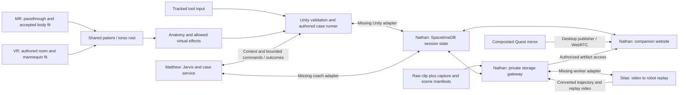

# System Integration Map

Audited October 3, 2026. This is the starting point for understanding the actual repository, routing, and work remaining to assemble one surgery environment. Read [current direction](current-direction.md) for product scope and [integration contracts](integration-contracts.md) for boundary requirements. A component working on its own is not a working session.

## Audited Sources

These are source snapshots, not deployment claims. Refresh this table and the affected routes after fetching changes before a shipping milestone. Branch names can move; the commit links preserve the audit evidence.

| Component / owner | Snapshot | Actual contents and limits |
| --- | --- | --- |
| Native workbench / Stephen | [`a895dab`](https://github.com/stephenhungg/scalpal/tree/a895dab7e35d3be00b2f9fefad35f9f82be75c0f) | Openable Unity 6000.0.66f2 project, 15 tool prefabs/runtime, instrument sandbox, static operating-room/patient preview, reconstructable camera experiment. Android OpenXR native workbench with head/controllers, room art and patch validity/reset gates. Held-tool interpolation disabled and poses refreshed before rendering after user-reported lag; user confirmed held motion keeps up after correction. No complete surgery bootstrap, organs, body registration or network adapter. |
| Jarvis / Matthew | [`68576cc`](https://github.com/stephenhungg/scalpal/tree/68576cc0f92190d461c2fee995c5022da9f9b3f7) | Pre-op/case catalogs and service, coach engine, ElevenLabs browser client, Unity case director/contact/coach/anatomy code; MR/VR voice context, appendectomy rehearsals and receipt/late-join contract updates, optional event deduplication/headset-step reconciliation and live FinchNode consent/chart handling. Not merged or bound to main's room. |
| Anatomy / Matthew lane | [`6057689`](https://github.com/stephenhungg/scalpal/tree/6057689cfa7bb6968b1a572d4598d47bd3e68e9e) | Anatomy source/export/build/preview assets, supplemental targets, case/input binding and guarded coach synchronization; appendectomy-first desktop harness. Asset source frames and licenses differ; no measured Quest performance or patient fit. |
| Companion / Nathan | [`f576924`](https://github.com/stephenhungg/scalpal/tree/f57692486e48ebea3d76a3c8bf141bf5f0c00204) | SpacetimeDB module, web observer, private artifact gateway, worker protocol, proposed implemented contracts, generated C# bindings and an R2 provisioning/round-trip helper. No connected Quest or Matthew adapter. |
| Motion / Silas | [`3992f7e`](https://github.com/stephenhungg/scalpal/tree/3992f7ed2ca449ef634fe372f6371134d2333404) | Video decode, right-hand inference/retargeting, Shadow-hand kinematic MuJoCo replay, local CLI/HTTP processor. No Nathan worker adapter or actual Quest-clip validation. |

The enabled build scene is now `Assets/Scalpal/Quest/Scenes/NativeWorkbench.unity`. It composes the existing sandbox/tool runtime and static room art with Android OpenXR, a stereo camera and a common floor-space tracking origin. The two original sample scenes remain available. See [native build and evidence](native-workbench.md). OpenXR does not make this a complete surgery scene or body-registration result. The project still uses the built-in renderer; teammate handoffs that assume URP must be reconciled with the actual package manifest before import. Feature branches overlap; do not blindly combine their entire histories or overwrite Unity settings.

## Intended Connected Routes

This diagram is the target assembly. Missing adapters are listed below; it is not evidence these edges currently run.

Immediate rendering, registration, tool physics and input stay local. SpacetimeDB coordinates small confirmed state and commands. Video bytes travel through WebRTC or private storage, never a subscription table. The existing laptop mirror supplies spectator media; raw passthrough supplies the proposed motion input. Those sources have different contents.

## Where the Current Code Routes

### Case selection, practice and Jarvis

Matthew's [`services/preop`](https://github.com/stephenhungg/scalpal/tree/68576cc0f92190d461c2fee995c5022da9f9b3f7/services/preop) defaults to port **8787**. `GET /patients`, `GET /patients/:id/case` and `POST /patients/:id/preop-check` supply authored cases and synthetic FinchNode chart context. `/unity/bundle` supplies the Unity-safe offline bundle. Returned `actions` route through `ScalpalPreopService.Dispatch`; the bundle fallback is not a fallback for cloud voice or shared-state connectivity.

The laptop `/jarvis` page creates `POST /coach/sessions` with `patientId` and presentation `mode` (`mixed_reality` or `virtual`). Coach snapshots and tracking-loss speech now distinguish those modes; this does not switch the Unity scene. `CoachRelay` currently adopts the newest matching session through `GET /coach/current?patientId=...`, posts batches to `/coach/sessions/:sid/events`, polls `/commands`, and posts `/commands/:cid/ack`. The browser receives `/coach/sessions/:sid/stream` SSE and obtains ElevenLabs connection details through `/jarvis/connection`. The coach sessions live in a service-local `Map`, not SpacetimeDB. Latest voice work uses deterministic pre-rendered next-step callouts alongside reflex warnings and reports appendectomy text rehearsals; that is not a headset scene rehearsal.

[`CaseDirector`](https://github.com/stephenhungg/scalpal/blob/68576cc0f92190d461c2fee995c5022da9f9b3f7/apps/quest/Assets/Scalpal/Experience/CaseDirector.cs) creates a local `CaseRunner`, consumes scene/UI events, and forwards those events to the coach's separate server engine. The coach snapshot has a `version`; the Unity relay’s input batch still has no event ID, attempt ID or expected version. The server now accepts optional `eventId` and `stepId`, deduplicates remembered IDs and attempts forward reconciliation to the reported headset step. The existing relay does not populate those fields. These remain two engines that can diverge after loss/retry or laptop simulation, not one confirmed authoritative shared attempt.

`AnatomyCoachBinding` applies only `highlight` and `clear_highlight`, then acknowledges the result. The broader preview/rotate/isolate/confirm/pause commands in Nathan's allowlist are not automatically implemented by this binding. The Jarvis demo page's **auto-apply highlight** checkbox is checked by default; disable it for real Unity integration so a browser cannot report a scene effect it did not perform.

On the Jarvis branch, relay gaps include `pending.Clear()` before HTTP success, command IDs marked seen before a reliable acknowledgement, and initial tracking defaulting true. The newer anatomy branch changes that relay; see the alternative slice below. Reconnect/retry needs a deduplicated event outbox, retryable acknowledgements and an explicit initial validity snapshot. Match an explicitly paired session/attempt; newest-patient adoption is only a single-room prototype shortcut.

### Newer anatomy/case integration slice

The anatomy branch's latest [integration guide](https://github.com/stephenhungg/scalpal/blob/6057689cfa7bb6968b1a572d4598d47bd3e68e9e/docs/anatomy-integration.md) adds `AnatomyCaseSource` → `AnatomyExerciseBinding` → local `CaseRunner` → updated `CoachRelay`. It prepares appendectomy first (`lap_appendectomy`, adult `patient-demo-multi-source`), validates required target/collider and step-graph bindings, excludes preview from scoring and stops the old attempt on loading/failure. This is a more guarded alternative to the Jarvis branch's `CaseDirector`, not another runner to enable alongside it.

The anatomy relay explicitly publishes initial tracking, validates an untouched matching patient/procedure/initial step, isolates outstanding requests/commands by session generation and pauses synchronization after delivery failure. It still forwards events to a separate coach engine and needs fresh-session recovery; durable retry/idempotency, concurrent-writer ownership and SpacetimeDB routing remain unimplemented. Import the selected relay version deliberately rather than overwriting its fixes with the older Jarvis copy.

Jarvis receipt work (`8616c0c`, retained in `68576cc`) separates receipt `accepted` (well formed/received) from `applied` (reached scoring), adds snapshot `eventCount` and allows well-formed noncatalog IDs as off-target events. The anatomy relay still requires `snapshot.version == 0`, although hints/highlights/timers can advance that version before any exercise input. Align adoption with zero exercise inputs plus initial step/completed count, and check case/content/presentation identity. Its DTO currently ignores `applied`; receipt success alone must not be treated as equal local/server progression. The local binding also rejects noncase contacts while the server now accepts them as off-target attempts; agree one feedback policy before wiring raw contacts. Server-side `receive` now exposes `headsetStepId`, `desynced` and `resyncCount`; forward reconciliation synthesizes expected events in its own engine. This does not replace an explicit confirmed-step exchange or an outbox/attempt contract. Event IDs remain optional and the remembered set is service-local and bounded.

`AnatomyInstrumentTip` defaults to contact-entry activation and checks the selected tool ID; it does not read `InstrumentBehaviour.Held`, tracking or trigger input. Native integration must disable `activateOnEntry` and bridge deliberate held/tracked activation into `ActivateContact`, with per-cycle debounce and raw focus kept separate. Do not stack it with the other two contact adapters. The new desktop generator uses simulated inputs/registration and still assumes a team's URP project; real Unity editor import, physics, native XR and patient alignment remain unvalidated by its test doubles.

### Tools and local scene effects

Main's [instrument runtime](instrument-runtime.md) owns pickup, tracked pose, activation and allowed effects. The native workbench now connects those inputs to floor-space head/controllers, while gating effects on XR/head/focus validity. It listens to `ActionApplied` only for local hardware telemetry and does not feed a case scorer. A resets tool and target root poses; before-render pose refresh changes presentation without replaying trigger events. The user reported lag in the first build; the user confirmed the corrected held tool keeps up with hand movement. All **15 tool IDs match Matthew's audited instrument catalog**. Prefabs use `inst_<id>`; addressable anatomy uses `AnatomyPart.stableId` / `anat_<id>`. The latest anatomy manifest adds 11 supplemental targets and reports complete interactive/mistake target coverage for the three catalog procedures. These include schematic approximations; identifier coverage does not prove spatial fit or clinical correctness.

`InstrumentBehaviour.ActionApplied` reports an actual authored effect, with Unity-world position and a Unity monotonic timestamp. `InstrumentTipContact.TouchApplied` reports deliberate activated contact. Matthew's alternative `InstrumentTip` adds raw-contact focus and activated scored touches. Pick one scored-contact path; never count both it and `TouchApplied` for the same action. A contact, a visual effect and an accepted step transition are distinct signals; map only the event the exercise rubric expects.

Matthew's current port placement occurs on trigger entry, before the held/activated check. `CaseDirector` gates operation phase and anatomy visibility, but does not check the entering tool against the port's permitted instrument IDs. Its anatomy reference is optional, so a missing reference bypasses the registration check. Before composing a real practice scene, require the practice controller reference, held/tracked permitted-tool placement, `forceActivated=false`, and a non-preview anatomy controller. Desktop autoplay and browser simulation must be excluded from a live scored attempt.

### Realtime, live observer and storage

Nathan's [`services/realtime`](https://github.com/stephenhungg/scalpal/tree/f57692486e48ebea3d76a3c8bf141bf5f0c00204/services/realtime) has private backing tables, identity/role checks and session-member views. Headset clients publish confirmed exercise state/results; coach/operator requests become command rows with `commandId` and `expectedStepVersion`, then a headset resolves them. Generated C# bindings exist, but no Unity connection/publisher or Matthew bridge consumes them yet.

The companion routes are `/`, `/join/:code`, `/s/:id` and `/s/:id/simulate`. The last is a browser headset substitute. The home form's `instrument-transfer` @ `0.1.0` is a placeholder, not an agreed Matthew catalog exercise. The realtime field `mode` means lifecycle phase; it lacks a separate MR/full-VR presentation field. Matthew's coach `mode` means presentation instead; map these explicitly rather than copying the same field name.

The desktop publisher uses `getDisplayMedia` to share an explicitly selected mirror window, with audio off, one WebRTC peer per viewer and private signaling rows. Same-network browser test evidence does not establish actual Quest-mirror capture, cross-network TURN or measured headset-to-observer delay.

Nathan's [`services/api`](https://github.com/stephenhungg/scalpal/tree/f57692486e48ebea3d76a3c8bf141bf5f0c00204/services/api) also defaults to port **8787**, conflicting with Matthew's service. Proposed local layout: keep Matthew on 8787, set Nathan's `PORT=8788` and `PUBLIC_BASE_URL=http://<reachable-host>:8788`, with companion 5173, SpacetimeDB 3000 and Silas local processor 8765. This is a configuration recommendation, not a running deployment. On Quest, `localhost` is the headset; use the reachable Mac address or configured USB forwarding. Recheck browser origins, HTTP policy and signed URLs when changing ports.

Storage is local private files or configured S3/R2. Nathan’s `setup-r2.ts` adds bucket reachability/CORS setup and a Node presigned PUT/read/head/hash/delete round trip. CORS setup errors are caught before that round trip continues, so a successful script run alone does not prove browser CORS or the authorized session-upload path. This audit did not run it. Upload goes `requestUpload` → signed PUT grant → upload → `markUploaded` → gateway existence/size and optional hash verification → available/failed. A browser file labeled `raw_clip` does not prove camera provenance. `capture_manifest` and `scene_timeline` kinds exist, but their contents are not validated; no native clip recorder is connected. Large artifacts may be marked available without SHA256 verification. Deletion exists; automatic retention is not established.

### Motion jobs and replay

Nathan's [worker proposal](https://github.com/stephenhungg/scalpal/blob/f57692486e48ebea3d76a3c8bf141bf5f0c00204/packages/contracts/worker-api.md) uses authenticated **pull**: `POST /v1/worker/claim`, then `/v1/worker/jobs/:job/runs/:run/{heartbeat,outputs,complete,fail}`. Input arrives through signed reads; outputs need registration and signed uploads. Jobs deduplicate on attempt/input/config; retries increment the run generation. Its example worker produces synthetic targets.

Silas's [`services/motion`](https://github.com/stephenhungg/scalpal/tree/3992f7ed2ca449ef634fe372f6371134d2333404/services/motion) implements CLI `run`, `process`, `serve` and synchronous **push** `POST /jobs` on 8765. It decodes video, estimates right-hand landmarks, retargets to 24 named Shadow-hand joint values (including two fixed wrist joints), and renders kinematic MuJoCo replay. Wrist world translation/orientation, robot contact/dynamics and autonomous learning are not supplied.

| Boundary | Silas output | Nathan / companion expects | Required integration |
| --- | --- | --- | --- |
| Worker lifecycle | String `run_id`, one synchronous result | Job ID, numeric run generation, claim/heartbeat/upload/complete | Adapter around real processor; preserve original IDs and reject stale runs |
| Motion JSON | `scalpal.robot_motion/0`, frame records, null `qpos` when invalid | `scalpal.robot_trajectory.v1`, `frames.t/q/valid` arrays | Versioned conversion, joint names/units/limits and explicit invalid mask |
| Artifact kinds | `hand_track`, `robot_motion`, `replay_video` | `hand_estimates`, `robot_trajectory`, `replay_video`, `quality_report` | Map kinds and preserve input/config/model identity |
| Replay view | `replay.mp4` when ffmpeg exists | Video plus parsed trajectory controls/charts | Upload both compatible artifacts; video alone does not satisfy current viewer controls |

Do not replace invalid poses with invented observations to satisfy the v1 numeric-array requirement. Agree whether a held display pose with `valid:false` is acceptable and preserve null/missing observations in the source artifact. The companion currently shows video and joint plots/bars, not an interactive articulated 3D robot viewer.

Silas uses decoded-video `t_ms`, image-normalized and hand-centered model coordinates, and radians for joints. This is not Quest world motion. Rendering holds the last pose during invalid intervals with a visible warning; constant-average-FPS MP4 makes variable-frame-rate timing approximate. The worker currently ignores capture manifests.

## One Cohesive Surgery Environment

Both presentations must instantiate the same validated scene assembly; these are required bindings, not existing bootstrap components:

| Shared binding | Requirement |
| --- | --- |
| Session / attempt | Explicit paired IDs, selected authored exercise/content version, step version, separate presentation mode |
| XR rig / tools | Actual native tracking origin and controller adapters; grip/tip anchors; tracking loss drops tools |
| Patient / torso | Stable patient root, calibrated anatomy offset, torso origin at skin umbilicus, meters, +Z toward head, +Y out of abdomen, +X participant left |
| Anatomy | Separate selection preview and practice controller; known stable IDs, validated highlight materials and interaction colliders |
| Registration | One validity signal reaches practice rendering, tool targets, contact dispatcher, case/UI scoring and coach/shared state |
| Case / coach | Exactly one accepted transition per action; Unity outcome acknowledgement; shared context reflects confirmed state |
| Capture / timeline | Explicit raw-versus-composited source, frame/clock mapping and applied virtual scene events tied to the same attempt |
| Reset / mode change | Release tools, stop actions, invalidate old fit, clear stale commands, restore target state and rebind before practice |

Full VR supplies an authored patient transform; MR supplies an accepted current real-person fit. Neither makes an arbitrary imported organ atlas automatically align. `AnatomyRoot_Unbound` in the shipped room is deliberately unbound. Scale/frame conversion belongs in a validated anatomy-to-torso adapter, not duplicated per tool. VR tracking and scene validity still gate actions even without body CV. Keep the selection pedestal's preview bypass out of practice.

For the first integration, Unity remains the immediate simulation and authored-step authority, publishes its accepted state to SpacetimeDB, and Matthew's coach consumes that confirmed state for guidance. This is the proposed resolution of today's duplicate engines, requiring owner agreement and adapter work; do not add a third scorer in the gateway. A server scorer may instead be chosen deliberately, but then Unity needs an explicit prediction/reconciliation path and all clients use that choice consistently.

## Integration Work Before an End-to-End Claim

1. **Stephen + Matthew:** Compose one native XR room/patient/anatomy/tool case, enforce required references and all validity gates, and exercise it on Quest. Start with full VR to isolate scene/input work; validate MR body fit separately.
2. **Stephen + Nathan + Matthew:** Pair one session/attempt, map authored catalog/version IDs, add presentation mode, connect the Unity publisher and single Jarvis bridge, and remove duplicated progression. Cover request → validation → actual outcome → acknowledgement → observer update.
3. **Stephen + Nathan + Silas:** Capture one permitted raw clip with manifest/timeline; connect the real worker via Nathan's lease protocol and compatible trajectory conversion; show its real outputs in the companion.
4. **Nathan / boundary owners:** Enforce retry event IDs and attempt/session associations; same-attempt capture extras; authenticated worker ownership and strict lease expiry; output schema/finite values/units/limits before ready. Current source lacks these checks. Silas must strictly validate run IDs and job object shape before exposing local processing beyond a trusted adapter.

The service checks are specific source findings, not evidence an exposed system is currently compromised. Keep prototype routes local until their actual intended deployment and access boundaries are tested.

## Shipping Checks

Every integration milestone names the audited commits, changed boundary, tested environment and remaining gap. Component tests do not substitute for these exchanges:

- Fresh-clone Unity import has stable GUIDs, no missing meshes/materials/scripts, required scene bindings and compatible packages. Check catalog/tool/anatomy IDs against the selected case, not filenames alone.
- One tracked activation creates one accepted event and one transition; repeated collider entry, event retry and reconnect cannot double count. Wrong-tool/port/contact is rejected. Missing references fail closed.
- Initial invalid fit, loss/recovery and a mode change hide misleading practice anatomy and block tool effects plus UI scoring. Preview visibility never authorizes practice.
- A real voice request applies or rejects in Unity; only that outcome is acknowledged. Observer and coach see the same attempt and confirmed version. Failed HTTP/ack retries recover; old session commands cannot affect a new attempt.
- Actual composited headset video is visible remotely with organs/tools; stream failure is distinct from state failure. Measure delay on the tested network rather than equating requested 30 FPS with end-to-end latency.
- One nonpersonal artifact proves upload/access verification first; then a permitted actual Quest clip runs through the real processor, compatible private outputs and browser replay. Failed/gapped video remains labeled; stale/expired/other-worker completion and cross-attempt metadata are rejected.
- Reset and repeat the complete selected exercise in each presentation without stale held targets, duplicated sessions or leftover scoring. Record physical-headset frame time separately from editor checks.

## Evidence From This Audit

Source routing and formats were inspected at the commits above. Catalog comparison confirmed all 15 main tool prefab IDs match Matthew's catalog. The latest anatomy binding update was inspected before publication; target manifest/mesh content remains unchanged from the checked export. Source-manifest checks confirmed unique interactive/mistake targets for cholecystectomy (7), appendectomy (6) and sigmoid colectomy (10), plus the 11 supplemental target mesh checksum. Documentation checks passed 75 local links/anchors and 12 pinned repository references. These checks do not establish imported scene bindings, spatial fit or runtime behavior. This documentation audit did not execute the feature-branch services or an end-to-end headset session. Prior main validation passed 157 instrument editor checks and room/patient import checks. The new native build passed scene validation, the moved-target reset regression and 160 instrument checks including immediate held-pose/interpolation restoration. Version 0.1.0-native built and installed on Quest 3S; app telemetry observed valid XR/head/floor/focus, tracked controllers, tool pickup/release states and a reset event. The user reported slow tool motion. Version 0.1.1-native removes held-body interpolation and refreshes controller poses before rendering; its ARM64 APK built and installed, then emitted live valid tracking, pickup/release and applied grasper/dissector patch effects. The user confirmed the updated tool keeps up with hand movement; no quantitative latency bound was measured. These establish a native component and a reported defect with a user-confirmed motion correction, not a working surgical session. Render frame time, per-eye appearance and cutting were not measured in this milestone. Nathan's branch reports 23 local integration tests and synthetic browser media; Silas reports synthetic/photo-loop/worker checks. Those are teammate-reported component evidence, not independently reproduced integrated results.

Refresh this map whenever a route, contract, owner, entry scene or verified milestone changes. Link component-specific details rather than creating a competing architecture in every handoff.
