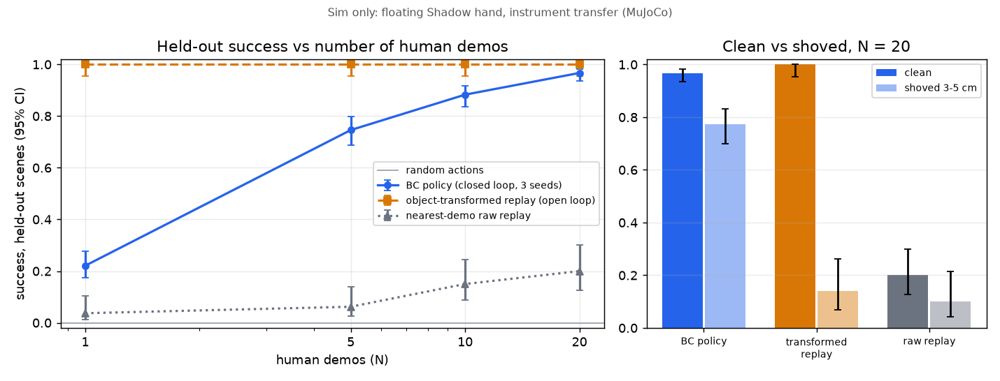

# Proof of Learning (sim): human-hand demos train a closed-loop policy

This answers "does your video data train a robot, or just replay it?" with a small experiment in MuJoCo, following [04-proof-of-learning](../../../../docs/research/robotics/04-proof-of-learning.md), cut down to fit the time we had. Everything here runs in simulation. No physical robot is involved.

**Result (measured October 3, 2026, M-series Mac, CPU only, about 32 min for the full sweep):** with 20 human-derived demos, a behavior-cloned MLP placed the instrument handle in the tray on **96.7% of 240 held-out rollouts** (80 scenes x 3 seeds, 95% CI 93.6 to 98.3). Replaying the nearest demo got **20%** (CI 12.7 to 30.0). When the handle was shoved 3 to 5 cm at t = 1.0 s, the policy still succeeded **77.3%** of the time (CI 70.0 to 83.3). Object-transformed open-loop replay dropped from 100% to **14%** (CI 7.0 to 26.2).



## Task and embodiment

- **Task, "instrument transfer":** a 12.4 x 2.4 cm capsule handle (30 g, friction 1.5) lies on a table at a random pose: x and y within +/-10 cm, yaw within +/-30 deg. The hand has to put it in a rimmed 14 x 18 cm tray whose position is random within +/-5 cm. **Success** means the handle center is inside the tray floor and resting there (under 1 cm/s) with no hand contact for 0.25 s, all within 10 s.
- **Embodiment: MuJoCo Menagerie Shadow Hand (right),** floating. The forearm has a free joint welded to a mocap body, commanded as grip-point xyz plus yaw with the palm down. The 18 finger position actuators are commanded directly, and the two wrist joints are held at 0. Control runs at 20 Hz on 2 ms physics steps. The forearm mount has no collisions.
- **Gate (report 04, section 6):** a scripted grasp (open, descend, close, lift 18 cm) held the handle in **10/10** tries, with the handle offset +/-1 cm and yawed +/-15 deg. That was after sweeping the grip offset, which ended at 0.36 m ahead of and 6.4 cm below the forearm origin. The gate passed, so we kept the Shadow hand and did not need the parallel-gripper fallback.

## What comes from human data vs what is synthesized

| From human data | Synthesized |
| --- | --- |
| The finger closing trajectory and its timing, from the 40% flex crossing to the plateau | The wrist path (min-jerk reach, descend, lift, carry, lower, retreat). The episodes log no wrist pose. |
| The closed finger shape for FF, MF, RF, and LF (J3, J4, LFJ5, and coupled J1+J2, capped) | Each source demo's handle and tray pose (seeded). The clip records no object. |
| The finger opening (release) trajectory and its timing | The open-hand pre-shape before the closure starts |
| | The thumb's closed pose (a fixed opposition: THJ5 0.6, THJ4 1.2, THJ1 0.8), reached on the human closure's own progress curve |
| | A cap of 1.6 rad on coupled distal flexion (J1+J2) |
| | Every generated episode: MimicGen transform, DART noise, and physics success filter |

**Human source:** `/private/tmp/claude-501/live-ep/robot/motion.json`. This is the 400-frame `import-episode` output of dex-retargeting's public 13 s sample clip (MIT), and it is **not a Quest task clip**. Closure detection found **one** grasp-like closure, onset at 8.45 s with amplitude 1.0 of the clip's flex range. So all 20 "human demos" share that one finger trajectory and differ only in their synthesized source scene and a 0.9 to 1.1x time warp. The extracted profile, including the raw human targets before adaptation, is committed as [`learning-results/human_profiles.json`](../../learning-results/human_profiles.json).

**Why the contact adaptation:** the clip shows a bare fist with no object in it. The coupled distal joints curl to about 2.8 rad, and the thumb barely opposes (THJ1 0.24 rad). The same scripted lift held:
- **4/10** with the raw human targets
- **6/10** with J0 capped and the human thumb
- **10/10** with J0 capped and the opposition thumb

We used the last variant. A real Quest task clip, where the hand is actually holding something, should need less adaptation.

## Method

1. **Extract** (`demos.extract_profiles`): drop gaps over 300 ms and never fill them, resample to 20 Hz, then compute flex as the mean of the FF/MF/RF/LF J2 and J3 joints. Onset, plateau, and release come from the 40%/90% crossings of the clip's p5 to p95 flex range. Partial curls below 0.6 of the range are reported but not used.
2. **Source demos** (`make_demos`): a synthesized wrist path around the human finger trajectory. Each demo is executed once in its own scene to measure where the handle sits in the hand, and that offset is baked into its place segment, the way a recorded demo would carry it.
3. **Generation** (`generate`, 1000 episodes per N, a fixed budget):
   - Each demo is transformed MimicGen-style. Approach and grasp are re-expressed in the handle frame, place and release in the tray frame, with a linear blend between them. The new handle poses stay within +/-6 cm and +/-20 deg of the demo's own pose, so coverage grows with N.
   - Episodes run in physics with correlated DART noise (about 6 mm and 2 deg on the wrist, 0.05 rad on the fingers). Labels are the clean correction back to the reference.
   - 30% of episodes include a 2 to 5 cm shove before contact, and the expert re-targets to the handle's current pose.
   - Only successful placements are kept. **Yield was 58 to 60%.**
4. **Policy** (`policy.py`):
   - **Input:** a 42-dim state: 22 finger joints, grip pose, command-minus-measured wrist offset, handle pose relative to the hand, tray relative to the handle, thumb/index contact flags, and handle height. There is no time or phase input.
   - **Network and training:** an MLP (3 x 512, LayerNorm, GELU, dropout 0.1) outputs a chunk of 10 actions. Training uses L1 loss and AdamW, 8000 steps at batch 512, about 95 s per run on CPU.
   - **Execution:** chunks are combined with ACT temporal ensembling.
5. **Evaluation** (`evaluate.py`):
   - **Held-out scenes:** 80 in-distribution scenes plus 20 in a 5 cm out-of-distribution ring outside the training box, from eval seed 10000. This seed is disjoint from the demo seed 0 and the generation seeds 1000+N.
   - **Shove scenes:** 50 more from seed 20000. The handle is displaced 3 to 5 cm in a random direction at t = 1.0 s, before contact.
   - **Seeds and CIs:** policies are trained with 3 seeds and pooled, with 95% Wilson CIs.

## Results (`learning-results/results.json`)

Success rate (95% Wilson CI). Policy numbers pool 3 training seeds: 240 in-distribution, 60 OOD, and 150 shove rollouts. Each baseline has 80, 20, and 50 rollouts.

| N human demos | BC policy, in-dist | BC policy, OOD ring | BC policy, shoved | Raw replay (nearest demo), in-dist | Transformed replay, in-dist | Transformed replay, shoved |
| --- | --- | --- | --- | --- | --- | --- |
| 1 | 22.1% (17.3 to 27.7) | 6.7% (2.6 to 15.9) | 15.3% (10.4 to 22.0) | 3.7% (1.3 to 10.5) | 100% (95.4 to 100) | 16.0% (8.3 to 28.5) |
| 5 | 74.6% (68.7 to 79.7) | 61.7% (49.0 to 72.9) | 50.7% (42.7 to 58.6) | 6.2% (2.7 to 13.8) | 100% | 14.0% (7.0 to 26.2) |
| 10 | 88.3% (83.7 to 91.8) | 81.7% (70.1 to 89.4) | 81.3% (74.3 to 86.8) | 15.0% (8.8 to 24.4) | 100% | 14.0% |
| 20 | **96.7% (93.6 to 98.3)** | 80.0% (68.2 to 88.2) | **77.3% (70.0 to 83.3)** | **20.0% (12.7 to 30.0)** | 100% | **14.0% (7.0 to 26.2)** |

- **Per-seed spread:** in-dist at N = 20 was 0.963 / 0.975 / 0.963, and shoved was 0.84 / 0.74 / 0.74.
- **Random actions:** 0/80 clean and 0/50 shoved.
- **Grasp rate:** the policy lifted the handle 5 cm or more in 85% of N = 1 rollouts and 100% at N >= 5.
- **Video:** [`replay_vs_policy.mp4`](../../learning-results/replay_vs_policy.mp4) shows two shoved held-out scenes side by side. On the left is object-transformed open-loop replay, which reaches for where the handle was. On the right is the N = 20 policy, which re-targets and places the handle.

**How to read it:**
- **Raw replay rarely transfers.** Replaying the nearest demo's recorded commands works only when the new handle happens to sit close to the recorded one.
- **Transformed replay is an oracle.** It is given the handle and tray pose at t = 0 and uses the same transform as the data generator, and with an undisturbed handle it is perfect: 100% in-distribution and 100% on the OOD ring. **The policy does not beat it on clean trials.** It gets within its CI at N = 20 in-distribution and stays below it on the OOD ring.
- **The difference is closed loop.** Under a shove, the policy keeps 77% while open-loop replay falls to 14%.
- **Success grows with the number of demos,** from 22% at N = 1 to 97% at N = 20 at a fixed 1000-episode budget. Each demo only seeds data within 6 cm of its own scene, so this curve measures coverage of initial conditions. It does not measure diversity of finger behavior, since there is one human closure.

**Caveat on the shove test:** 30% of generated training episodes contained a pre-contact shove with a re-targeting expert. So the policy saw shove-like states in training, and open-loop replay by construction cannot react to them. We did not run the ablation without shoves in training.

## Claims

| Say | Don't say |
| --- | --- |
| "In simulation, a policy trained on demonstrations derived from retargeted human hand motion picks up an instrument handle from held-out positions and places it in a tray: 96.7% (CI 93.6 to 98.3) at 20 demos, vs 20% for replaying the nearest demo." | "Our robot learned surgery" or anything about autonomous surgery |
| "Closed loop: with the handle shoved 3 to 5 cm mid-reach, the policy succeeds 77% of the time; open-loop replay of the object-adapted demo, 14%." | "Robust" without the numbers, or "beats replay" without saying the oracle replay matches it on clean trials |
| "Finger closure shape and timing come from the human motion; the wrist path and object poses are synthesized; the thumb pose and the distal-flex cap are adapted for contact." | "Learned end to end from video" or "learned from Quest clips" (no Quest task clip exists yet) |
| "Sim-filtered: about 60% of generated episodes physically succeeded and were kept." | Hiding the filter yield or the contact adaptation |
| "Success scales with the number of demos (22% at 1, 97% at 20), measured with 3 seeds." | "Scales with human data diversity." All demos share one human closure. |
| "Sim only; floating hand, no arm; no physical robot; sim-to-real untested." | "Ready for a real robot" |

## Run

From `services/motion`, first fetch the Menagerie Shadow hand into the gitignored `models/` (about 50 MB):

```sh
git clone --depth 1 --filter=blob:none --sparse https://github.com/google-deepmind/mujoco_menagerie.git models/menagerie
git -C models/menagerie sparse-checkout set shadow_hand
```

Then:

```sh
uv run scalpal-motion learn extract --motion path/to/robot/motion.json [more.json ...]   # -> learning-results/human_profiles.json
uv run scalpal-motion learn sweep                    # N = 1,5,10,20; 3 seeds; 1000 episodes; 8000 steps (~32 min on 8 cores)
uv run scalpal-motion learn sweep --n 1,5,20 --steps 6000     # shorter variant
uv run scalpal-motion learn report                   # -> learning-results/chart.png
uv run scalpal-motion learn video --video-n 20       # -> learning-results/replay_vs_policy.mp4
uv run pytest -q tests/test_learning.py
```

The committed results came from `learn extract` with no `--motion` argument, which falls back to the sample clip path, followed by `learn sweep --n 1,5,10,20 --seeds 3 --budget 1000 --steps 8000`, `learn report`, and `learn video --video-n 20`.

**New data drops in:** the `motion.json` output of `scalpal-motion import-episode` from real Quest task episodes. Each grasp closure detected in those files becomes another finger profile, and demos cycle through the profiles.

Bulky files (datasets and policy weights) go to `out/learning/`, which is gitignored. The sweep appends each N to `results.json` as it finishes.

## Not done / limits

- **No real task clip.** We have one human closure, and the wrist is synthesized. The Unity wrist and instrument log (report 04, option a) would replace the synthesized wrist path and source poses.
- **Ablations not run:** noisy vs filtered data, and training with vs without shove augmentation.
- **Pre-contact shove only.** The shove happens before contact, not after the grasp.
- **Pure behavior cloning.** No diffusion policy and no vision; the policy reads simulator state, not pixels.
- **Shadow hand compromises:**
  - The forearm mount has collisions disabled.
  - The handle is a capsule with high friction.
  - The grasp often drags and turns the handle under the palm before the lift. It still holds, but it is not a clean pinch.
